# Kubernetes Troubleshooting Tasks (01 to 09)

This document covers the commands and expected outputs for troubleshooting tasks 01 through 09 based on the screenshots and practical examples.

## Task 01: kubectl get

**Goal:** Understand how to view the current status of Kubernetes resources using `kubectl get`.

**Commands:**
```bash
kubectl apply -f 01-kubectl-get/sample-workload.yaml
kubectl get pods
kubectl get pods -o wide
kubectl get all
```

**Output:**
```text
NAME       READY   STATUS    RESTARTS   AGE     IP            NODE
get-demo   1/1     Running   0          2s      10.244.0.47   minikube
```

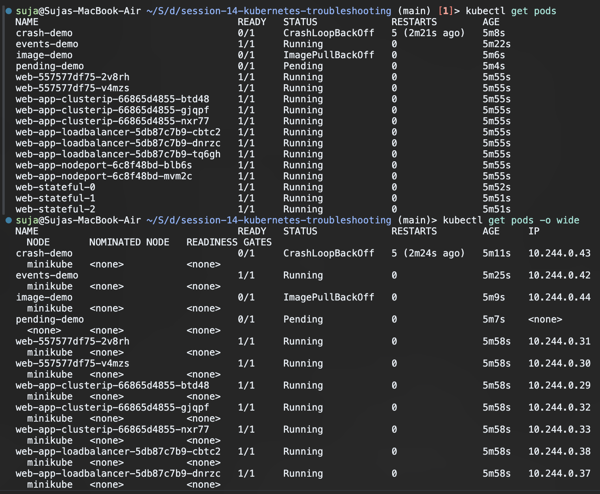

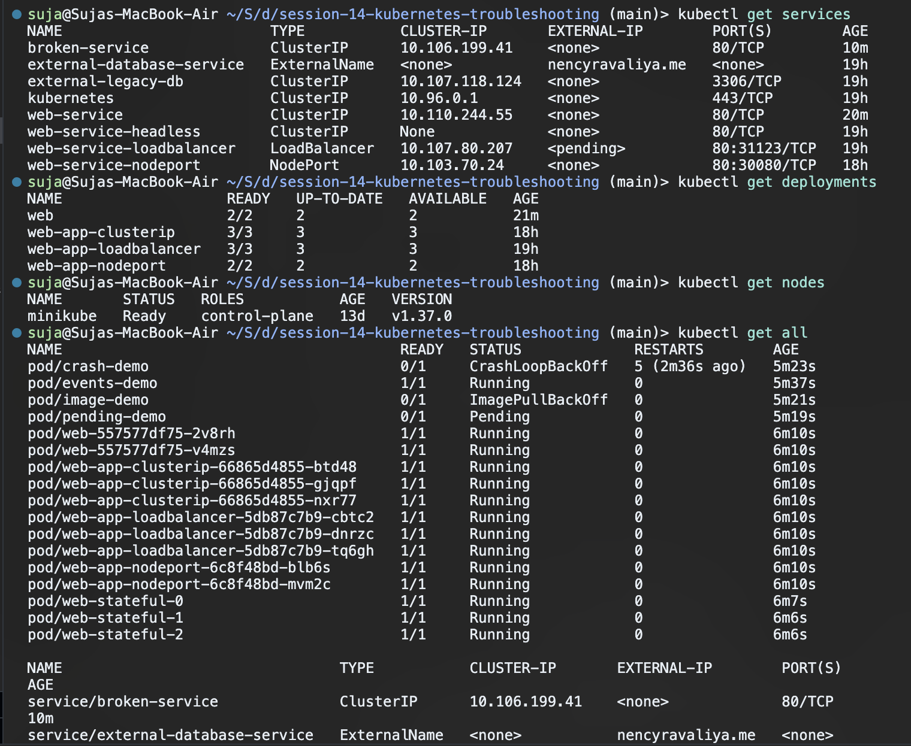

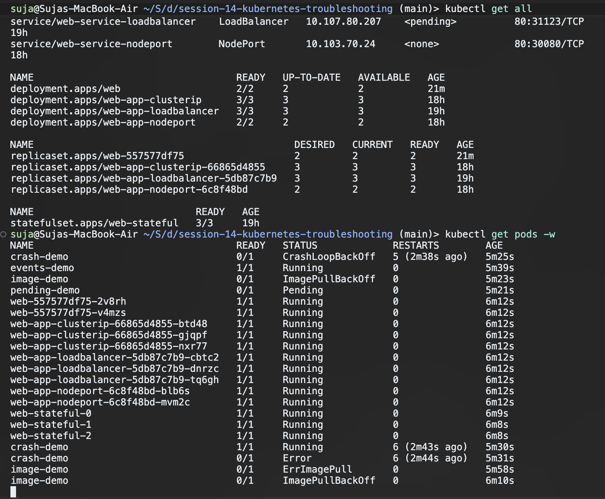


## Task 02: kubectl describe

**Goal:** Understand how to investigate the detailed state of a specific resource using `kubectl describe`.

**Commands:**
```bash
kubectl apply -f 02-kubectl-describe/demo-pod.yaml
kubectl describe pod describe-demo
```

**Output:**
```text
Name:             describe-demo
Namespace:        default
Priority:         0
Service Account:  default
Node:             minikube/192.168.49.2
Start Time:       Mon, 21 Sep 2026 12:55:09 +0530
Labels:           app=describe-demo
Annotations:      <none>
Status:           Running
IP:               10.244.0.48
```

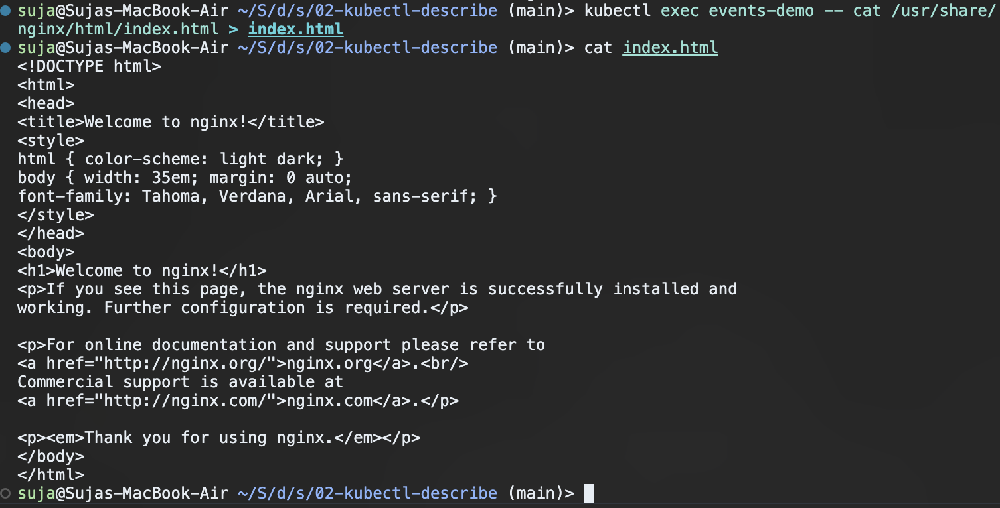


## Task 03: kubectl logs

**Goal:** Understand how to view the application output from inside a container using `kubectl logs`.

**Commands:**
```bash
kubectl apply -f 03-kubectl-logs/pod.yaml
kubectl logs logs-demo
```

**Output:**
```text
Application started
Connecting to database...
Database connection successful
Application is running
Application is healthy
```

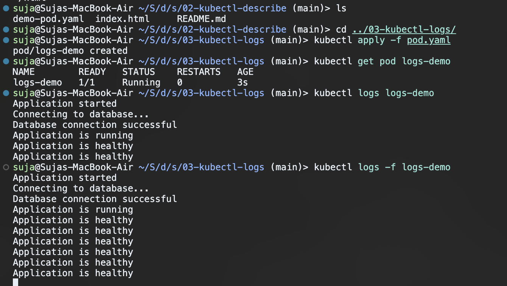


## Task 04: kubectl exec

**Goal:** Understand how to execute commands inside a running container for deep troubleshooting using `kubectl exec`.

**Commands:**
```bash
kubectl apply -f 04-kubectl-exec/pod.yaml
kubectl exec -it exec-demo -- bash
ls /usr/share/nginx/html
```

**Output:**
```text
50x.html
index.html
```

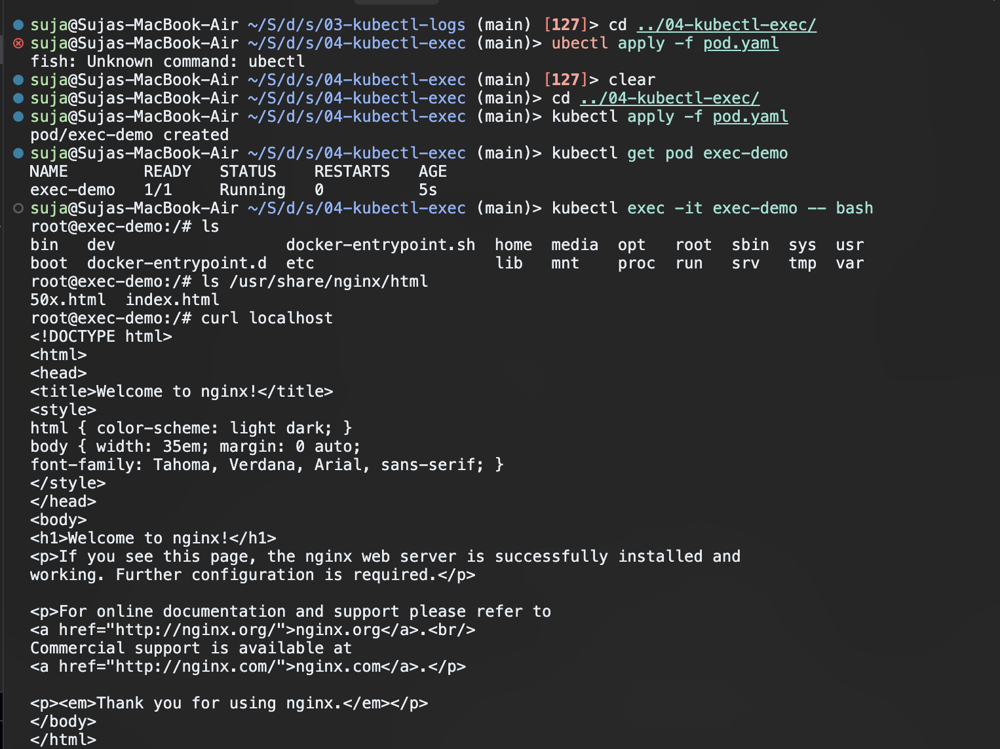

## Task 05: Kubernetes Events

**Goal:** Understand how to check Kubernetes events to see what the cluster is doing with resources.

**Commands:**
```bash
kubectl apply -f 05-events/pod.yaml
kubectl get events --sort-by=.metadata.creationTimestamp | tail -n 5
```

**Output:**
```text
30s         Normal    Started                   pod/web-stateful-2                          Container started
2s          Normal    Started                   pod/events-demo                             Container started
2s          Normal    Pulled                    pod/events-demo                             Container image "nginx:1.27" already present on machine and can be accessed by the pod
2s          Normal    Scheduled                 pod/events-demo                             Successfully assigned default/events-demo to minikube
2s          Normal    Created                   pod/events-demo                             Container created
```

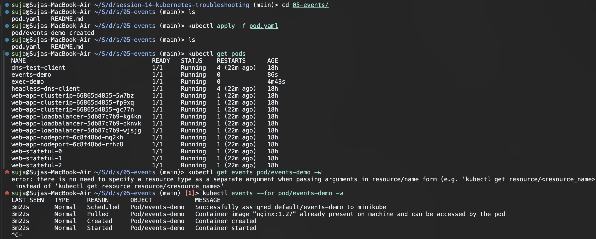


## Task 06: CrashLoopBackOff

**Goal:** Identify a pod that is crashing immediately after starting due to an application or script error.

**Commands:**
```bash
kubectl apply -f 06-crashloopbackoff/broken-pod.yaml
kubectl get pods crash-demo
```

**Output:**
```text
NAME         READY   STATUS   RESTARTS     AGE
crash-demo   0/1     Error    1 (2s ago)   2s
```

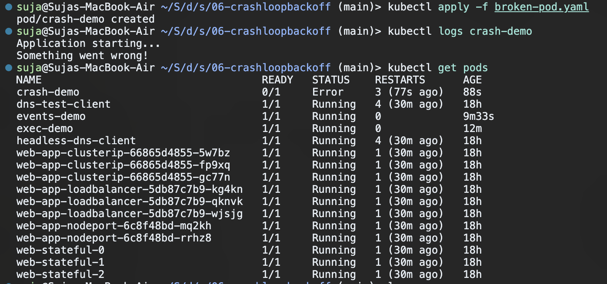

*(Note: It will transition to `CrashLoopBackOff` after a few restarts as the container repeatedly fails and exits).*

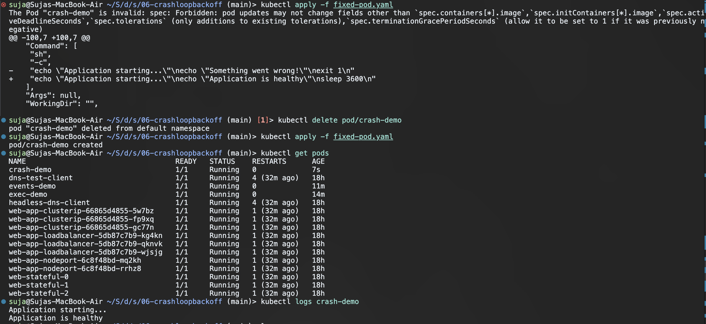


## Task 07: ImagePullBackOff

**Goal:** Identify a pod failing because the requested image cannot be pulled from the registry.

**Commands:**
```bash
kubectl apply -f 07-imagepullbackoff/broken-pod.yaml
kubectl get pods image-demo
```

**Output:**
```text
NAME         READY   STATUS              RESTARTS   AGE
image-demo   0/1     ContainerCreating   0          2s
```

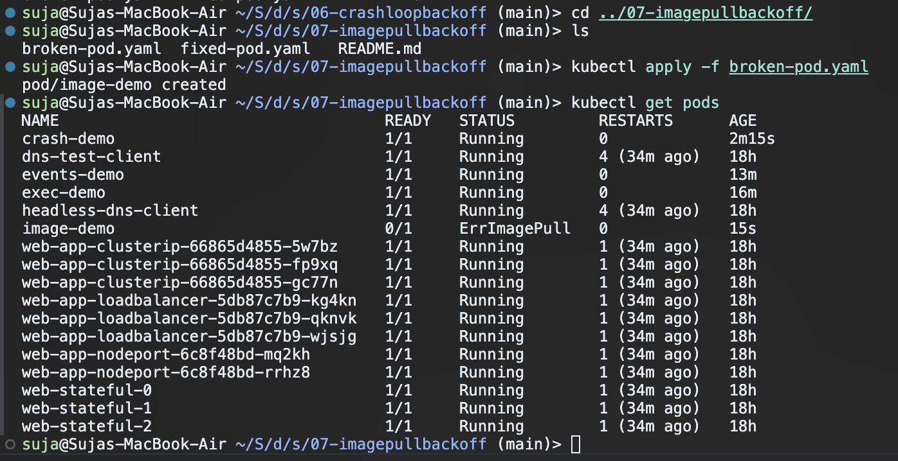

*(Note: Shortly after, this will transition to `ErrImagePull` and then `ImagePullBackOff` since the image `nginx:1.999` does not exist).*

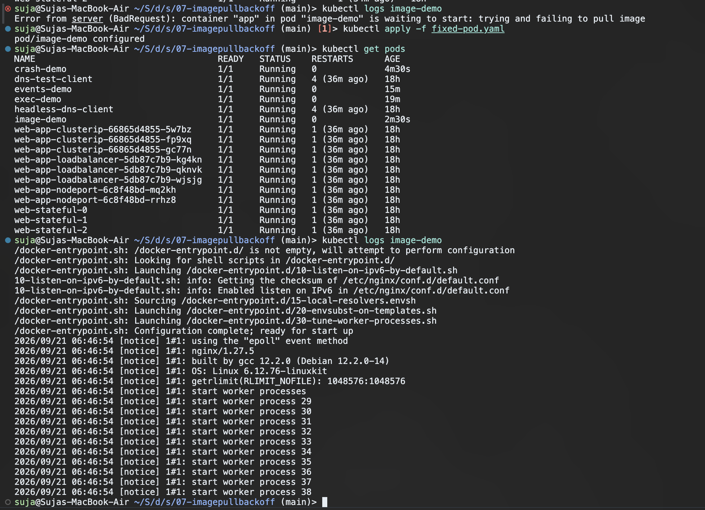


## Task 08: Pending Pods

**Goal:** Identify a pod that cannot be scheduled (e.g. asking for too many resources, like 1000 CPUs).

**Commands:**
```bash
kubectl apply -f 08-pending-pods/broken-pod.yaml
kubectl get pods pending-demo
```

**Output:**
```text
NAME           READY   STATUS    RESTARTS   AGE
pending-demo   0/1     Pending   0          2s
```

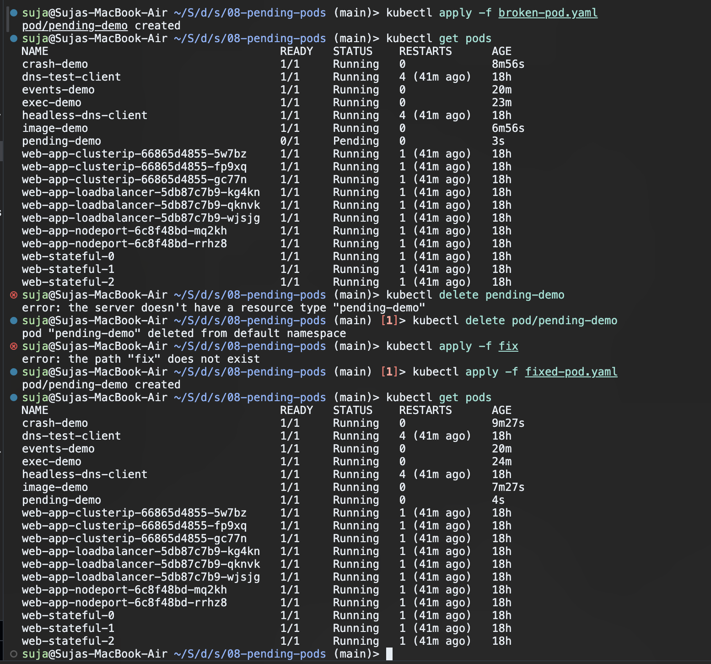

*(Note: You can run `kubectl describe pod pending-demo` to see the exact `FailedScheduling` reason under the Events section).*

## Task 09: Service DNS & Selectors Troubleshooting

**Goal:** Identify a service that is not routing traffic to any pods due to a label selector mismatch.

**Commands:**
```bash
kubectl apply -f 09-service-dns-troubleshooting/service.yaml
kubectl get service broken-service
kubectl get endpoints broken-service
```

**Output:**
```text
NAME             TYPE        CLUSTER-IP      EXTERNAL-IP   PORT(S)   AGE
broken-service   ClusterIP   10.106.199.41   <none>        80/TCP    5m6s

NAME             ENDPOINTS   AGE
broken-service   <none>      5m6s
```

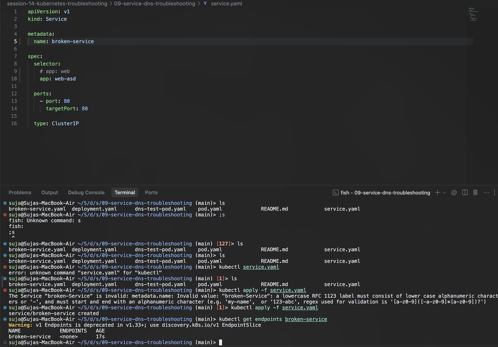

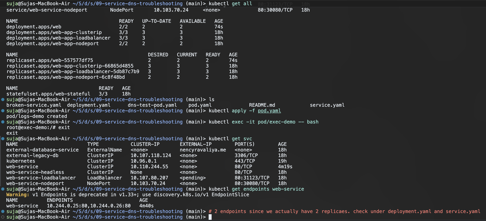

*(Note: The `<none>` under ENDPOINTS indicates that the service selector (`app: web-asd`) does not match the labels of any running pods (which are `app: web`)).*
