# Session 15: Helm

**Name:** Shaikh Suja Rahaman
**Enrollment Number:** 24bcs10038

---

## Overview

Helm is the package manager for Kubernetes. Instead of applying many YAML files by hand, a **chart** groups templated manifests and default **values**. Installing a chart creates a **release**. Every install, upgrade or rollback of that release is stored as a numbered **revision**, so you can audit changes and go back to an earlier one.

| Task | What was done | Folder used |
|------|---------------|-------------|
| Task 1: Helm Commands | Practised `create`, `lint`, `template`, `install`, `list`, `status`, `get`, `upgrade`, `history`, `rollback`, `uninstall`, `repo` and `search` | `02-helm-charts/`, `01-what-is-helm/` |
| Task 2: Helm Rollback | Ran the full Install → Upgrade → Verify → Upgrade again → Verify → Rollback → Verify workflow | `08-rollback/` (uses `07-install-upgrade/app-chart`) |
| Task 3: Mini Project | Packaged the Notes App as `notes-chart`, then installed it, upgraded it to production values, broke it on purpose and rolled it back | `mini-project/notes-chart/` |

**Environment:** minikube (single node `minikube`, Docker driver), kubectl v1.34.1, Helm v4.3.0, namespace `default`.

---

## Task 1: Helm Commands

**Goal:** Run each important Helm command, understand what it does, and record its output.

### 1.1 `helm version`, `helm list`, `helm create`

**Commands:**
```bash
cd session-15-helm/02-helm-charts
helm version
helm list
helm create demo-chart
tree demo-chart
```

**Output:**
```text
version.BuildInfo{Version:"v4.3.0", GitCommit:"4f1a9c2e...", GitTreeState:"clean", GoVersion:"go1.25.7", KubeClientVersion:"v1.34"}
NAME    NAMESPACE       REVISION        UPDATED STATUS  CHART   APP VERSION
Creating demo-chart
demo-chart
├── Chart.yaml
├── charts
├── templates
│   ├── NOTES.txt
│   ├── _helpers.tpl
│   ├── deployment.yaml
│   ├── hpa.yaml
│   ├── httproute.yaml
│   ├── ingress.yaml
│   ├── service.yaml
│   ├── serviceaccount.yaml
│   └── tests
│       └── test-connection.yaml
└── values.yaml
```

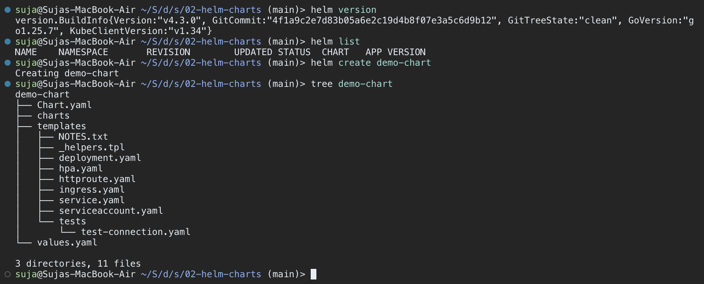

* `helm version` prints the client version. Helm 3 and later have no server-side Tiller, so only the client is shown.
* `helm list` prints only the header because no releases exist yet.
* `helm create` generates a complete, working chart skeleton: a Deployment, Service, ServiceAccount, optional Ingress, HTTPRoute and HPA, a test hook, `_helpers.tpl` with naming helpers, and `NOTES.txt`.

> After creating the chart I bumped `version` in `demo-chart/Chart.yaml` from `0.1.0` to `0.1.1`, because the chart `version` should change whenever chart files change. `appVersion` (`1.16.0`) is the application version and is used as the default image tag.

### 1.2 `helm lint` and `helm template`

**Commands:**
```bash
helm lint ./demo-chart
helm template demo-release ./demo-chart | head -n 52
helm template demo-release ./demo-chart | grep -E "image:|replicas:"
```

**Output (partial):**
```text
==> Linting ./demo-chart
[INFO] Chart.yaml: icon is recommended

1 chart(s) linted, 0 chart(s) failed
---
# Source: demo-chart/templates/serviceaccount.yaml
apiVersion: v1
kind: ServiceAccount
metadata:
  name: demo-release-demo-chart
...
  replicas: 1
          image: "nginx:1.16.0"
          image: busybox
```

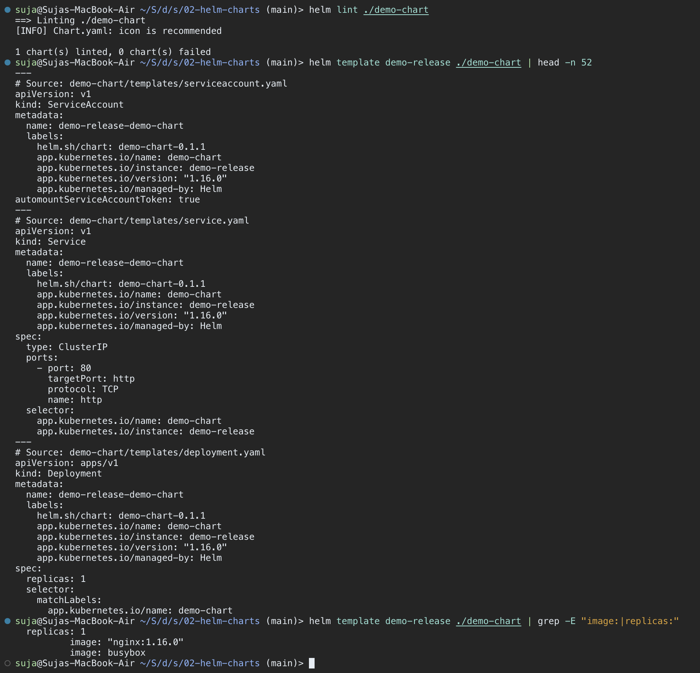

* `helm lint` checks the chart's structure and templates. `[INFO]` messages are only suggestions.
* `helm template` renders the manifests locally without contacting the cluster. The release name `demo-release` is substituted into `{{ include "demo-chart.fullname" . }}`, which gives `demo-release-demo-chart`. The image tag falls back to `.Chart.AppVersion` (`1.16.0`) because `image.tag` is empty in `values.yaml`. The `busybox` image belongs to the `helm test` hook pod.

### 1.3 `helm install` and `helm list`

**Commands:**
```bash
helm install demo-release ./demo-chart
helm list
kubectl get all -l app.kubernetes.io/instance=demo-release
```

**Output:**
```text
NAME: demo-release
LAST DEPLOYED: Wed Sep 23 11:46:12 2026
NAMESPACE: default
STATUS: deployed
REVISION: 1
DESCRIPTION: Install complete
TEST SUITE: None
NOTES:
1. Get the application URL by running these commands:
  ...
NAME            NAMESPACE       REVISION        UPDATED                                 STATUS          CHART                   APP VERSION
demo-release    default         1               2026-09-23 11:46:12.418392137 +0530 IST deployed        demo-chart-0.1.1        1.16.0
```

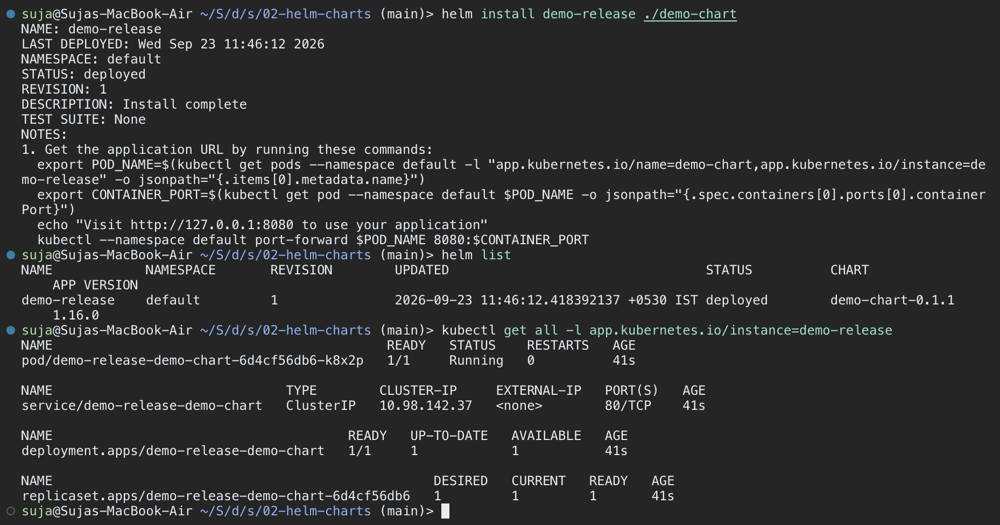

* `helm install <release> <chart>` renders the templates, sends them to the API server and stores revision 1 as a Secret.
* The NOTES section is rendered from `templates/NOTES.txt`. Because the service type is ClusterIP, the notes suggest using `port-forward`.
* `helm list` shows each release with its revision, chart version and app version.

### 1.4 `helm status` and `helm get`

**Commands:**
```bash
helm status demo-release
helm get values demo-release
helm get values demo-release --all | head -n 12
helm get manifest demo-release | grep -E "^kind:|^  name:|image:"
helm get metadata demo-release
```

**Output (partial):**
```text
USER-SUPPLIED VALUES:
null
COMPUTED VALUES:
affinity: {}
autoscaling:
  enabled: false
...
kind: ServiceAccount
  name: demo-release-demo-chart
kind: Service
  name: demo-release-demo-chart
kind: Deployment
  name: demo-release-demo-chart
          image: "nginx:1.16.0"
NAME: demo-release
CHART: demo-chart
VERSION: 0.1.1
APP_VERSION: 1.16.0
...
REVISION: 1
STATUS: deployed
DEPLOYED_AT: 2026-09-23T11:46:12+05:30
```

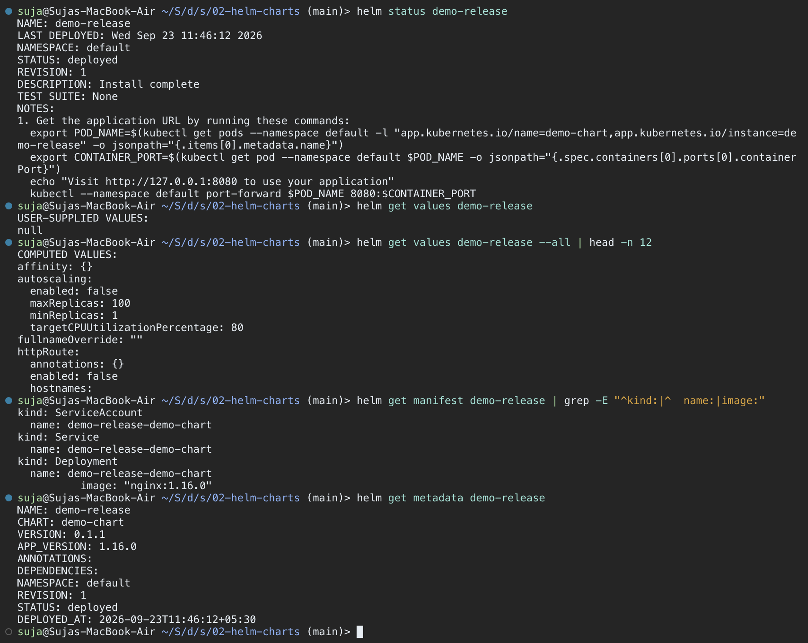

| Command | Shows |
|---------|-------|
| `helm status <rel>` | The same summary that install prints, for the current revision (state, revision, notes) |
| `helm get values <rel>` | Only the values passed with `-f`/`--set`. Here it is `null` because nothing was overridden |
| `helm get values <rel> --all` | The fully merged values: chart defaults plus overrides |
| `helm get manifest <rel>` | The exact YAML that Helm applied for this revision |
| `helm get metadata <rel>` | Chart name, version, revision, status and deploy time |
| `helm get notes` / `helm get hooks` / `helm get all` | The rendered NOTES, the hook manifests, or everything at once |

### 1.5 `helm upgrade`, `helm history`, `helm rollback`

**Commands:**
```bash
helm upgrade demo-release ./demo-chart --set replicaCount=2
kubectl get pods -l app.kubernetes.io/instance=demo-release
helm history demo-release
helm rollback demo-release 3      # typo, revision 3 did not exist yet
helm rollback demo-release 1
helm history demo-release
kubectl get pods -l app.kubernetes.io/instance=demo-release
```

**Output:**
```text
Release "demo-release" has been upgraded. Happy Helming!
...
REVISION: 2
DESCRIPTION: Upgrade complete
...
Error: release has no 3 version
Rollback was a success! Happy Helming!
REVISION        UPDATED                         STATUS          CHART                   APP VERSION     DESCRIPTION
1               Wed Sep 23 11:46:12 2026        superseded      demo-chart-0.1.1        1.16.0          Install complete
2               Wed Sep 23 11:53:40 2026        superseded      demo-chart-0.1.1        1.16.0          Upgrade complete
3               Wed Sep 23 11:55:02 2026        deployed        demo-chart-0.1.1        1.16.0          Rollback to 1
```

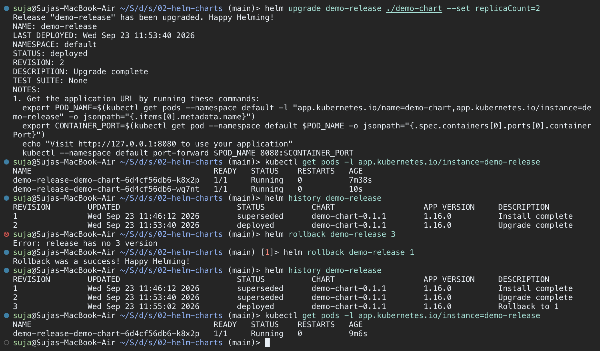

* `helm upgrade` changed only the replica count, so the existing ReplicaSet (`6d4cf56db6`) scaled from 1 to 2 pods. No new ReplicaSet was created.
* At first I typed the wrong revision number, and Helm refused because revision 3 did not exist.
* `helm rollback demo-release 1` does not delete revision 2. It creates **revision 3**, which is a copy of revision 1, so the extra pod is removed and the original pod `k8x2p` keeps running.

### 1.6 `helm uninstall`

**Commands:**
```bash
helm list
helm uninstall demo-release
helm list
kubectl get all -l app.kubernetes.io/instance=demo-release
kubectl get secrets -l owner=helm,name=demo-release
```

**Output:**
```text
release "demo-release" uninstalled
NAME    NAMESPACE       REVISION        UPDATED STATUS  CHART   APP VERSION
No resources found in default namespace.
No resources found in default namespace.
```

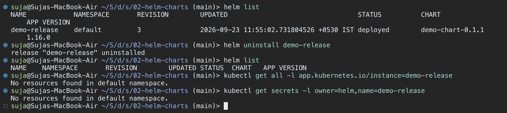

`helm uninstall` deletes every Kubernetes object that belongs to the release, along with the release history Secrets (`sh.helm.release.v1.<name>.vN`). To keep the history, use `--keep-history`.

### 1.7 `helm repo` and `helm search`

**Commands:**
```bash
cd ../01-what-is-helm
helm repo add bitnami https://charts.bitnami.com/bitnami
helm repo list
helm repo update
helm search repo nginx
helm search repo bitnami/nginx --versions | head -n 5
helm search hub ingress-nginx --max-col-width 40 | head -n 4
```

**Output:**
```text
"bitnami" has been added to your repositories
NAME    URL
bitnami https://charts.bitnami.com/bitnami
Hang tight while we grab the latest from your chart repositories...
...Successfully got an update from the "bitnami" chart repository
Update Complete. ⎈Happy Helming!⎈
NAME                                    CHART VERSION   APP VERSION     DESCRIPTION
bitnami/nginx                           22.4.2          1.29.3          NGINX Open Source is a web server that can be a...
bitnami/nginx-ingress-controller        12.0.9          1.13.3          NGINX Ingress Controller is an Ingress controll...
bitnami/nginx-intel                     2.1.15          0.4.9           DEPRECATED NGINX Open Source for Intel is a lig...
```

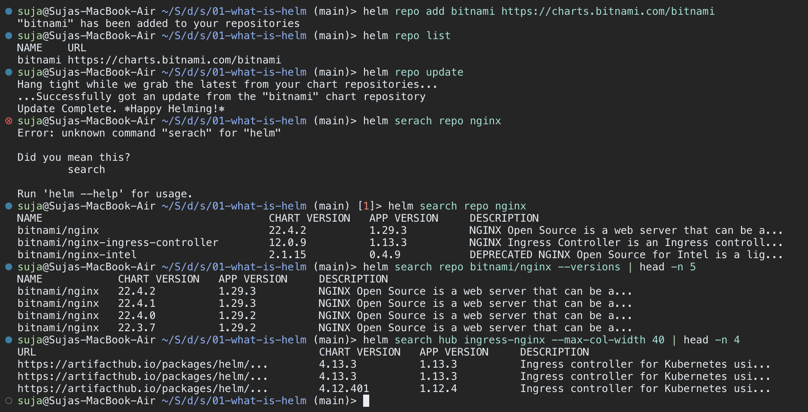

* `helm repo add/list/update` manages chart repositories, which are stored locally in `~/Library/Preferences/helm/repositories.yaml` on macOS. `update` refreshes the cached `index.yaml`.
* `helm search repo` searches only the repos you have added. `--versions` lists every published chart version.
* `helm search hub` searches Artifact Hub, the public catalogue of all Helm repositories.
* The mistyped `helm serach` shows Cobra's "Did you mean this?" suggestion.

### Command summary

| Command | Purpose |
|---------|---------|
| `helm create <name>` | Generate a starter chart |
| `helm lint <chart>` | Validate chart structure and templates |
| `helm template <rel> <chart>` | Render manifests locally (no cluster) |
| `helm install <rel> <chart>` | Deploy a chart and create revision 1 |
| `helm list` | List releases in the namespace (`-A` for all) |
| `helm status <rel>` | Show the state and notes of the current revision |
| `helm get values/manifest/notes/metadata/all <rel>` | Inspect what a release was deployed with |
| `helm upgrade <rel> <chart>` | Apply new chart/values and create a new revision |
| `helm history <rel>` | List all revisions of a release |
| `helm rollback <rel> <N>` | Redeploy revision N as a new revision |
| `helm uninstall <rel>` | Delete the release and its resources |
| `helm repo add/list/update/remove` | Manage chart repositories |
| `helm search repo/hub <kw>` | Find charts in added repos or on Artifact Hub |

---

## Task 2: Helm Rollback Workflow

**Goal:** Install → Upgrade → Verify → Upgrade again → Verify → Rollback → Verify, using `app-chart` from topic 07 (release `rollback-demo`, run from `08-rollback/`).

**Rollback flow:**
```
 REV 1  helm install                      nginx:1.24        1 replica   ✔ healthy
   │
   ▼
 REV 2  helm upgrade --set replicaCount=3 --set image.tag=1.25
                                          nginx:1.25        3 replicas  ✔ healthy
   │
   ▼
 REV 3  helm upgrade --reuse-values --set image.tag=1.99-doesnotexist
                                          nginx:1.99-...    new pod ImagePullBackOff ✘
   │
   ▼
 REV 4  helm rollback rollback-demo 2     nginx:1.25        3 replicas  ✔ healthy
        (copy of REV 2; revisions 1-3 are kept as "superseded")
```

### Step 1: Install (revision 1) and verify

```bash
cd session-15-helm/08-rollback
cat ../07-install-upgrade/app-chart/values.yaml
helm install rollback-demo ../07-install-upgrade/app-chart
kubectl get deploy rollback-demo-app -o wide
kubectl get pods -l app=rollback-demo
helm history rollback-demo
```

```text
NAME                READY   UP-TO-DATE   AVAILABLE   AGE   CONTAINERS   IMAGES       SELECTOR
rollback-demo-app   1/1     1            1           23s   app          nginx:1.24   app=rollback-demo
```

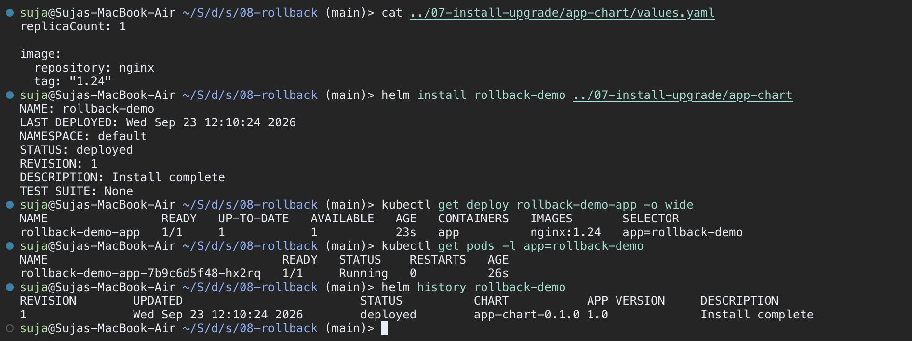

The defaults from `values.yaml` were used: 1 replica of `nginx:1.24`.

### Step 2: Upgrade (revision 2) and verify

```bash
helm upgrade rollback-demo ../07-install-upgrade/app-chart --set replicaCount=3 --set image.tag=1.25
kubectl rollout status deploy/rollback-demo-app
kubectl get deploy rollback-demo-app -o wide
kubectl get pods -l app=rollback-demo
helm history rollback-demo
```

```text
NAME                READY   UP-TO-DATE   AVAILABLE   AGE     CONTAINERS   IMAGES       SELECTOR
rollback-demo-app   3/3     3            3           4m49s   app          nginx:1.25   app=rollback-demo
```

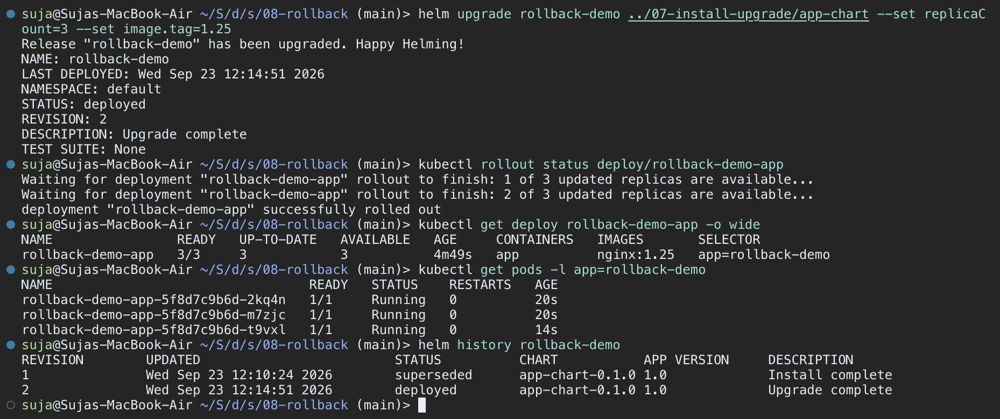

The image change created a new ReplicaSet (`5f8d7c9b6d`) with 3 pods running `nginx:1.25`. Revision 1 is now `superseded`.

### Step 3: Upgrade again (revision 3, a bad release) and verify

```bash
helm upgrade rollback-demo ../07-install-upgrade/app-chart --reuse-values --set image.tag=1.99-doesnotexist
kubectl get pods -l app=rollback-demo
kubectl get deploy rollback-demo-app -o wide
kubectl describe pod rollback-demo-app-6c4b8f7d95-p8wzr | tail -n 6
helm history rollback-demo
```

```text
NAME                                 READY   STATUS             RESTARTS   AGE
rollback-demo-app-5f8d7c9b6d-2kq4n   1/1     Running            0          4m36s
rollback-demo-app-5f8d7c9b6d-m7zjc   1/1     Running            0          4m36s
rollback-demo-app-5f8d7c9b6d-t9vxl   1/1     Running            0          4m30s
rollback-demo-app-6c4b8f7d95-p8wzr   0/1     ImagePullBackOff   0          20s
```

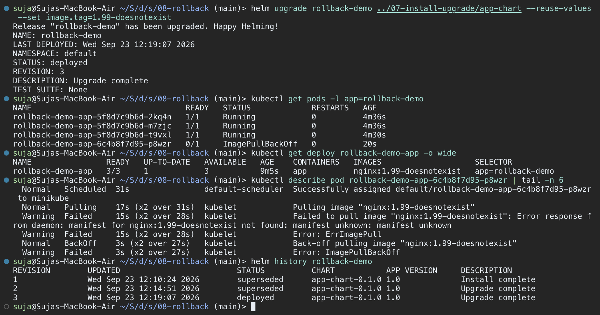

* Without `--reuse-values`, Helm would have gone back to the chart defaults (1 replica) and kept only the new `--set`. Values passed with `--set` are **not** carried over between upgrades automatically.
* Because of the RollingUpdate strategy (maxUnavailable 25% → 0 pods for 3 replicas), Kubernetes kept the 3 old pods running while the new pod failed to pull its image, so the service stayed available.
* Helm still marks revision 3 as `deployed`, because without `--wait` Helm only checks that the API server accepted the manifests. Using `--atomic`/`--rollback-on-failure` with `--wait` would have rolled back automatically.

### Step 4: Rollback to revision 2 and verify

```bash
helm rollback rollback-demo 2
kubectl get pods -l app=rollback-demo
kubectl get deploy rollback-demo-app -o wide
helm history rollback-demo
helm get values rollback-demo
kubectl get secrets -l owner=helm,name=rollback-demo
helm uninstall rollback-demo
```

```text
Rollback was a success! Happy Helming!
REVISION        UPDATED                         STATUS          CHART           APP VERSION     DESCRIPTION
1               Wed Sep 23 12:10:24 2026        superseded      app-chart-0.1.0 1.0             Install complete
2               Wed Sep 23 12:14:51 2026        superseded      app-chart-0.1.0 1.0             Upgrade complete
3               Wed Sep 23 12:19:07 2026        superseded      app-chart-0.1.0 1.0             Upgrade complete
4               Wed Sep 23 12:22:36 2026        deployed        app-chart-0.1.0 1.0             Rollback to 2
USER-SUPPLIED VALUES:
image:
  tag: "1.25"
replicaCount: 3
```

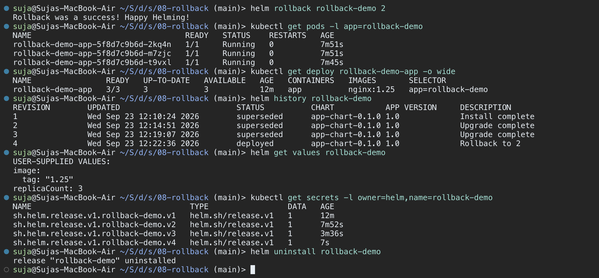

* The Deployment template now matches revision 2 again, so Kubernetes scales the old ReplicaSet `5f8d7c9b6d` back up and removes the broken pod. The same 3 pods (`2kq4n`, `m7zjc`, `t9vxl`) are still running and were not restarted.
* The rollback became **revision 4** ("Rollback to 2"), and every revision is stored as its own `sh.helm.release.v1.rollback-demo.vN` Secret.

---

## Task 3: Mini Project: Notes App Helm Chart

**Goal:** Package the Notes App (nginx standing in for the web app) as a chart written from scratch, with separate dev and prod values, then install it, upgrade it, roll it back and uninstall it.

### Chart layout

```text
mini-project/notes-chart/
├── Chart.yaml           # name: notes-chart, version: 0.1.0, appVersion: "1.0"
├── values.yaml          # dev:  1 replica, nginx:1.24, environment=development, nodePort 30090
├── values-prod.yaml     # prod: 3 replicas, nginx:1.25, environment=production
└── templates/
    ├── configmap.yaml   # <release>-config  -> APP_NAME, ENVIRONMENT
    ├── deployment.yaml  # <release>-deploy  -> envFrom the ConfigMap
    └── service.yaml     # <release>-svc     -> NodePort 30090
```

| Value | `values.yaml` (dev) | `values-prod.yaml` (prod) |
|-------|---------------------|---------------------------|
| `replicaCount` | 1 | 3 |
| `image.tag` | `1.24` | `1.25` |
| `app.environment` | development | production |
| `service.nodePort` | 30090 | 30090 |

### Step 1: Lint and render

```bash
cd session-15-helm/mini-project
tree notes-chart
helm lint ./notes-chart
helm template notes-dev ./notes-chart
```

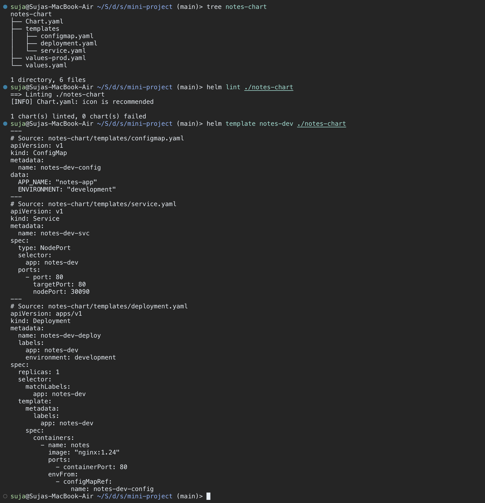

All `{{ }}` placeholders render correctly. `.Release.Name` becomes `notes-dev`, so the objects are `notes-dev-config`, `notes-dev-svc` and `notes-dev-deploy`. Helm also orders them ConfigMap → Service → Deployment.

### Step 2: Install (development) and verify

```bash
helm install notes-dev ./notes-chart
kubectl get deploy/notes-dev-deploy svc/notes-dev-svc cm/notes-dev-config
kubectl get pods -l app=notes-dev -o wide
kubectl exec deploy/notes-dev-deploy -- printenv APP_NAME ENVIRONMENT
kubectl exec deploy/notes-dev-deploy -- nginx -v
helm list
```

```text
NAME                     TYPE       CLUSTER-IP      EXTERNAL-IP   PORT(S)        AGE
service/notes-dev-svc    NodePort   10.104.187.63   <none>        80:30090/TCP   34s
notes-app
development
nginx version: nginx/1.24.0
```

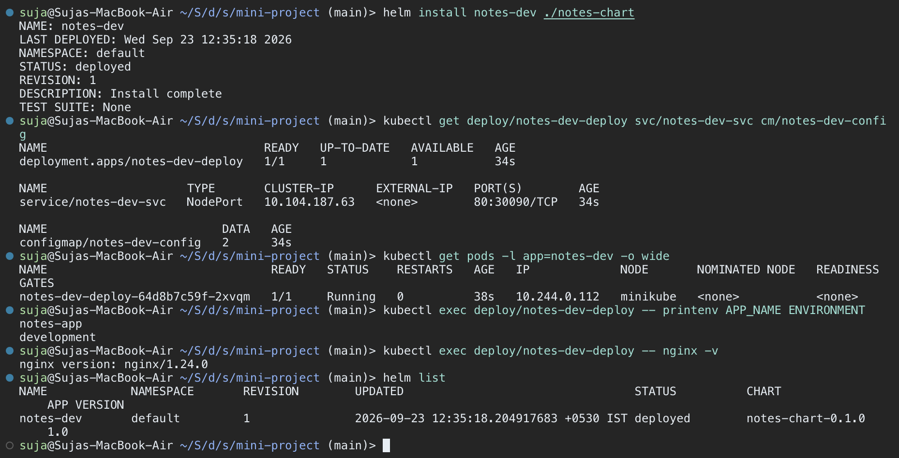

The ConfigMap values reach the container as environment variables through `envFrom`.

### Step 3: Upgrade to production values

```bash
helm upgrade notes-dev ./notes-chart -f notes-chart/values-prod.yaml
kubectl get pods -l app=notes-dev
kubectl get deploy notes-dev-deploy -o wide
kubectl exec deploy/notes-dev-deploy -- printenv APP_NAME ENVIRONMENT
helm get values notes-dev
helm history notes-dev
```

```text
NAME               READY   UP-TO-DATE   AVAILABLE   AGE     CONTAINERS   IMAGES       SELECTOR
notes-dev-deploy   3/3     3            3           4m57s   notes        nginx:1.25   app=notes-dev
notes-app
production
```

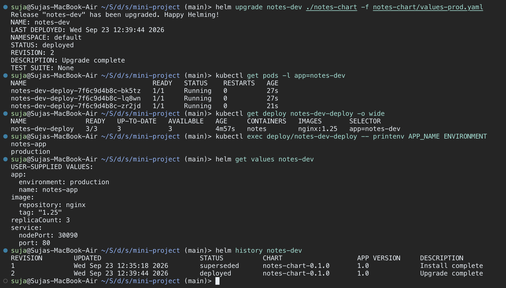

Revision 2 runs 3 replicas of `nginx:1.25` with `ENVIRONMENT=production`. Because the image changed, new pods were created, and those new pods also picked up the updated ConfigMap.

### Step 4: Bad upgrade and rollback

```bash
helm upgrade notes-dev ./notes-chart -f notes-chart/values-prod.yaml --set image.tag=broken-tag-does-not-exist
kubectl get pods -l app=notes-dev
helm rollback notes-dev 2
kubectl get pods -l app=notes-dev
helm history notes-dev
helm status notes-dev | head -n 7
```

```text
NAME                                READY   STATUS         RESTARTS   AGE
notes-dev-deploy-58b9f6d7c4-vx4hc   0/1     ErrImagePull   0          29s
...
Rollback was a success! Happy Helming!
4               Wed Sep 23 12:45:29 2026        deployed        notes-chart-0.1.0       1.0             Rollback to 2
```

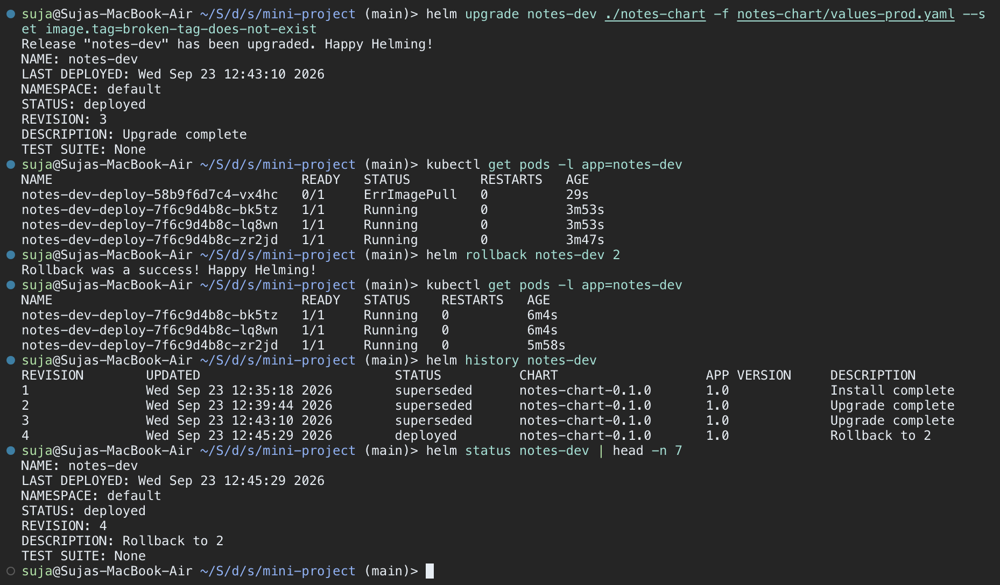

I kept `-f notes-chart/values-prod.yaml` in the bad upgrade so that only the image tag changed. Without it, Helm would also have reverted to the dev defaults. After `helm rollback notes-dev 2`, the broken pod is gone and the 3 production pods are healthy again.

### Step 5: Clean up

```bash
helm uninstall notes-dev
helm list
kubectl get deploy,pods -l app=notes-dev
kubectl get svc/notes-dev-svc cm/notes-dev-config
```

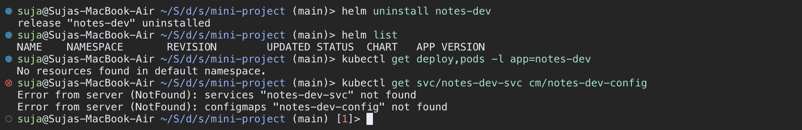

A single `helm uninstall` removed the Deployment, pods, Service and ConfigMap.

---

## Deliverables Checklist

| Deliverable | Location |
|-------------|----------|
| Helm chart (generated) | `02-helm-charts/demo-chart/`, `02-helm-charts/myapp/`, `05-values-yaml/my-app/` |
| Helm charts (hand-written) | `03-chart-structure/simple-chart/`, `06-templates/template-demo/`, `07-install-upgrade/app-chart/`, `09-deploying-application/guestbook-chart/` |
| values.yaml / environment overrides | `05-values-yaml/values.yaml`, `05-values-yaml/values-prod.yaml`, `mini-project/notes-chart/values*.yaml` |
| Templates | `*/templates/` in every chart (Deployment, Service, ConfigMap, helpers, NOTES) |
| Installation | Task 1.3, Task 2 Step 1, Task 3 Step 2 |
| Upgrade | Task 1.5, Task 2 Steps 2–3, Task 3 Step 3 |
| Rollback | Task 1.5, Task 2 Step 4, Task 3 Step 4 |
| Screenshots | `./screenshots/01-…png` to `16-…png` |
| README files | This file plus the topic READMEs `01-` to `09-` and `mini-project/README.md` |
| Mini project | `mini-project/notes-chart/` (Task 3) |

---

## Key Learnings

* **Chart vs release vs revision:** a chart is the package, a release is an installed instance of it, and a revision is one version of that release's history.
* **Value precedence:** `values.yaml` < `-f file` < `--set`. On `helm upgrade`, earlier `--set` values are dropped unless you use `--reuse-values` or pass them again. Keeping environment settings in files (`values-prod.yaml`) is safer and can be reviewed in Git.
* **Rollback never rewrites history:** it adds a new revision that copies an older one, and each revision is stored as a Secret with `owner=helm`.
* **`helm status: deployed` does not mean the pods are healthy:** always verify with `kubectl get pods` / `kubectl rollout status`, or upgrade with `--wait --atomic` so a failed upgrade rolls back automatically.
* **Render before you deploy:** `helm lint` and `helm template` catch most mistakes without touching the cluster.
