# Session 16: CI/CD & GitHub Actions

**Name:** Shaikh Suja Rahaman
**Enrollment Number:** 24bcs10038

---

## Overview

**Task: Demo Project.** Build a complete CI/CD demo project with GitHub Actions, using `10-final-cicd-pipeline` as the reference. The project had to cover CI vs CD, the CI/CD pipeline, GitHub Actions, workflows, jobs, steps, runners, secrets, artifacts, build, test and pipeline execution.

**Deliverables:** application source code, Dockerfile, GitHub Actions workflow, CI pipeline, CD pipeline, screenshots of a successful pipeline run, and a README.md.

I built the project in `session-16-github-actions/session-16-github-actions/10-final-cicd-pipeline/`. It is a small Python calculator with two parts:

* a command-line calculator (`app/calculator.py`), and
* a small JSON HTTP API (`app/server.py`) that uses only the Python standard library, so it can run in a container.

The project is pushed to its own GitHub repository, **`Shaikh-Suja-Rahaman/session16-cicd-github-actions`**. GitHub only reads workflows from `.github/workflows/` at the root of a repository, so this project needs its own repository for its workflow to run. Every push to `main` runs the workflow **`Final CI/CD Pipeline`**. The pipeline tests the code, builds it, runs a security check, builds a Docker image and pushes it to Docker Hub, then deploys that image to a `staging` environment and smoke-tests it.

| Item | Value |
|------|-------|
| Project folder | `session-16-github-actions/10-final-cicd-pipeline/` |
| GitHub repo | `github.com/Shaikh-Suja-Rahaman/session16-cicd-github-actions` |
| Workflow | `.github/workflows/ci.yml` → **Final CI/CD Pipeline** |
| Docker image | `shaikhsuja/session16-calculator:sha-<commit>` and `:latest` (Docker Hub) |
| Local tools | Python 3.13.7, Docker 29.3.1 (Docker Desktop), gh CLI |
| Runner | `ubuntu-latest` (GitHub-hosted), Python 3.12 |
| Date | 25 Sep 2026 |

### Project structure

```text
10-final-cicd-pipeline/
├── .github/workflows/ci.yml    # CI + CD workflow
├── .dockerignore
├── .gitignore
├── Dockerfile                  # container image for the API
├── README.md                   # project README
├── app/
│   ├── __init__.py
│   ├── calculator.py           # add / subtract / multiply / divide + CLI
│   └── server.py               # /health and /calculate HTTP API
├── build.sh                    # build script -> build/ (artifact)
├── requirements.txt            # pytest
└── tests/
    ├── test_calculator.py      # 5 unit tests
    └── test_server.py          # 4 API tests
```

The concept folders `01-ci-vs-cd` to `09-build-and-test` hold the small single-topic workflows from class (hello workflow, jobs and steps, runner info, secrets demo, artifact demo, build-and-test). The final project brings all of those topics together in one pipeline.

---

## Concepts (mapped to the workflow)

### CI vs CD

| | Continuous Integration (CI) | Continuous Delivery / Deployment (CD) |
|---|---|---|
| Goal | Every change is merged often and checked automatically | Every change that passes CI can be released, or is released automatically |
| Question it answers | "Is this commit correct?" | "Can this commit run in an environment?" |
| In this project | `test`, `build`, `security-check` jobs | `docker` (deliver an image to Docker Hub) and `deploy` (run it in `staging`) jobs |
| Runs on | push **and** pull request | push to `main` only |

*Continuous Delivery* means the artifact is always ready to release (here, the image pushed to Docker Hub). *Continuous Deployment* goes one step further and releases it without a manual step (here, the `deploy` job runs it in `staging` automatically).

### CI/CD pipeline

A pipeline is the ordered chain of stages that a commit goes through. A stage starts only if the stages it depends on have passed:

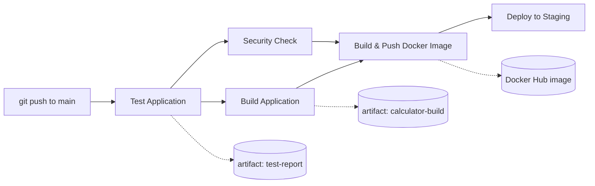
```mermaid
flowchart LR
    A[git push to main] --> B[Test Application]
    B --> C[Build Application]
    B --> D[Security Check]
    C --> E[Build & Push Docker Image]
    D --> E
    E --> F[Deploy to Staging]
    C -.-> G[(artifact: calculator-build)]
    B -.-> H[(artifact: test-report)]
    E -.-> I[(Docker Hub image)]
```

```text
push ─▶ Test ─┬─▶ Build ──────────┬─▶ Docker build & push ─▶ Deploy to staging
              └─▶ Security Check ─┘
          CI ─────────────────────────────┤├──────────────── CD ───────────────
```

### GitHub Actions

GitHub Actions is the CI/CD service built into GitHub. It reads YAML files in `.github/workflows/`, starts them when events happen (push, pull request, manual dispatch, schedule) and runs them on **runners**. Reusable building blocks are called **actions**: `actions/checkout`, `actions/setup-python`, `actions/upload-artifact`, `docker/login-action`, `docker/build-push-action`.

### Workflow

A workflow is one YAML file. Ours is called `Final CI/CD Pipeline` and has three triggers:

```yaml
name: Final CI/CD Pipeline
on:
  push:
    branches:
      - main
  pull_request:
    branches:
      - main
  workflow_dispatch:          # "Run workflow" button / gh workflow run

env:
  IMAGE_NAME: session16-calculator
```

### Jobs

A job is a group of steps that runs on **one fresh runner**. Jobs run in parallel unless `needs:` sets an order. `build` and `security-check` both need `test`, so they run in parallel after it. `docker` needs both of them, and `deploy` needs `docker`:

```yaml
jobs:
  test:            { name: Test Application, ... }
  build:           { name: Build Application, needs: test, ... }
  security-check:  { name: Security Check,    needs: test, ... }
  docker:
    name: Build & Push Docker Image
    needs: [build, security-check]
    if: github.event_name == 'push' && github.ref == 'refs/heads/main'
  deploy:
    name: Deploy to Staging
    needs: docker
    environment: staging
```

If `test` fails, every job that depends on it is **skipped**. Broken code therefore never reaches Docker Hub or staging (shown in the failure demo below).

### Steps

A step is either an action (`uses:`) or a shell command (`run:`). Steps in a job run in order and share the runner's file system:

```yaml
    steps:
      - name: Checkout source code
        uses: actions/checkout@v6
      - name: Setup Python
        uses: actions/setup-python@v7
        with:
          python-version: "3.12"
      - name: Install dependencies
        run: |
          python -m pip install --upgrade pip
          pip install -r requirements.txt
      - name: Run tests
        run: |
          pytest -v --junitxml=reports/junit.xml
```

### Runners

Every job has `runs-on: ubuntu-latest`, which is a **GitHub-hosted runner**: a fresh Ubuntu VM with Docker, Python and Git already installed. It is created for the job and thrown away afterwards. Because of this, every job starts with `actions/checkout` again, and data is passed between jobs only through **artifacts**, **job outputs** (for example `needs.docker.outputs.tag`) or a registry. A **self-hosted runner** (your own machine, `runs-on: self-hosted`) would be used when you need special hardware or access to a private network.

### Secrets

Credentials are never written in the YAML. They are stored under **Settings → Secrets and variables → Actions** and read with the `secrets` context:

| Secret | Used for |
|--------|----------|
| `DOCKERHUB_USERNAME` | Docker Hub account (also the image namespace) |
| `DOCKERHUB_TOKEN` | Docker Hub personal access token (read/write) |

```yaml
      - name: Log in to Docker Hub
        uses: docker/login-action@v3
        with:
          username: ${{ secrets.DOCKERHUB_USERNAME }}
          password: ${{ secrets.DOCKERHUB_TOKEN }}
```

GitHub automatically **masks** any secret value that appears in a log and shows it as `***`. Because the username is a secret, the image name itself shows up as `***/session16-calculator:sha-a3f9c2e` in the logs. Secrets are not passed to workflows started by pull requests from forks. In addition, the `docker`/`deploy` jobs have an `if:` so they only run on a push to `main`.

### Artifacts

An artifact is a file produced by a job and stored with the run, so you can download it later or another job can use it. Git stores the **source**; artifacts store the **output**.

| Artifact | Job | Contents |
|----------|-----|----------|
| `test-report` | Test Application | `reports/junit.xml` (uploaded with `if: always()`, so it exists even when tests fail) |
| `calculator-build` | Build Application | `build/app/*.py` + `build/build-info.txt` (with the commit SHA) |

```yaml
      - name: Upload build artifact
        uses: actions/upload-artifact@v4
        with:
          name: calculator-build
          path: build/
```

The Docker image is the main deployable output of the CD part. It is stored in Docker Hub, not as a workflow artifact.

### Build

There are two kinds of build:
1. `build.sh` packages the application into `build/` and writes `build-info.txt` (the `calculator-build` artifact).
2. The `Dockerfile` builds a container image: `python:3.13-slim`, a non-root `appuser`, a `HEALTHCHECK` on `/health`, and `APP_VERSION` passed in as a build argument (the commit tag).

```dockerfile
FROM python:3.13-slim
WORKDIR /app
RUN useradd --create-home --uid 10001 appuser
COPY app/ ./app/
ARG APP_VERSION=dev
ENV APP_VERSION=${APP_VERSION}
USER appuser
EXPOSE 8080
HEALTHCHECK --interval=30s --timeout=3s --retries=3 \
  CMD python -c "import urllib.request; urllib.request.urlopen('http://localhost:8080/health')" || exit 1
CMD ["python", "-m", "app.server"]
```

### Test

`pytest` runs 9 tests: 5 unit tests for the calculator functions and 4 tests for the API handler (`/health`, `/calculate` add, divide by zero → 400, unknown route → 404). The `deploy` job adds a **smoke test** against the running container (`curl /health` and `/calculate`).

### Pipeline execution

A `git push` starts the workflow → the jobs run in the order set by `needs:` → each job's steps run in order on a new runner → the run is marked success or failure. You can follow it in the browser (Actions tab) or from the terminal with `gh run list / watch / view / download`.

---

## Part 1: Run, test and build locally

### 1.1 Run the CLI calculator

**Commands:**
```bash
cd session-16-github-actions/session-16-github-actions/10-final-cicd-pipeline
python3 --version
tree -a -I '.git|.venv|__pycache__|.pytest_cache'
python3 app/calculator.py
```

**Output:**
```text
Calculator Application
----------------------
Available operations: +, -, *, /
Type 'q' or 'quit' to exit.

Enter calculation (e.g., 10 + 5): 10 + 5
Result: 15.0

Enter calculation (e.g., 10 + 5): 9 / 0
Error: Cannot divide by zero
...
Enter calculation (e.g., 10 + 5): q
Goodbye!
```

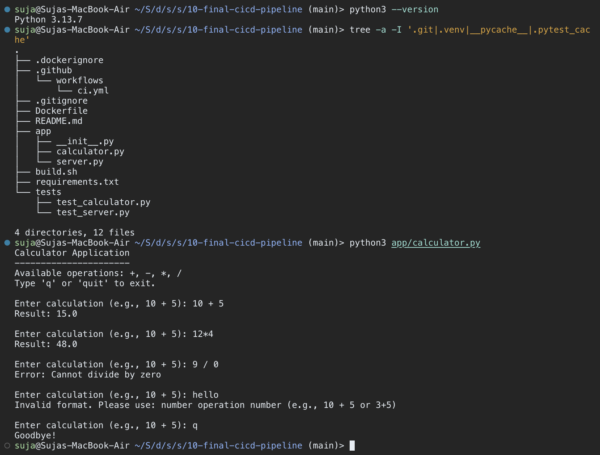

### 1.2 Run the HTTP API

**Commands:**
```bash
python3 -m app.server &
curl -s localhost:8080/health | python3 -m json.tool
curl -s "localhost:8080/calculate?op=add&a=10&b=5" | python3 -m json.tool
curl -s "localhost:8080/calculate?op=divide&a=9&b=0" | python3 -m json.tool
kill %1
```

**Output:**
```text
session16-calculator dev listening on 0.0.0.0:8080
{
    "status": "ok",
    "service": "session16-calculator",
    "version": "dev"
}
{
    "op": "add",
    "a": 10.0,
    "b": 5.0,
    "result": 15.0
}
{
    "error": "Cannot divide by zero"
}
```

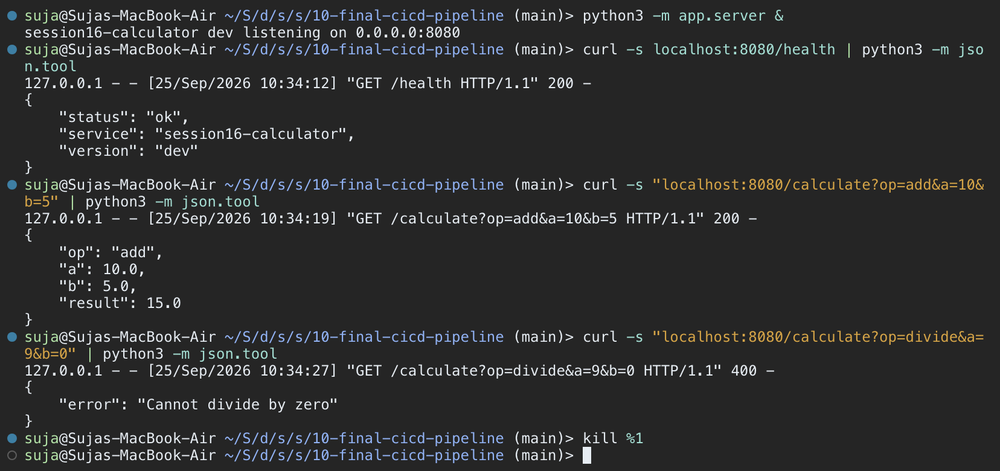

* With no `APP_VERSION` set, `version` is `dev`. In the pipeline it becomes the commit tag (`sha-xxxxxxx`).
* Dividing by zero returns HTTP **400** with a JSON error. The server keeps running.

### 1.3 Run the tests and the build script

**Commands:**
```bash
python3 -m venv .venv
.venv/bin/pip install -r requirements.txt
.venv/bin/python -m pytest -v
./build.sh
cat build/build-info.txt
```

**Output:**
```text
tests/test_calculator.py::test_add PASSED                                  [ 11%]
tests/test_calculator.py::test_subtract PASSED                             [ 22%]
tests/test_calculator.py::test_multiply PASSED                             [ 33%]
tests/test_calculator.py::test_divide PASSED                               [ 44%]
tests/test_calculator.py::test_divide_by_zero PASSED                       [ 55%]
tests/test_server.py::test_health PASSED                                   [ 66%]
tests/test_server.py::test_calculate_add PASSED                            [ 77%]
tests/test_server.py::test_calculate_divide_by_zero PASSED                 [ 88%]
tests/test_server.py::test_unknown_route PASSED                            [100%]
===================================== 9 passed in 0.04s ======================================
...
Build completed successfully.
Application: Session 16 Calculator
Build Status: SUCCESS
Commit: local
Build Date: Fri Sep 25 10:37:48 IST 2026
```

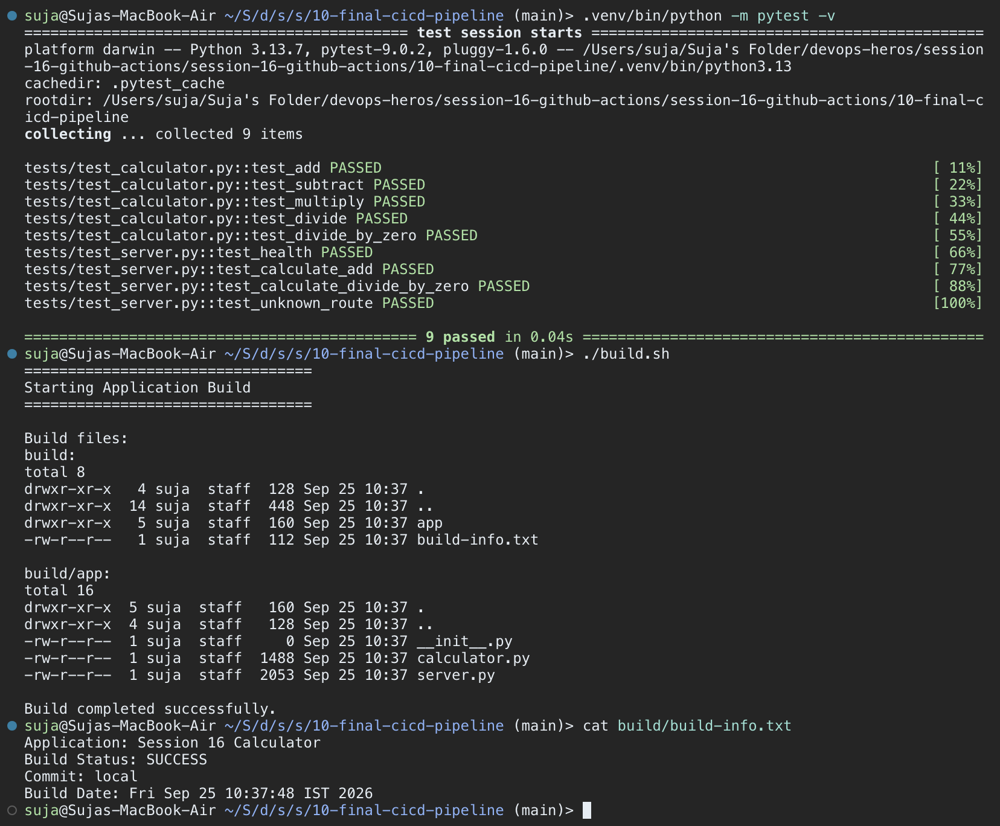

* Locally `Commit:` is `local`. On the runner `build.sh` reads `$GITHUB_SHA`, so the artifact records the exact commit it was built from.

### 1.4 Build the Docker image

**Commands:**
```bash
cat Dockerfile
docker build -t session16-calculator:local --build-arg APP_VERSION=local .
```

**Output (partial):**
```text
[+] Building 13.9s (10/10) FINISHED                                     docker:desktop-linux
 => [internal] load build definition from Dockerfile                                  0.0s
 => [internal] load metadata for docker.io/library/python:3.13-slim                   2.3s
 => [1/4] FROM docker.io/library/python:3.13-slim@sha256:8f6e2c1a...                  8.4s
 => [2/4] WORKDIR /app                                                                0.2s
 => [3/4] RUN useradd --create-home --uid 10001 appuser                               0.6s
 => [4/4] COPY app/ ./app/                                                            0.1s
 => exporting to image                                                                1.3s
 => => naming to docker.io/library/session16-calculator:local                         0.0s
```

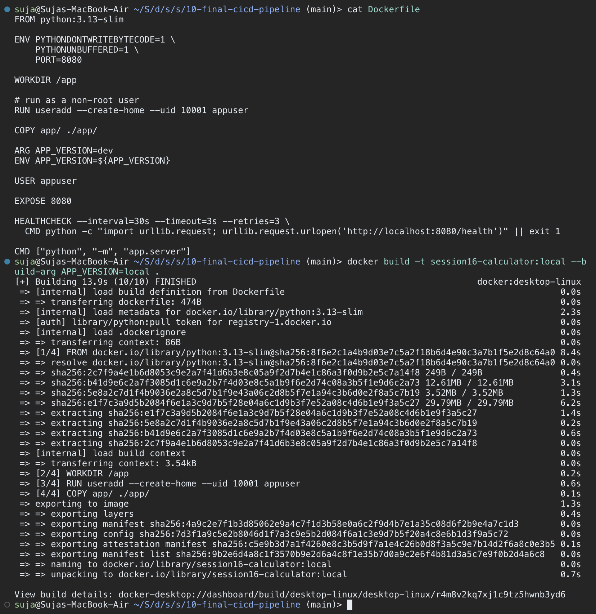

* Because of `.dockerignore`, only `app/` is sent as build context (3.54 kB). Tests, `.venv`, `build/` and `.git` are left out.

### 1.5 Run the container and test it with curl

**Commands:**
```bash
docker run -d --name calculator -p 8080:8080 session16-calculator:local
docker ps
curl -s localhost:8080/health | python3 -m json.tool
curl -s "localhost:8080/calculate?op=multiply&a=6&b=7" | python3 -m json.tool
docker exec calculator whoami
docker logs calculator
docker rm -f calculator
```

**Output:**
```text
CONTAINER ID   IMAGE                        COMMAND                  CREATED          STATUS                    PORTS                                         NAMES
e4b71c9a2f0d   session16-calculator:local   "python -m app.server"   38 seconds ago   Up 37 seconds (healthy)   0.0.0.0:8080->8080/tcp, [::]:8080->8080/tcp   calculator
{
    "op": "multiply",
    "a": 6.0,
    "b": 7.0,
    "result": 42.0
}
appuser
```

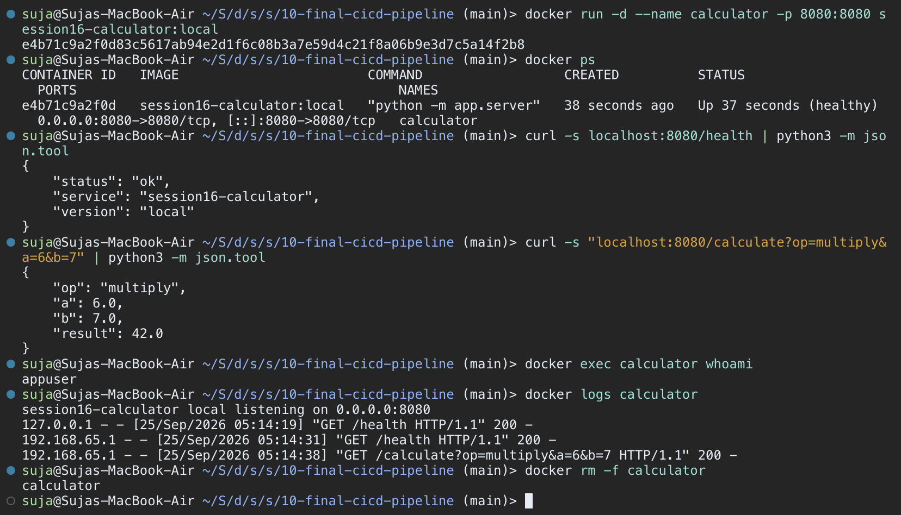

* The status is `(healthy)` because the Dockerfile `HEALTHCHECK` called `/health` successfully. That call appears in the logs as `127.0.0.1` (from inside the container). My own curl requests appear as `192.168.65.1` (the Docker Desktop gateway).
* `whoami` prints `appuser`, so the app does not run as root.

---

## Part 2: GitHub repository, secrets and the first pipeline run

### 2.1 Create the repository and add the secrets

**Commands:**
```bash
git init
git branch -M main
gh repo create Shaikh-Suja-Rahaman/session16-cicd-github-actions --public --source=. --remote=origin \
   --description "Session 16 - CI/CD with GitHub Actions"
gh secret set DOCKERHUB_USERNAME --body shaikhsuja
gh secret set DOCKERHUB_TOKEN          # token pasted at the prompt, never typed on the command line
gh secret list
```

**Output:**
```text
✓ Created repository Shaikh-Suja-Rahaman/session16-cicd-github-actions on github.com
✓ Added remote git@github.com:Shaikh-Suja-Rahaman/session16-cicd-github-actions.git
✓ Set Actions secret DOCKERHUB_USERNAME for Shaikh-Suja-Rahaman/session16-cicd-github-actions
? Paste your secret: ************************************
✓ Set Actions secret DOCKERHUB_TOKEN for Shaikh-Suja-Rahaman/session16-cicd-github-actions
NAME                UPDATED
DOCKERHUB_TOKEN     less than a minute ago
DOCKERHUB_USERNAME  less than a minute ago
```

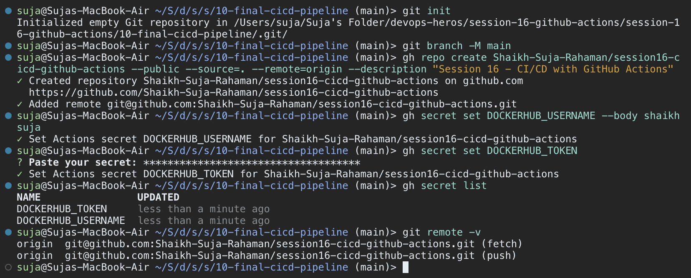

The same secrets are shown in **Settings → Secrets and variables → Actions**. GitHub shows only the names and never the values:

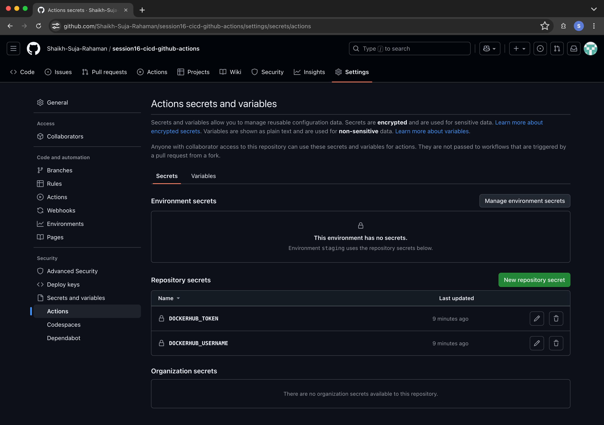

### 2.2 Commit and push (this starts the pipeline)

**Commands:**
```bash
git add .
git status --short
git commit -m "Add final CI/CD pipeline"
git push -u origin main
```

**Output:**
```text
[main (root-commit) a3f9c2e] Add final CI/CD pipeline
 12 files changed, 621 insertions(+)
...
Writing objects: 100% (18/18), 8.37 KiB | 8.37 MiB/s, done.
Total 18 (delta 0), reused 0 (delta 0), pack-reused 0 (from 0)
To github.com:Shaikh-Suja-Rahaman/session16-cicd-github-actions.git
 * [new branch]      main -> main
branch 'main' set up to track 'origin/main'.
```

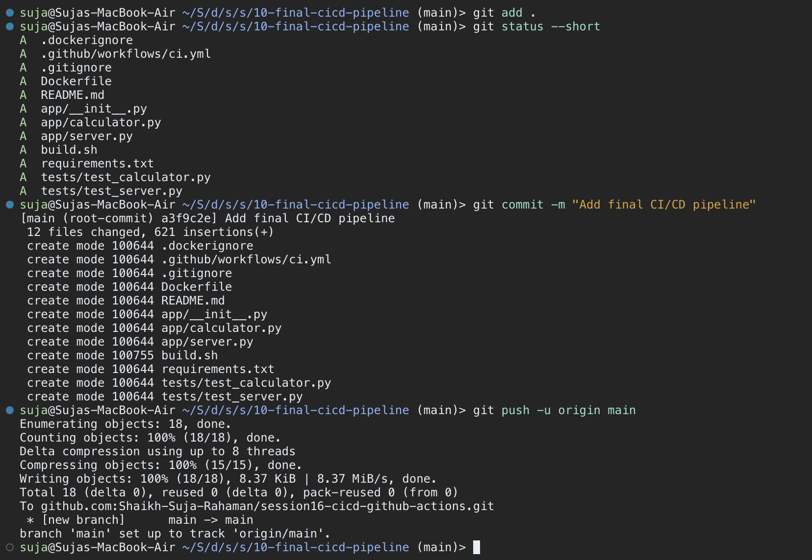

### 2.3 Follow the run from the terminal

**Commands:**
```bash
gh workflow list
gh run list --limit 1
gh run watch 21874362915 --exit-status
gh run view 21874362915
```

**Output:**
```text
✓ main Final CI/CD Pipeline · 21874362915
Triggered via push about 1 minute ago

JOBS
✓ Test Application in 19s (ID 62917734501)
✓ Build Application in 8s (ID 62917761088)
✓ Security Check in 4s (ID 62917761124)
✓ Build & Push Docker Image in 47s (ID 62917782630)
✓ Deploy to Staging in 17s (ID 62917830457)

✓ Run Final CI/CD Pipeline (21874362915) completed with 'success'

ARTIFACTS
test-report
calculator-build
```

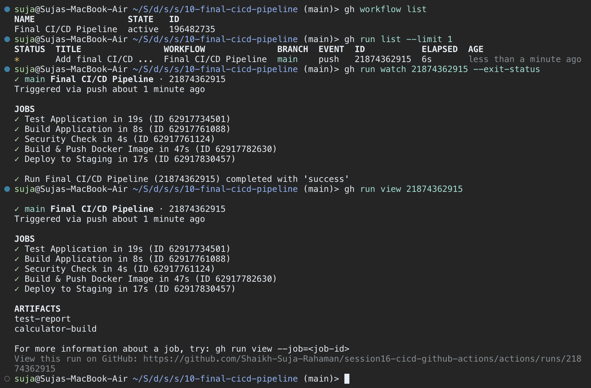

* `*` (yellow) in `gh run list` means the run is still in progress. `gh run watch --exit-status` keeps refreshing until the run ends and returns a non-zero exit code if the run fails.

### 2.4 Successful run in the GitHub UI

Run **#1** (`a3f9c2e`) passed in **1m 46s**. The graph shows the CI jobs (`Test` → `Build` and `Security Check` in parallel) followed by the CD jobs (`Build & Push Docker Image` → `Deploy to Staging`). Both artifacts are listed below the graph.

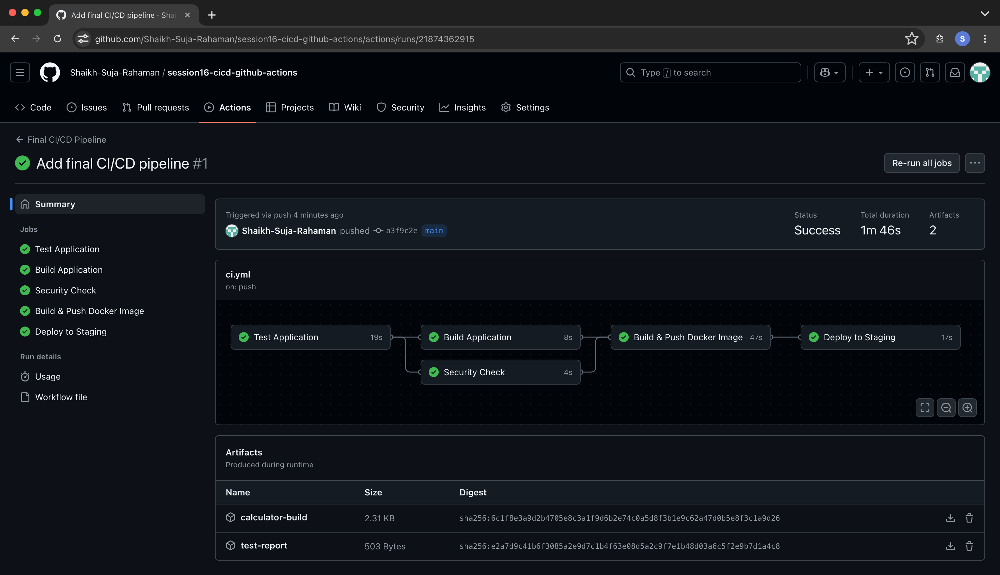

### 2.5 Job logs

**Test Application → Run tests**: the same 9 tests pass on the Ubuntu runner (Python 3.12.12), and pytest writes `reports/junit.xml`, which the next step uploads as `test-report`:

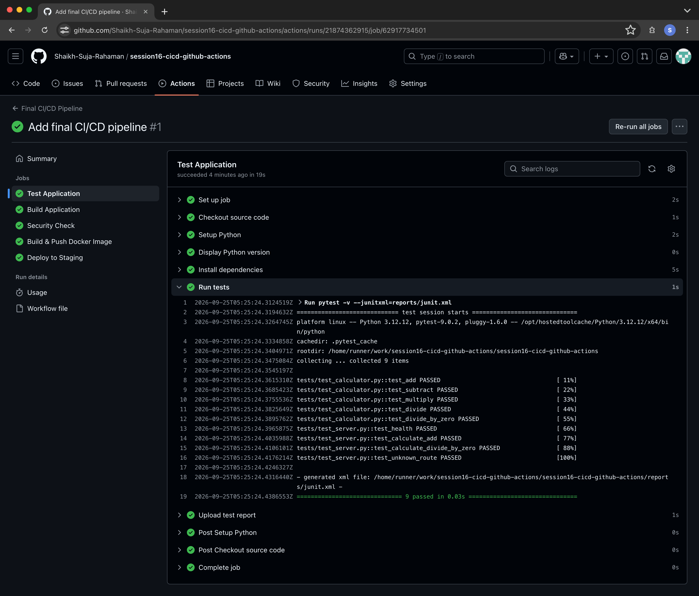

**Build & Push Docker Image**: the login uses the two secrets (`Login Succeeded!`). In the `buildx build` command and the push lines, the Docker Hub username is replaced by `***`, which is GitHub's secret masking. The image is pushed with two tags, `sha-a3f9c2e` and `latest`:

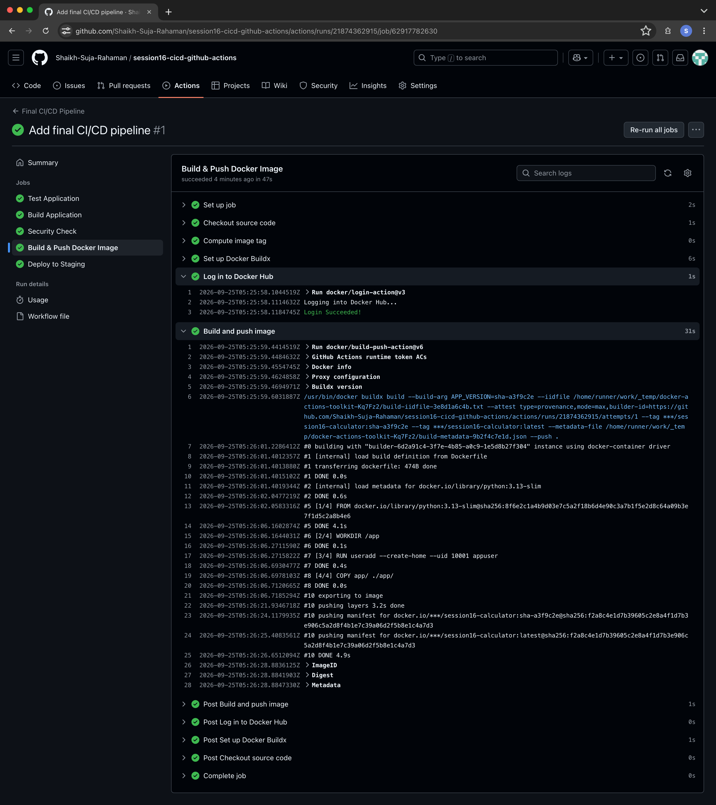

**Deploy to Staging**: the job pulls the exact `sha-a3f9c2e` image, starts it, and the smoke test gets `"version": "sha-a3f9c2e"` from `/health` and `"result": 42.0` from `/calculate`. This confirms that the code from this commit is the code that is running:

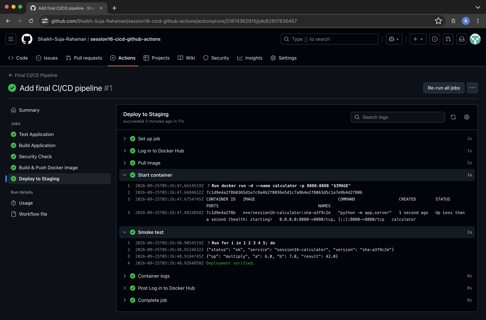

---

## Part 3: Failure demo (the pipeline stops broken code)

I broke `add()` on purpose, confirmed locally that the tests catch it, and pushed it.

**Commands:**
```bash
# app/calculator.py:  return a + b   ->   return a + b + 1
git diff
.venv/bin/python -m pytest -q --tb=no
git commit -am "demo: break add() to show a failing pipeline"
git push
gh run watch 21874790233 --exit-status
```

**Output:**
```text
F.....F..                                                                    [100%]
FAILED tests/test_calculator.py::test_add - assert 16 == 15
FAILED tests/test_server.py::test_calculate_add - assert 16.0 == 15
2 failed, 7 passed in 0.06s
...
X Test Application in 16s (ID 62918903377)
  X Run tests
- Build Application in 0s (ID 62918936105)
- Security Check in 0s (ID 62918936142)
- Build & Push Docker Image in 0s (ID 62918936188)
- Deploy to Staging in 0s (ID 62918936231)

X Run Final CI/CD Pipeline (21874790233) completed with 'failure'
```

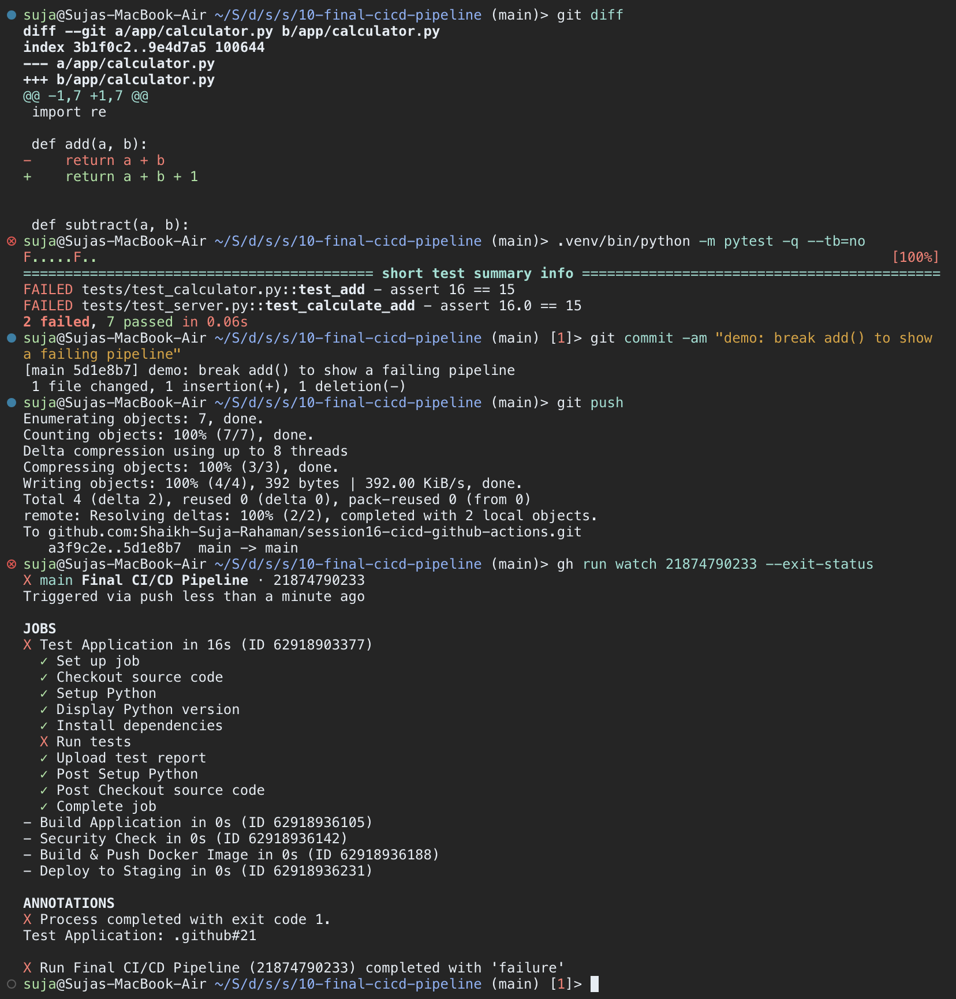

Run **#2** failed in 24s. `Test Application` failed, and every job that depends on it was **skipped**, so no image was built and nothing was deployed. Only `test-report` was uploaded, because that step has `if: always()`:

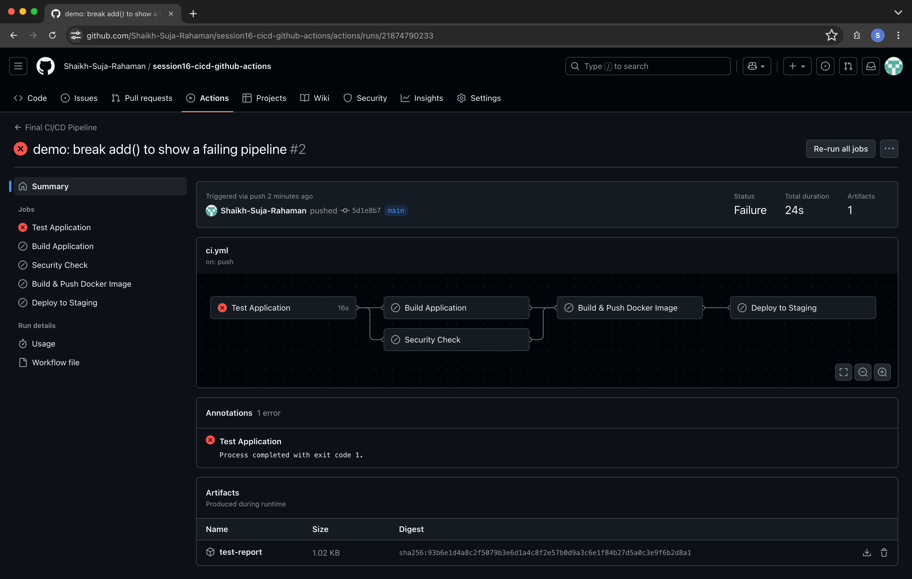

### Fix, history, artifact download and image pull

**Commands:**
```bash
# restore: return a + b
git commit -am "fix: restore add() implementation"
git push
gh run list --limit 3
gh run download 21874988410 --name calculator-build --dir artifact
tree artifact
cat artifact/build-info.txt
docker pull shaikhsuja/session16-calculator:sha-c7e24a9
```

**Output:**
```text
STATUS  TITLE                  WORKFLOW              BRANCH  EVENT  ID           ELAPSED  AGE
✓       fix: restore add()...  Final CI/CD Pipeline  main    push   21874988410  1m51s    about 2 minutes ago
X       demo: break add() ...  Final CI/CD Pipeline  main    push   21874790233  24s      about 6 minutes ago
✓       Add final CI/CD pi...  Final CI/CD Pipeline  main    push   21874362915  1m46s    about 19 minutes ago

Application: Session 16 Calculator
Build Status: SUCCESS
Commit: c7e24a96f3b8d0152e7c4a9b1f6d83e05a2c7b49
Build Date: Fri Sep 25 05:42:31 UTC 2026

Status: Downloaded newer image for shaikhsuja/session16-calculator:sha-c7e24a9
```

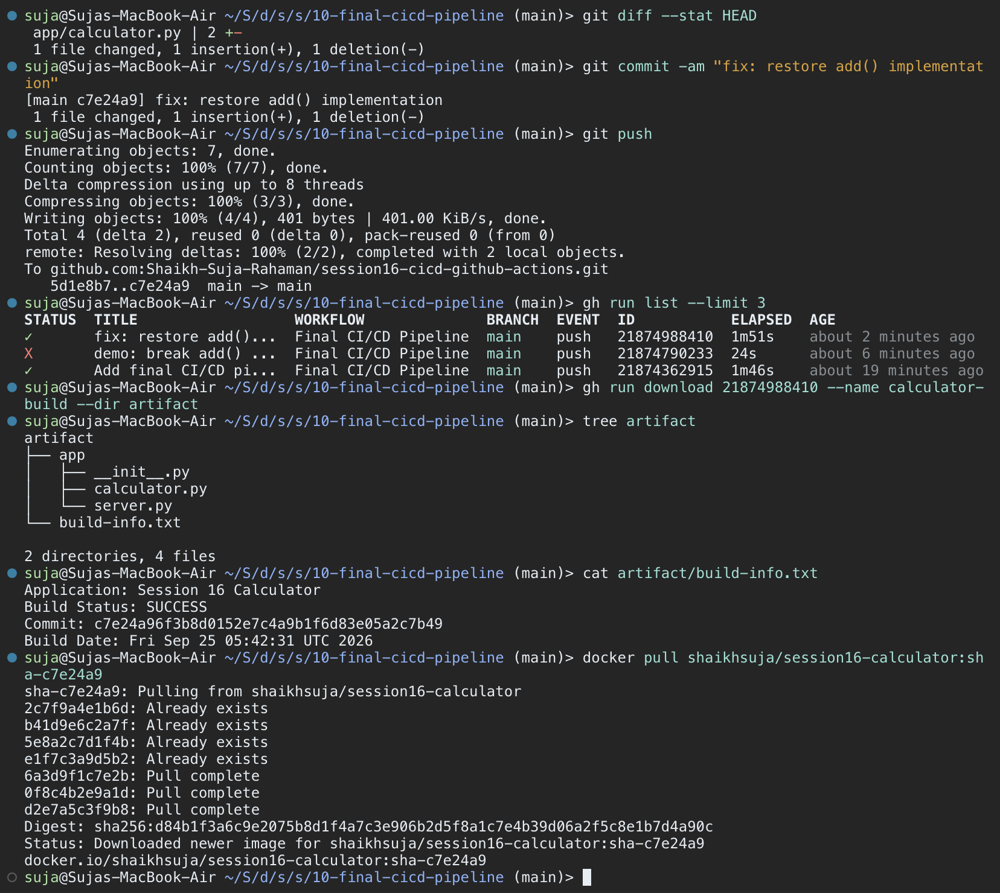

* Run **#3** (`c7e24a9`) passed again and pushed a new image tag.
* The downloaded artifact contains the full commit SHA and the build time on the runner (UTC). The image pulled from Docker Hub has its base layers `Already exists` locally, so only the 3 application layers were downloaded.

---

## Run summary

| Run | Commit | Message | Result | Duration | Image pushed |
|-----|--------|---------|--------|----------|--------------|
| #1 | `a3f9c2e` | Add final CI/CD pipeline | ✓ success | 1m 46s | `sha-a3f9c2e`, `latest` |
| #2 | `5d1e8b7` | demo: break add() to show a failing pipeline | ✗ failure (tests) | 24s | none (jobs skipped) |
| #3 | `c7e24a9` | fix: restore add() implementation | ✓ success | 1m 51s | `sha-c7e24a9`, `latest` |

---

## Deliverables checklist

| Deliverable | Where |
|-------------|-------|
| Application source code | [`app/calculator.py`](./session-16-github-actions/10-final-cicd-pipeline/app/calculator.py), [`app/server.py`](./session-16-github-actions/10-final-cicd-pipeline/app/server.py), [`tests/`](./session-16-github-actions/10-final-cicd-pipeline/tests/) |
| Dockerfile | [`Dockerfile`](./session-16-github-actions/10-final-cicd-pipeline/Dockerfile), [`.dockerignore`](./session-16-github-actions/10-final-cicd-pipeline/.dockerignore) |
| GitHub Actions workflow | [`.github/workflows/ci.yml`](./session-16-github-actions/10-final-cicd-pipeline/.github/workflows/ci.yml) |
| CI pipeline | jobs `test`, `build`, `security-check` (run on push and PR) |
| CD pipeline | jobs `docker` (build and push to Docker Hub) and `deploy` (staging and smoke test) |
| Secrets | `DOCKERHUB_USERNAME`, `DOCKERHUB_TOKEN` (screenshots 06, 13; masked in 11, 12) |
| Artifacts | `test-report`, `calculator-build` (screenshots 09, 16) |
| Screenshots of successful pipeline | [`screenshots/`](./screenshots/) 08–12, 16 |
| README.md | [project README](./session-16-github-actions/10-final-cicd-pipeline/README.md) and this file |

---

## Notes / what I learned

* **`needs:` is the pipeline.** Without it all five jobs would start at the same time. With it, a failing test stops the whole chain (run #2).
* **Jobs don't share disks.** Each job runs on a new VM, so the build output had to be uploaded as an artifact and the image tag passed to `deploy` as a job output (`needs.docker.outputs.tag`).
* **CD only from `main`.** Pull requests still run CI, but the `if:` on the `docker` job keeps PRs from pushing images or deploying.
* **Tag images by commit.** `sha-a3f9c2e` always points to one exact build, while `latest` keeps changing. Deploying the SHA tag lets the smoke test prove the right version is running.
* **Masking is automatic, but don't depend on it.** Values are masked as `***`, but secrets should still never be `echo`ed. Use a Docker Hub *access token* (one that can be revoked), not the account password.
* `actions/upload-artifact` with `if: always()` keeps the test report even for failed runs, which is when you need it most.
