# Session 10: Kubernetes Core Objects & Deployments
**Author:** Suja Rahaman
**Course:** SST DevOps & Cloud [SWE]
**Session:** 10 - Kubernetes Core Objects
**Repository:** devops-heros / session10-k8s-core-objects

---

### Task 1: Cluster Health Verification & Baseline Environment Checks
**Description:** Verify that the local Kubernetes cluster control plane, DNS components, and worker nodes are operational prior to workload deployments.

**Expected Terminal Output:**
```
Kubernetes control plane is running at https://127.0.0.1:52554
CoreDNS is running at https://127.0.0.1:52554/api/v1/namespaces/kube-system/services/kube-dns:dns/proxy

NAME                   STATUS   ROLES           AGE   VERSION
demo-cluster-control   Ready    control-plane   6d    v1.29.1
demo-cluster-worker    Ready    <none>          6d    v1.29.1
```

**Screenshot:**
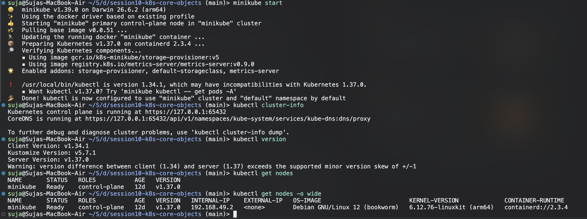

---

### Task 2: Standard Pod Deployment, Extended Inspection & Teardown
**Description:** Create an individual Pod running Nginx, inspect its labels, runtime IP, node assignment, and container logs, then cleanly delete it.

**Screenshot:**
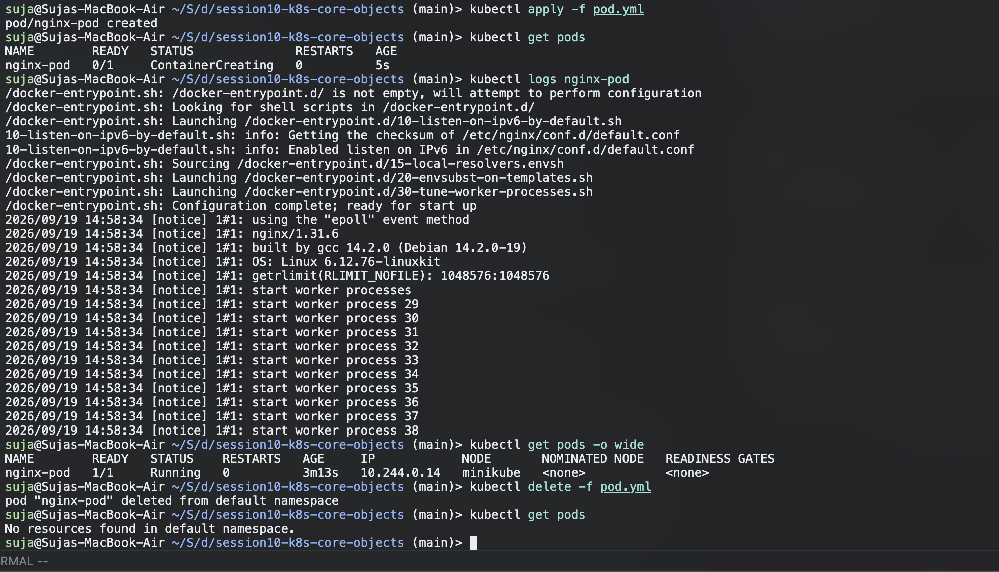

---

### Task 3: Error State Simulation — `ErrImagePull` & `ImagePullBackOff`
**Description:** Demonstrate Kubernetes error handling when pulling a non-existent container image, observing the exponential backoff loop.

**Screenshot:**
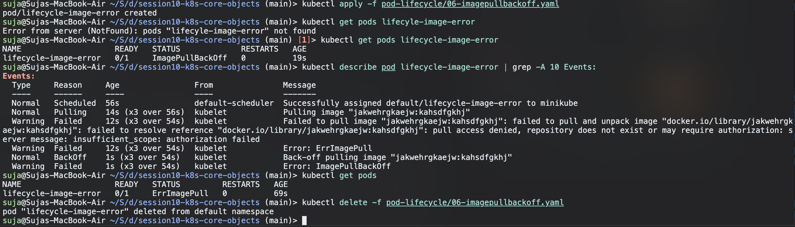

---

### Task 4: Capturing Transient Pod Lifecycle Stages
**Description:** Deploy a batch execution container (`busybox`) configured with `restartPolicy: Never` and capture all three lifecycle states in real time.

**Screenshot:**
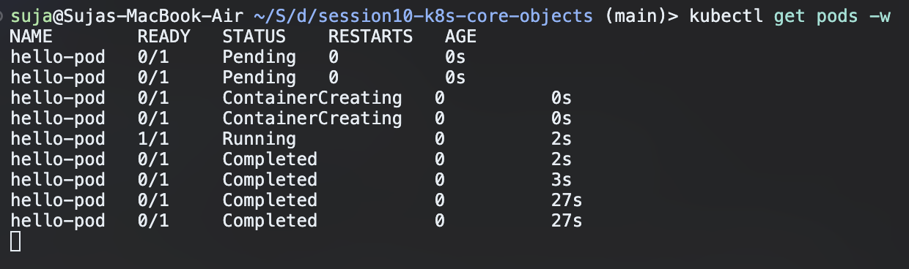

---

### Task 5: Exhaustive Pod Lifecycle States & Probes Lab
**Description:** Navigate to `session10-k8s-core-objects/pod-lifecycle/` and validate core lifecycle states, health checks, multi-container pods, and graceful termination.

**Screenshots:**
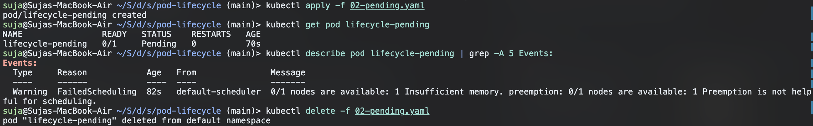
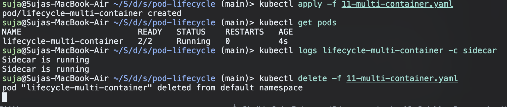

---

### Task 6: Core Controller Objects Exploration (ReplicaSet & StatefulSet)
**Description:** Deploy self-healing stateless replication via a ReplicaSet and predictable stateful storage via a StatefulSet.

**Screenshot:**
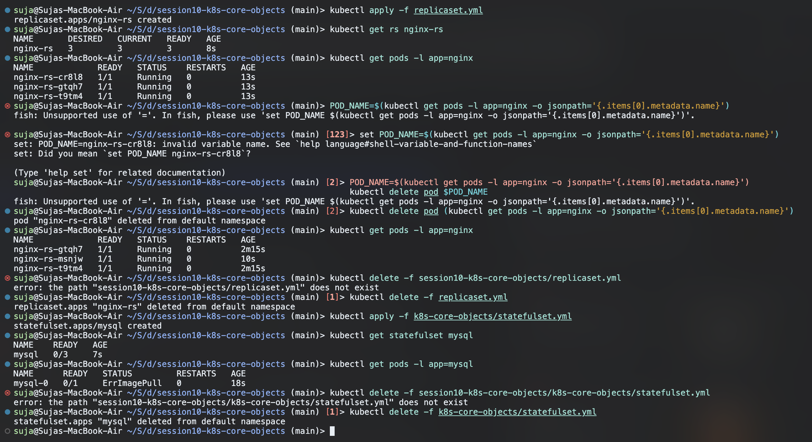

---

### Task 7: DaemonSet Architecture & Host Agent Deployment
**Description:** Deploy a host agent DaemonSet (`node-exporter`), demonstrating that exactly one pod runs on each eligible cluster node.

**Screenshot:**
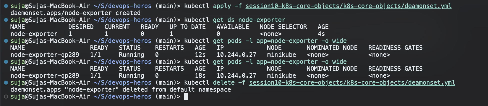

---

### Task 8: Deployment Upgrades, Rolling Updates & Instant Rollbacks
**Description:** Demonstrate declarative zero-downtime rolling updates using `maxSurge: 1` and `maxUnavailable: 0`, and execute an immediate rollback.

**Screenshot:**
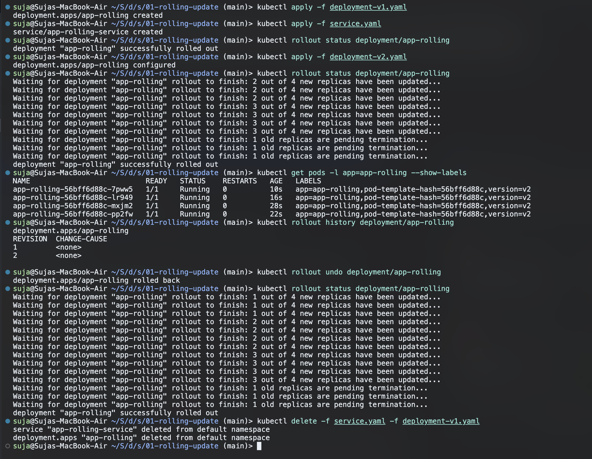

---

### Task 9: Real-World Troubleshooting Scenarios Lab
**Description:** Resolve an in-flight rollout failure caused by an unresolvable image tag, and debug an API server rejection caused by an immutable selector label mismatch.

**Screenshot:**
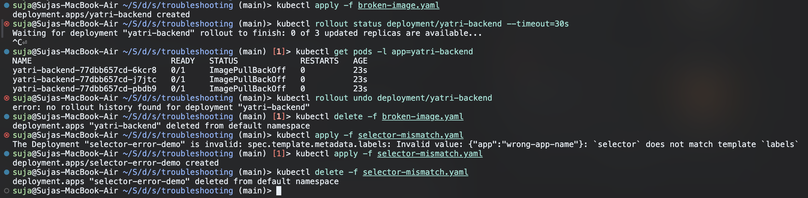

---

### Task 10: Theoretical & Architectural Conceptual Writeup
**1. The 4 Ports Clarified:**
* `containerPort`: Port opened inside the application container process (informational in PodSpec).
* `targetPort`: Port on the backend pod where the Kubernetes Service routes incoming traffic.
* `port`: Port exposed internally by the Kubernetes Service (ClusterIP).
* `nodePort`: Static high port (`30000–32767`) exposed across every worker node's external IP.

**2. Labels vs. Selectors:**
* **Labels**: Key-value pairs attached to objects (e.g., `app: nginx`, `env: prod`) for metadata identification.
* **Selectors**: Query filters used by controllers (Deployments, Services) to group and route to matching labelled pods.

**3. The 4 Deployment Strategies:**
* **RollingUpdate**: Progressively replaces old pods with new pods; zero downtime.
* **Recreate**: Kills all v1 pods before starting any v2 pods; causes brief downtime, but avoids version conflicts.
* **Blue-Green**: Deploys two complete environments (Blue=Live, Green=New); cutover and rollback happen instantly via service selector flip. Requires 2x compute capacity.
* **Canary**: Deploys a small fraction of v2 pods (e.g., 10%) alongside v1 stable pods to validate real-world production metrics prior to full rollout.

**4. `maxSurge` vs. `maxUnavailable` Math:**
* For `replicas: 4`, `maxSurge: 1`, `maxUnavailable: 0`:
    * Max allowed pods during rollout: 4 + 1 = 5.
    * Min available pods: 4 - 0 = 4 (Guarantees 100% service capacity throughout rollout).

**5. Resource Requests vs. Limits & Units:**
* **Requests**: Guaranteed minimum CPU/memory allocated by the scheduler to place the pod on a node.
* **Limits**: Maximum ceiling enforced by Linux cgroups. CPU throttling occurs if CPU limit is exceeded; container is OOM-killed if memory limit is exceeded.
* **Units**: 1 GB = 10^9 bytes (decimal, SI); 1 GiB = 2^30 bytes = 1,073,741,824 bytes (binary, IEC). Kubernetes uses mebibytes (`Mi`) and gibibytes (`Gi`).

---

### Task 11: Blue-Green Deployment Execution & Instant Selector Cutover
**Description:** Deploy the Blue and Green deployments side-by-side. Validate that traffic is initially 100% Blue, flip the Service label selector to point to Green, observe the instantaneous change in `Endpoints`, and execute an immediate rollback.

**Expected Terminal Output:**
```
# Before switch:
Selector:   app=myapp,slot=blue
<p>BLUE ENVIRONMENT</p>

# After switch:
service/myapp-service configured
Selector:   app=myapp,slot=green
<p>GREEN ENVIRONMENT</p>
```

**Screenshot:**
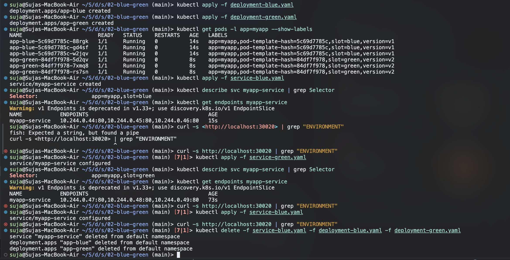

---

### Task 12: Canary Deployment Execution & Pod-Ratio Traffic Splitting
**Description:** Deploy a 9-replica stable deployment and a 1-replica canary deployment under the same Service. Run a curl loop to capture the approximate 10% canary traffic ratio, scale the canary to increase traffic share, and execute a rollback by scaling the canary to zero.

**Expected Terminal Output:**
```
STABLE v1
STABLE v1
STABLE v1
CANARY v2    <-- Canary absorbs ~10% of total incoming requests
STABLE v1
STABLE v1
STABLE v1
STABLE v1
STABLE v1
STABLE v1
```

**Screenshot:**
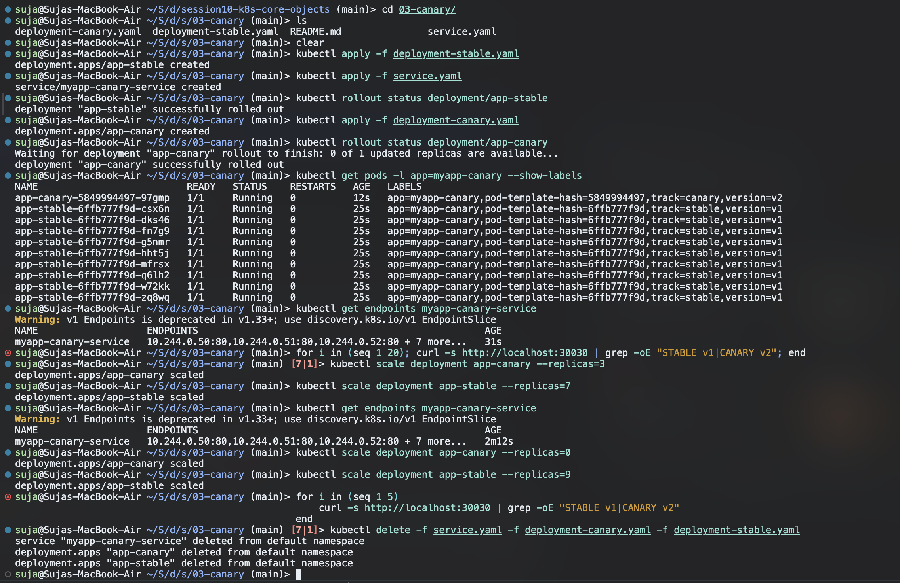

---

### Task 13: Recreate Deployment Execution & Downtime Outage Demonstration
**Description:** Deploy an application with `strategy.type: Recreate`. Stream live requests during an update to observe and capture the intentional downtime window where 0 pods exist between v1 termination and v2 creation.

**Expected Terminal Output:**
```
VERSION: v1
VERSION: v1
[OUTAGE] Connection refused / 0 pods alive
[OUTAGE] Connection refused / 0 pods alive
[OUTAGE] Connection refused / 0 pods alive
VERSION: v2 (UPGRADED)
VERSION: v2 (UPGRADED)
```

**Screenshot:**
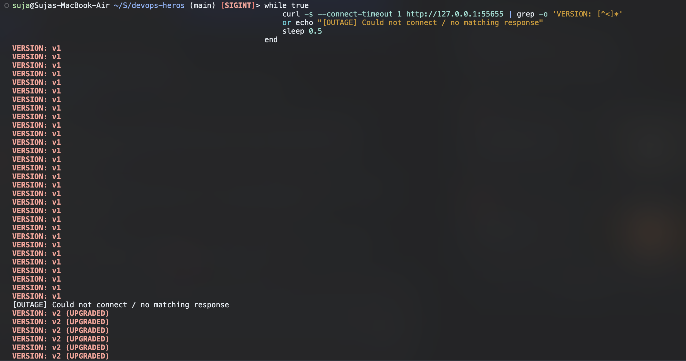
