# Session 18: Terraform & Infrastructure as Code

**Name:** Shaikh Suja Rahaman
**Enrollment Number:** 24bcs10038

---

## SECTION 1: Task Overview

* **Task 1: Terraform S3 Demo** — Build a Terraform project (`terraform-s3-demo/`) that creates an AWS S3 bucket, run the full workflow `init → fmt → validate → plan → apply → show → output → destroy`, and document it in the project README.
* **Task 2: AWS Services Research** — Study IAM, EC2, S3, VPC and DynamoDB/RDS and write a separate README for each in `aws-services/`.

**Environment:** Terraform v1.16.4 · AWS provider hashicorp/aws v6.66.0 · aws-cli/2.37.5 · region `us-east-1` · macOS (fish shell)

**Deliverables:**

```text
session18-terraform-iac/
├── terraform-s3-demo/
│   ├── main.tf
│   ├── variables.tf
│   ├── outputs.tf
│   ├── provider.tf
│   ├── terraform.tfvars
│   └── README.md
├── aws-services/
│   ├── 01-iam/README.md
│   ├── 02-ec2/README.md
│   ├── 03-s3/README.md
│   ├── 04-vpc/README.md
│   └── 05-dynamodb-rds/README.md
├── screenshots/
└── MyReadme.md
```

---

## SECTION 2: Task 1 — Terraform S3 Demo

**Goal:** Create an S3 bucket declaratively with Terraform, verify it in AWS, and tear it down again — exercising every core Terraform command.

Full workflow documentation: [terraform-s3-demo/README.md](./terraform-s3-demo/README.md)

### What the configuration creates

| Resource address | Purpose |
|---|---|
| `aws_s3_bucket.devops553` | Bucket `suja-tf-s3-demo-24bcs10038` with tags, `force_destroy = true` |
| `aws_s3_bucket_versioning.devops553` | Versioning `Enabled` |
| `aws_s3_bucket_server_side_encryption_configuration.devops553` | Default encryption SSE-S3 (`AES256`) with bucket key |
| `aws_s3_bucket_public_access_block.devops553` | Blocks all public ACLs and policies |

| File | Content |
|---|---|
| `provider.tf` | `terraform {}` block (`required_version >= 1.6.0`, `hashicorp/aws ~> 6.0`) + `provider "aws"` using `var.aws_region` |
| `variables.tf` | `aws_region`, `bucket_name`, `environment`, `versioning_enabled` |
| `terraform.tfvars` | `us-east-1`, `suja-tf-s3-demo-24bcs10038`, `dev`, `true` |
| `main.tf` | The 4 resources above |
| `outputs.tf` | `bucket_name`, `bucket_arn`, `bucket_region`, `bucket_regional_domain_name`, `versioning_status` |

---

### Step 0: Tooling, AWS identity and project files

**Commands:**
```bash
cd session18-terraform-iac/terraform-s3-demo
terraform -version
aws --version
aws sts get-caller-identity
ls -1
cat terraform.tfvars
```

**Output:**
```text
Terraform v1.16.4
on darwin_arm64

aws-cli/2.37.5 Python/3.13.7 Darwin/25.6.0 source/arm64

{
    "UserId": "AIDAUNM2Q7XK5HFE3LRTB",
    "Account": "304166770455",
    "Arn": "arn:aws:iam::304166770455:user/suja-devops"
}
```

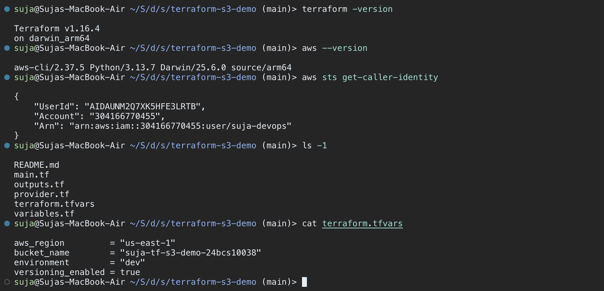

---

### Step 1: terraform init

**Commands:**
```bash
terraform init
ls -a
```

**Output:**
```text
Initializing the backend...
Initializing provider plugins...
- Reusing previous version of hashicorp/aws from the dependency lock file
- Installing hashicorp/aws v6.66.0...
- Installed hashicorp/aws v6.66.0 (signed by HashiCorp)

Terraform has been successfully initialized!
```

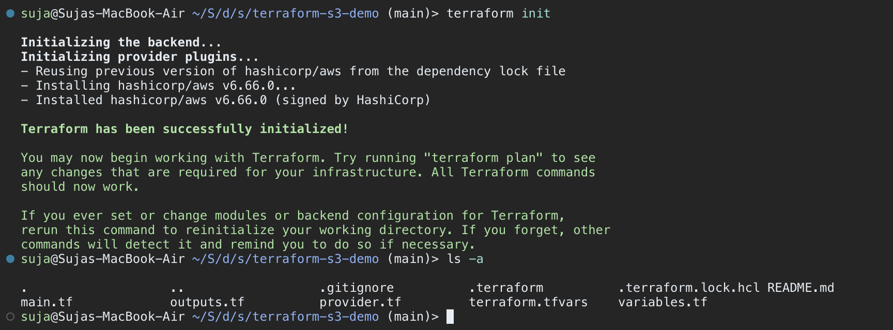

---

### Step 2 & 3: terraform fmt and terraform validate

**Commands:**
```bash
terraform fmt
terraform fmt -check
terraform validate
```

**Output:**
```text
main.tf
outputs.tf
variables.tf

Success! The configuration is valid.
```

`terraform fmt` lists the files it re-formatted; the second run with `-check` prints nothing, confirming every file is now in canonical format.

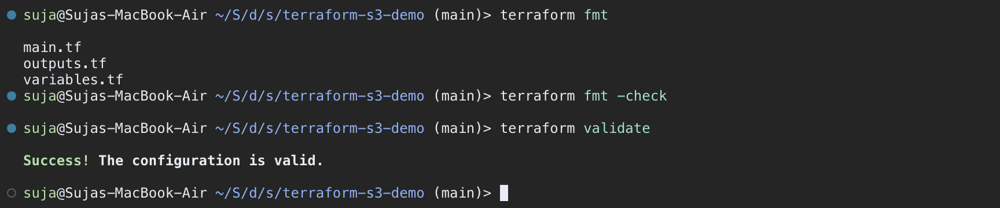

---

### Step 4: terraform plan

**Commands:**
```bash
terraform plan
```

**Output:**
```text
Terraform will perform the following actions:

  # aws_s3_bucket.devops553 will be created
  + resource "aws_s3_bucket" "devops553" {
      + arn                         = (known after apply)
      + bucket                      = "suja-tf-s3-demo-24bcs10038"
      + force_destroy               = true
      + region                      = "us-east-1"
      ...
    }

  # aws_s3_bucket_public_access_block.devops553 will be created
  # aws_s3_bucket_server_side_encryption_configuration.devops553 will be created
  # aws_s3_bucket_versioning.devops553 will be created

Plan: 4 to add, 0 to change, 0 to destroy.

Changes to Outputs:
  + bucket_arn                  = (known after apply)
  + bucket_name                 = "suja-tf-s3-demo-24bcs10038"
  + bucket_region               = "us-east-1"
  + bucket_regional_domain_name = (known after apply)
  + versioning_status           = "Enabled"
```

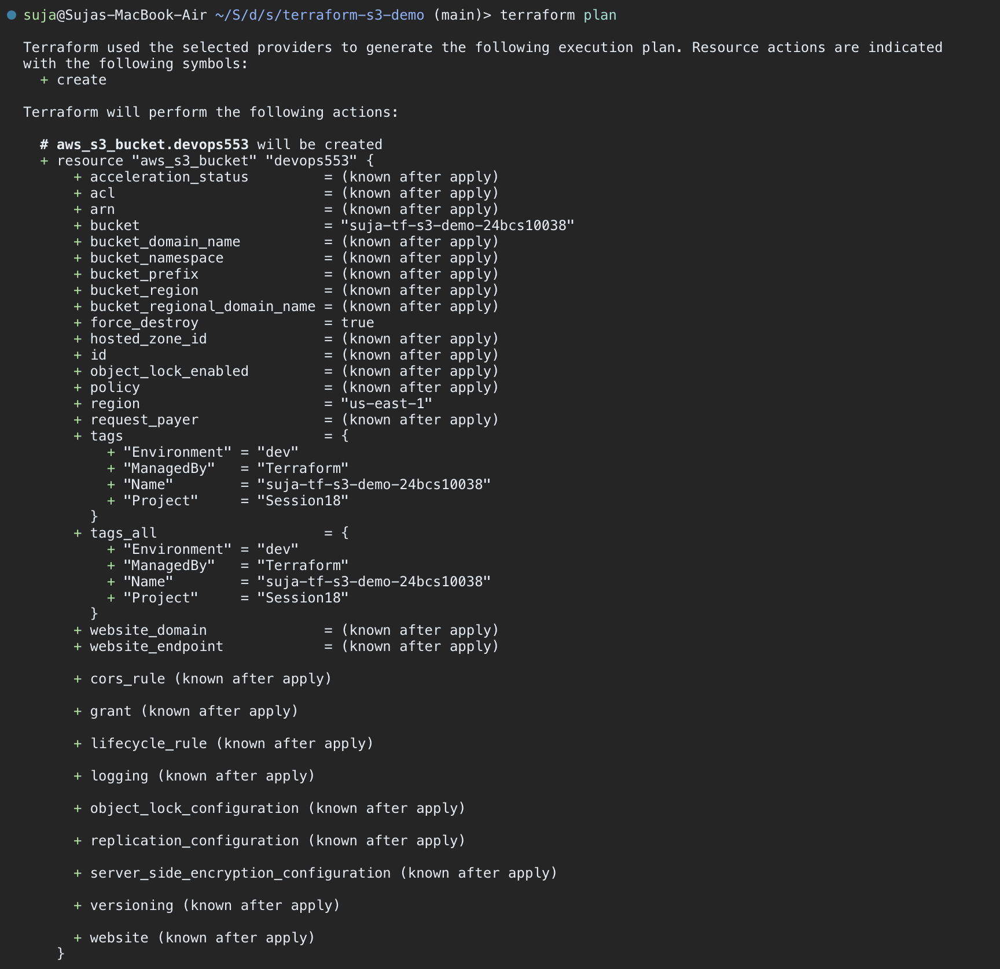

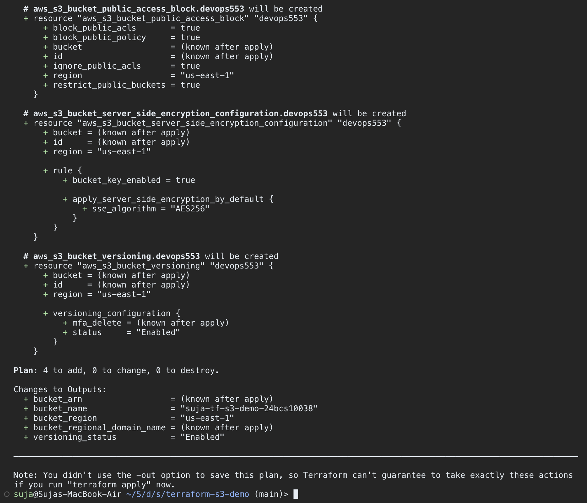

---

### Step 5: terraform apply

**Commands:**
```bash
terraform apply
# Enter a value: yes
```

**Output:**
```text
aws_s3_bucket.devops553: Creating...
aws_s3_bucket.devops553: Creation complete after 3s [id=suja-tf-s3-demo-24bcs10038]
aws_s3_bucket_public_access_block.devops553: Creating...
aws_s3_bucket_versioning.devops553: Creating...
aws_s3_bucket_server_side_encryption_configuration.devops553: Creating...
aws_s3_bucket_public_access_block.devops553: Creation complete after 1s [id=suja-tf-s3-demo-24bcs10038]
aws_s3_bucket_server_side_encryption_configuration.devops553: Creation complete after 1s [id=suja-tf-s3-demo-24bcs10038]
aws_s3_bucket_versioning.devops553: Creation complete after 2s [id=suja-tf-s3-demo-24bcs10038]

Apply complete! Resources: 4 added, 0 changed, 0 destroyed.

Outputs:

bucket_arn = "arn:aws:s3:::suja-tf-s3-demo-24bcs10038"
bucket_name = "suja-tf-s3-demo-24bcs10038"
bucket_region = "us-east-1"
bucket_regional_domain_name = "suja-tf-s3-demo-24bcs10038.s3.us-east-1.amazonaws.com"
versioning_status = "Enabled"
```

The bucket is created first; the versioning, encryption and public-access-block resources reference `aws_s3_bucket.devops553.id`, so Terraform waits for the bucket and then creates those three in parallel.

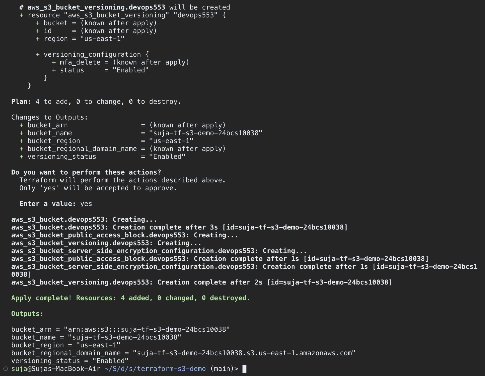

---

### Step 6: terraform show

**Commands:**
```bash
terraform show
```

**Output (excerpt):**
```text
# aws_s3_bucket.devops553:
resource "aws_s3_bucket" "devops553" {
    arn                         = "arn:aws:s3:::suja-tf-s3-demo-24bcs10038"
    bucket                      = "suja-tf-s3-demo-24bcs10038"
    bucket_domain_name          = "suja-tf-s3-demo-24bcs10038.s3.amazonaws.com"
    bucket_region               = "us-east-1"
    hosted_zone_id              = "Z3AQBSTGFYJSTF"
    ...

# aws_s3_bucket_versioning.devops553:
resource "aws_s3_bucket_versioning" "devops553" {
    ...
    versioning_configuration {
        status     = "Enabled"
    }
}
```

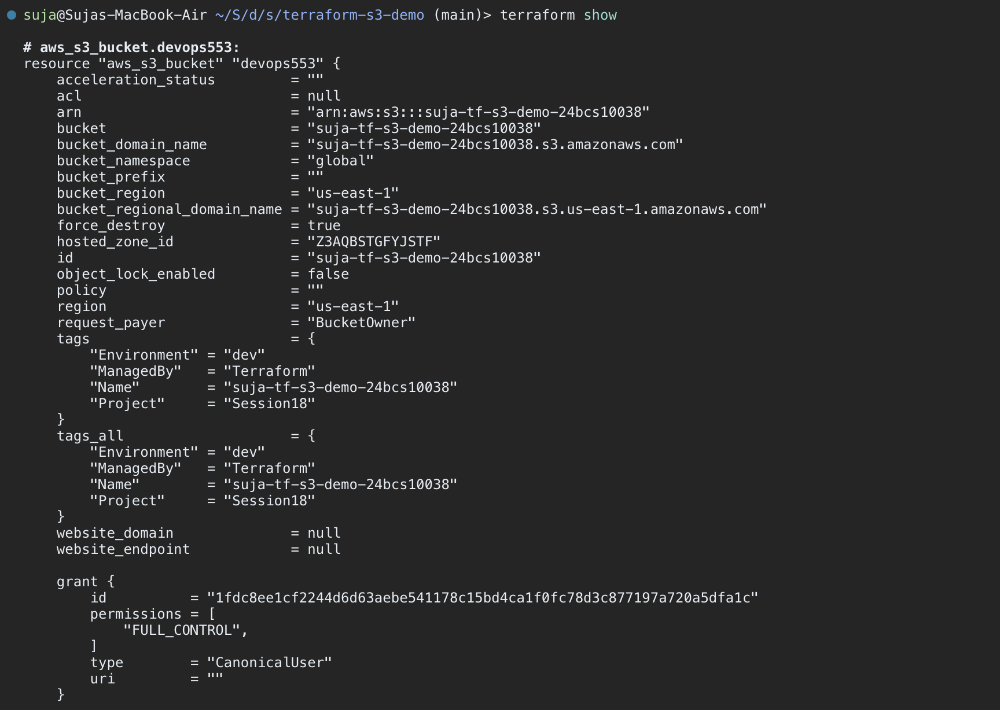

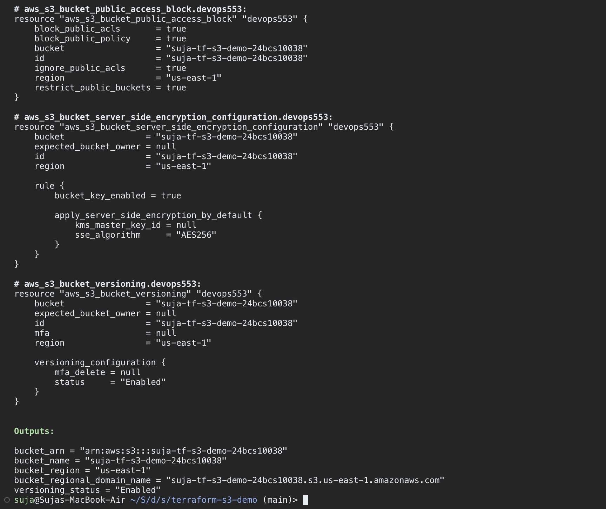

---

### Step 7: terraform output (and state list)

**Commands:**
```bash
terraform output
terraform output bucket_name
terraform output versioning_status
terraform state list
```

**Output:**
```text
bucket_arn = "arn:aws:s3:::suja-tf-s3-demo-24bcs10038"
bucket_name = "suja-tf-s3-demo-24bcs10038"
bucket_region = "us-east-1"
bucket_regional_domain_name = "suja-tf-s3-demo-24bcs10038.s3.us-east-1.amazonaws.com"
versioning_status = "Enabled"

aws_s3_bucket.devops553
aws_s3_bucket_public_access_block.devops553
aws_s3_bucket_server_side_encryption_configuration.devops553
aws_s3_bucket_versioning.devops553
```

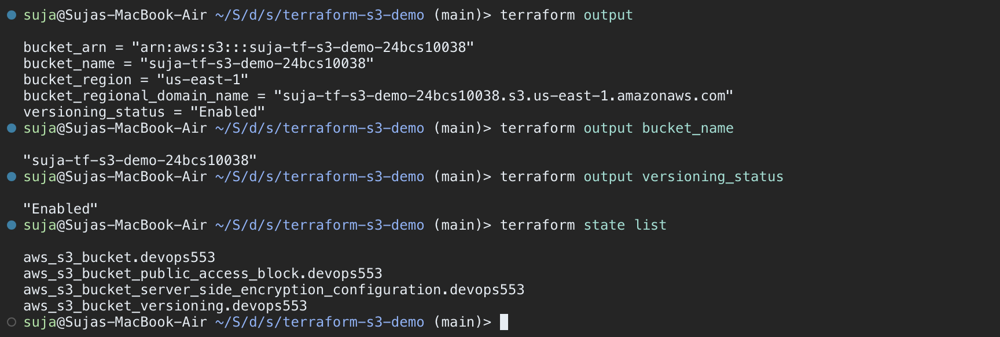

---

### Verification with the AWS CLI

**Commands:**
```bash
aws s3 ls
aws s3api get-bucket-versioning   --bucket suja-tf-s3-demo-24bcs10038
aws s3api get-bucket-encryption   --bucket suja-tf-s3-demo-24bcs10038
aws s3api get-public-access-block --bucket suja-tf-s3-demo-24bcs10038
aws s3 cp README.md s3://suja-tf-s3-demo-24bcs10038/
aws s3 ls s3://suja-tf-s3-demo-24bcs10038/
```

**Output:**
```text
2026-09-29 10:52:37 suja-42149ae5121a0167ca8e93ca26
2026-09-29 11:48:21 suja-tf-s3-demo-24bcs10038

{
    "Status": "Enabled"
}

upload: ./README.md to s3://suja-tf-s3-demo-24bcs10038/README.md
2026-09-29 11:53:04      11984 README.md
```

The bucket exists in the account, versioning is enabled, objects are encrypted with `AES256` and all four Block Public Access settings are `true` — exactly what the configuration declares.

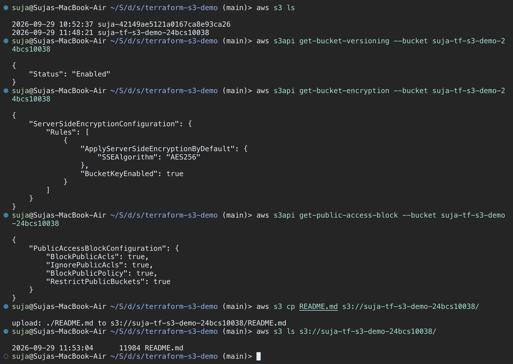

---

### Step 8: terraform destroy

**Commands:**
```bash
terraform destroy
# Enter a value: yes
terraform state list
aws s3 ls s3://suja-tf-s3-demo-24bcs10038/
```

**Output:**
```text
Plan: 0 to add, 0 to change, 4 to destroy.
...
aws_s3_bucket_public_access_block.devops553: Destroying... [id=suja-tf-s3-demo-24bcs10038]
aws_s3_bucket_versioning.devops553: Destroying... [id=suja-tf-s3-demo-24bcs10038]
aws_s3_bucket_server_side_encryption_configuration.devops553: Destroying... [id=suja-tf-s3-demo-24bcs10038]
aws_s3_bucket_server_side_encryption_configuration.devops553: Destruction complete after 1s
aws_s3_bucket_public_access_block.devops553: Destruction complete after 1s
aws_s3_bucket_versioning.devops553: Destruction complete after 1s
aws_s3_bucket.devops553: Destroying... [id=suja-tf-s3-demo-24bcs10038]
aws_s3_bucket.devops553: Destruction complete after 2s

Destroy complete! Resources: 4 destroyed.

An error occurred (NoSuchBucket) when calling the ListObjectsV2 operation: The specified bucket does not exist
```

Resources are destroyed in reverse dependency order. Because `force_destroy = true`, the uploaded `README.md` (and its versions) did not block deletion of the bucket. The empty `terraform state list` and the `NoSuchBucket` error confirm everything is gone.

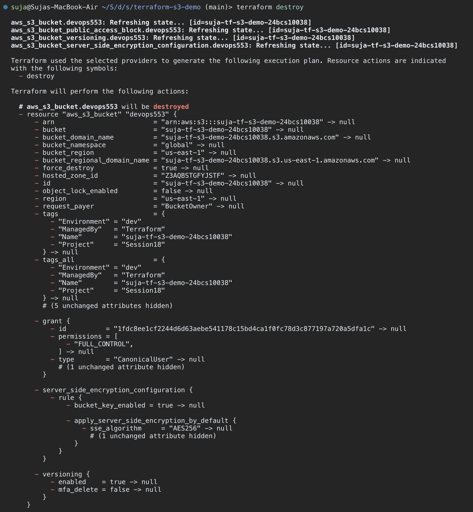

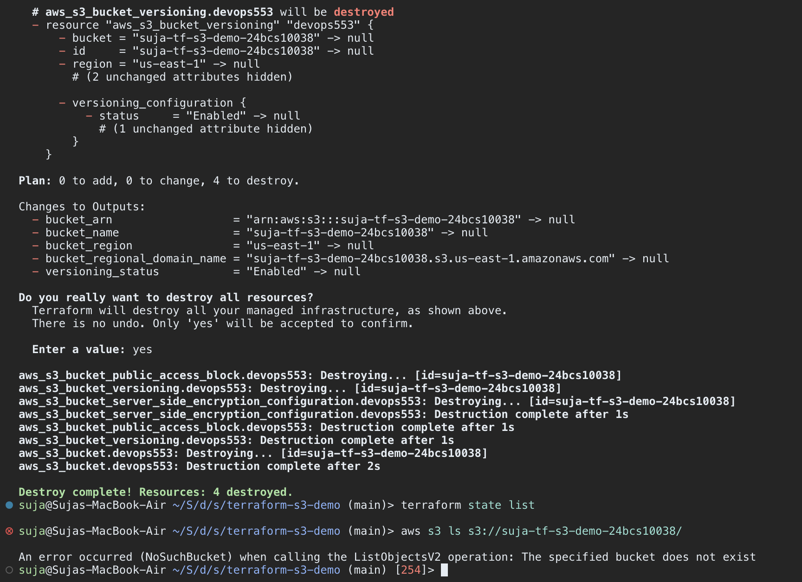

---

### Task 1 Notes

* **Implicit dependencies:** referencing `aws_s3_bucket.devops553.id` is enough for Terraform to build the dependency graph — no `depends_on` needed.
* **`terraform.tfvars`** is auto-loaded and overrides the defaults in `variables.tf` (default region `ap-south-1` → `us-east-1`).
* **State** (`terraform.tfstate`) is local and git-ignored; `.terraform.lock.hcl` is committed to pin the provider version (v6.66.0).
* **`(known after apply)`** values (ARN, domain names) only exist once AWS creates the resource.
* **AWS provider v4+** splits bucket settings into separate resources (`aws_s3_bucket_versioning`, `..._server_side_encryption_configuration`, `..._public_access_block`) instead of inline blocks.

---

## SECTION 3: Task 2 — AWS Services Research

| # | Service | Category | Topics covered | README |
|---|---|---|---|---|
| 01 | IAM | Governance | What is IAM, Users, Groups, Roles, Policies, Permissions (evaluation logic), Least privilege, Best practices, Use cases | [01-iam/README.md](./aws-services/01-iam/README.md) |
| 02 | EC2 | Compute | What is EC2, AMI, Instance types, Key pairs, Security Groups, EBS, Public vs private IP, Instance lifecycle, Use cases | [02-ec2/README.md](./aws-services/02-ec2/README.md) |
| 03 | S3 | Storage | What is S3, Buckets, Objects, Storage classes, Versioning, Lifecycle policies, Encryption, Bucket policies, Use cases | [03-s3/README.md](./aws-services/03-s3/README.md) |
| 04 | VPC | Networking | What is VPC, CIDR, Subnets, Route tables, Internet Gateway, NAT Gateway, Security Groups, Network ACLs, Public vs private subnet | [04-vpc/README.md](./aws-services/04-vpc/README.md) |
| 05 | DynamoDB & RDS | Databases | DynamoDB: NoSQL, Tables, Items, Attributes, Partition key, Sort key, Use cases · RDS: Relational DB, Engines, DB instances, Security, Backups, Multi-AZ, Read replicas, Use cases | [05-dynamodb-rds/README.md](./aws-services/05-dynamodb-rds/README.md) |

Each README includes explanations, comparison tables, AWS CLI commands and Terraform snippets.

### Key takeaways

* **IAM** — everything is implicitly denied; an explicit `Deny` always wins. Use roles (temporary credentials) for workloads and least-privilege policies for everyone.
* **EC2** — an instance = AMI + instance type + key pair + security group + EBS volume in a subnet. Public IPs change on stop/start; Elastic IPs do not.
* **S3** — 11 nines durability, globally unique bucket names, private and encrypted by default; versioning + lifecycle rules control protection and cost.
* **VPC** — a subnet is public only because its route table sends `0.0.0.0/0` to an Internet Gateway; private subnets use a NAT Gateway for outbound traffic. Security groups are stateful (instance level), NACLs are stateless (subnet level).
* **DynamoDB vs RDS** — DynamoDB for known key-based access patterns at any scale (partition + sort key design); RDS for relational data, joins and SQL, with Multi-AZ for availability and read replicas for read scaling.
