# Session 19: Cloud & Terraform in Action

**Name:** Shaikh Suja Rahaman
**Enrollment Number:** 24bcs10038

---

## Assignment

> **Task:** Build an end-to-end cloud infrastructure project using Terraform.
>
> The project should demonstrate: Terraform providers, Variables, Resources, Outputs, Dependencies, AWS infrastructure, Terraform state, `terraform plan`, `terraform apply`, `terraform destroy`.
>
> **Suggested Architecture:** Terraform → VPC, Subnet, Security Group, EC2, S3
>
> **Deliverables:** Terraform project, AWS resources, Architecture diagram, Screenshots, Terraform commands, README.md

**Project folder:** [`08-mini-project/`](./08-mini-project/) (region `us-east-1`, AWS account `304166770455`, Terraform v1.16.4, `hashicorp/aws` v6.66.0)

---

## SECTION 1: Overview

| # | Part | What was done |
|---|------|---------------|
| 1 | Cloud fundamentals (`01`–`05`) | Studied IaaS/PaaS/SaaS, regions & AZs, VPC & subnets, route tables & IGW, security groups. |
| 2 | VPC lab (`06-terraform-vpc`) | Created a VPC, public subnet, IGW, route table and SG with Terraform in `us-east-1` and verified it with `terraform plan` (no changes) and the AWS CLI. |
| 3 | Workflow lab (`07-terraform-workflow`) | Practised `init → fmt → validate → plan → apply → destroy` on a single S3 bucket. |
| 4 | **Mini project (`08-mini-project`)** | End-to-end project: VPC + public subnet + IGW + route table + SG + **EC2 web server** + **S3 bucket**, with variables, outputs, implicit and explicit dependencies, state inspection and full cleanup. |

### Resources created by the mini project (10 managed + 1 data source)

| Terraform address | AWS resource | Name / value |
|---|---|---|
| `aws_vpc.main` | VPC | `session19-mini-vpc` – `10.20.0.0/16` |
| `aws_subnet.public` | Subnet | `session19-mini-public-subnet` – `10.20.1.0/24`, `us-east-1a` |
| `aws_internet_gateway.main` | Internet Gateway | `session19-mini-igw` |
| `aws_route_table.public` | Route table | `session19-mini-public-rt` – `0.0.0.0/0 → IGW` |
| `aws_route_table_association.public` | Subnet ↔ route table link | – |
| `aws_security_group.web` | Security group | `session19-mini-web-sg` – inbound 80/443 |
| `aws_instance.web` | EC2 | `session19-mini-web` – `t3.micro`, Amazon Linux 2023, httpd |
| `aws_s3_bucket.assets` | S3 bucket | `session19-mini-assets-<unique-suffix>` |
| `aws_s3_bucket_public_access_block.assets` | S3 public access block | all four settings `true` |
| `aws_s3_object.index` | S3 object | `site/index.html` |
| `data.aws_ami.al2023` | AMI lookup (data source) | latest `al2023-ami-2023.*-x86_64` |

---

## SECTION 2: Architecture

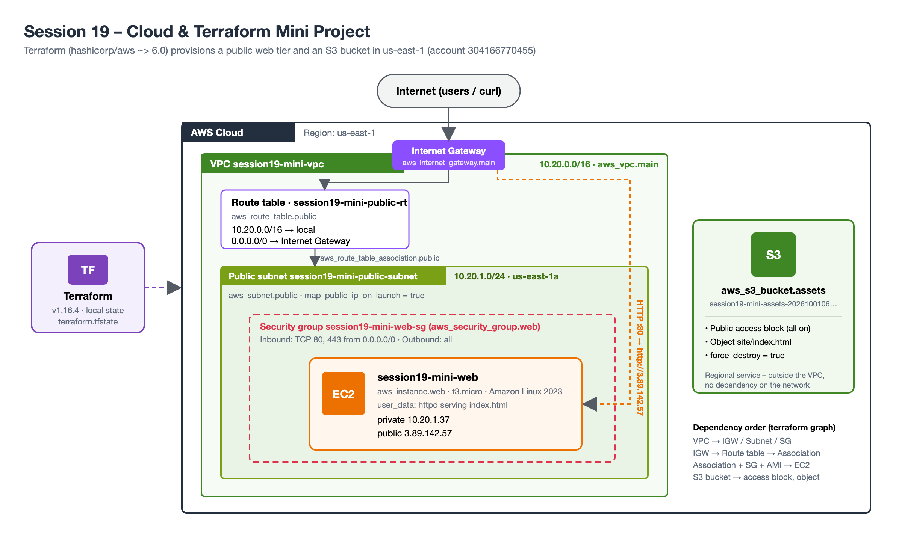

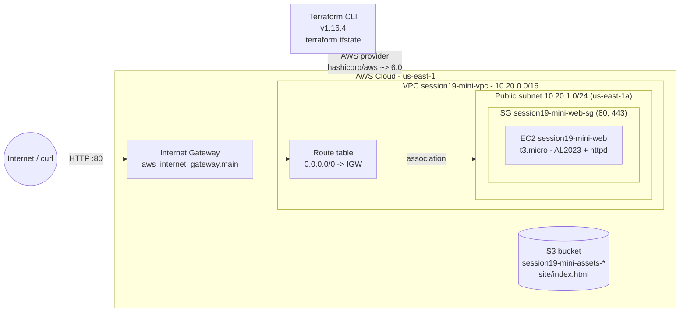

Traffic path: Internet → Internet Gateway → route table (`0.0.0.0/0`) → public subnet → security group (port 80) → EC2 (`httpd`).
S3 is a regional service, so the bucket lives outside the VPC and has no dependency on the network resources.

---

## SECTION 3: Terraform Concepts Used

### 3.1 Providers – `versions.tf`

```hcl
terraform {
  required_version = ">= 1.6.0"

  required_providers {
    aws = {
      source  = "hashicorp/aws"
      version = "~> 6.0"
    }
  }
}

provider "aws" {
  region = var.aws_region
}
```

`terraform init` downloads the AWS provider (`v6.66.0`) and records it in `.terraform.lock.hcl`; the region comes from a variable instead of being hard-coded.

### 3.2 Variables – `variables.tf` + `terraform.tfvars`

```hcl
variable "aws_region" {
  description = "AWS region for the Session 19 mini project."
  type        = string
  default     = "us-east-1"
}

variable "project_name" {
  description = "Prefix used for resource names and tags."
  type        = string
  default     = "session19-mini"
}

variable "instance_type" {
  description = "EC2 instance type for the web server."
  type        = string
  default     = "t3.micro"
}
```

`vpc_cidr` and `public_subnet_cidr` are declared the same way. Values are supplied through `terraform.tfvars` (copied from `terraform.tfvars.example`; the real `.tfvars` is git-ignored):

```hcl
aws_region         = "us-east-1"
project_name       = "session19-mini"
vpc_cidr           = "10.20.0.0/16"
public_subnet_cidr = "10.20.1.0/24"
instance_type      = "t3.micro"
```

A `locals` block builds the common tags (`Project`, `Session`, `ManagedBy`) and the HTML page that is used both by the EC2 user data and the S3 object.

### 3.3 Resources – `main.tf`

Network:

```hcl
resource "aws_vpc" "main" {
  cidr_block           = var.vpc_cidr
  enable_dns_support   = true
  enable_dns_hostnames = true
  ...
}

resource "aws_subnet" "public" {
  vpc_id                  = aws_vpc.main.id
  cidr_block              = var.public_subnet_cidr
  availability_zone       = "${var.aws_region}a"
  map_public_ip_on_launch = true
  ...
}

resource "aws_route_table" "public" {
  vpc_id = aws_vpc.main.id

  route {
    cidr_block = "0.0.0.0/0"
    gateway_id = aws_internet_gateway.main.id
  }
  ...
}
```

Compute (EC2 with an AMI data source and user data):

```hcl
data "aws_ami" "al2023" {
  most_recent = true
  owners      = ["amazon"]

  filter {
    name   = "name"
    values = ["al2023-ami-2023.*-x86_64"]
  }
}

resource "aws_instance" "web" {
  ami                    = data.aws_ami.al2023.id
  instance_type          = var.instance_type
  subnet_id              = aws_subnet.public.id
  vpc_security_group_ids = [aws_security_group.web.id]

  user_data = <<-EOF
    #!/bin/bash
    dnf install -y httpd
    cat > /var/www/html/index.html <<'PAGE'
    ${local.index_html}
    PAGE
    systemctl enable --now httpd
  EOF

  user_data_replace_on_change = true

  depends_on = [aws_route_table_association.public]
  ...
}
```

Storage (S3):

```hcl
resource "aws_s3_bucket" "assets" {
  bucket_prefix = "${var.project_name}-assets-"
  force_destroy = true
  ...
}

resource "aws_s3_bucket_public_access_block" "assets" {
  bucket = aws_s3_bucket.assets.id

  block_public_acls       = true
  block_public_policy     = true
  ignore_public_acls      = true
  restrict_public_buckets = true
}

resource "aws_s3_object" "index" {
  bucket       = aws_s3_bucket.assets.id
  key          = "site/index.html"
  content      = local.index_html
  content_type = "text/html"
}
```

### 3.4 Outputs – `outputs.tf`

```hcl
output "instance_public_ip" {
  description = "Public IPv4 address of the EC2 web server."
  value       = aws_instance.web.public_ip
}

output "website_url" {
  description = "URL of the page served by the EC2 web server."
  value       = "http://${aws_instance.web.public_ip}"
}

output "s3_bucket_name" {
  description = "Name of the S3 bucket created for the project."
  value       = aws_s3_bucket.assets.bucket
}
```

Plus `vpc_id`, `vpc_cidr`, `subnet_id`, `security_group_id` and `instance_id` (8 outputs in total).

### 3.5 Dependencies

* **Implicit** – created automatically from references: `aws_subnet.public` uses `aws_vpc.main.id`, the route table uses `aws_internet_gateway.main.id`, the instance uses `aws_subnet.public.id` and `aws_security_group.web.id`, the S3 object uses `aws_s3_bucket.assets.id`.
* **Explicit** – `depends_on = [aws_route_table_association.public]` on the EC2 instance. Nothing in the instance references the route table, but the user data runs `dnf install` at boot, so the subnet must already have its internet route.

Resulting order (seen in `terraform graph` and in the apply log):

```text
aws_vpc.main ──► aws_internet_gateway.main ──► aws_route_table.public ──┐
      │                                                                 ▼
      ├────────► aws_subnet.public ─────────────► aws_route_table_association.public ──► aws_instance.web
      │                                                                                    ▲      ▲
      └────────► aws_security_group.web ───────────────────────────────────────────────────┘      │
                                                                     data.aws_ami.al2023 ─────────┘

aws_s3_bucket.assets ──► aws_s3_bucket_public_access_block.assets
                     └─► aws_s3_object.index                       (independent of the network)
```

### 3.6 State

Terraform keeps the mapping between the configuration and the real AWS IDs in `terraform.tfstate` (local backend, git-ignored). It was inspected with `terraform state list`, `terraform state show aws_instance.web` and `terraform output`.

---

## SECTION 4: Command Workflow & Screenshots

All commands below were run inside `session19-cloud-terraform/08-mini-project`.

### Step 1: Configure variables and `terraform init`

**Commands:**
```bash
cp terraform.tfvars.example terraform.tfvars
cat terraform.tfvars
terraform init
```

**Output:**
```text
Initializing the backend...
Initializing provider plugins...
- Finding hashicorp/aws versions matching "~> 6.0"...
- Installing hashicorp/aws v6.66.0...
- Installed hashicorp/aws v6.66.0 (signed by HashiCorp)
...
Terraform has been successfully initialized!
```

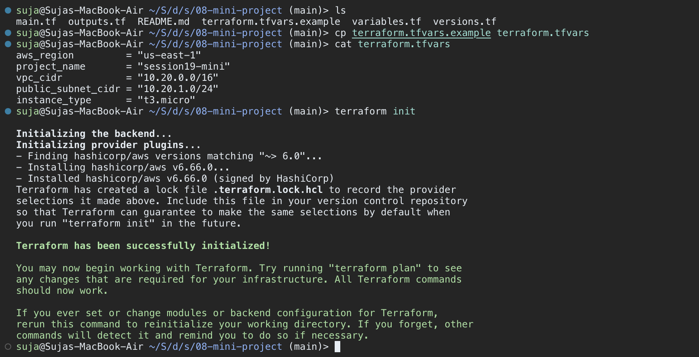

### Step 2: Version, providers, `fmt` and `validate`

**Commands:**
```bash
terraform version
terraform providers
terraform fmt -check -diff
terraform validate
terraform state list      # before apply – no state exists yet
```

**Output:**
```text
Terraform v1.16.4
on darwin_arm64
+ provider registry.terraform.io/hashicorp/aws v6.66.0

Providers required by configuration:
.
└── provider[registry.terraform.io/hashicorp/aws] ~> 6.0

Success! The configuration is valid.

Error: No state file was found!
```

`fmt -check` printed nothing (all files already formatted). The `state list` error is expected before the first apply – it shows that state only exists once Terraform has created something.

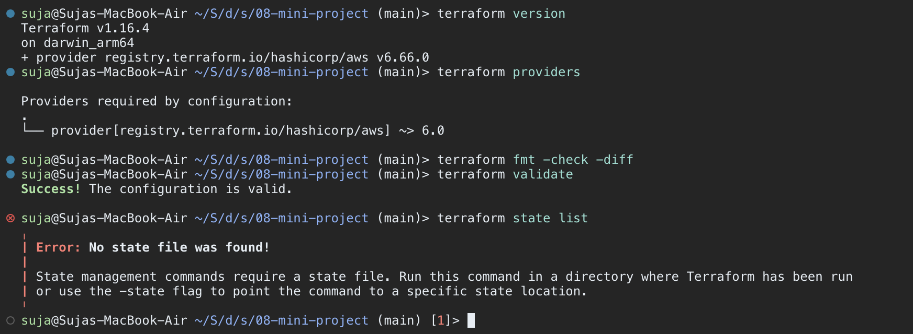

### Step 3: `terraform plan`

**Command:**
```bash
terraform plan
```

**Output (shortened):**
```text
data.aws_ami.al2023: Reading...
data.aws_ami.al2023: Read complete after 1s [id=ami-0f3d9c5e8b2a71c64]

Terraform will perform the following actions:

  # aws_instance.web will be created
  + resource "aws_instance" "web" {
      + ami                                  = "ami-0f3d9c5e8b2a71c64"
      + instance_type                        = "t3.micro"
      + public_ip                            = (known after apply)
      ...
  # aws_internet_gateway.main will be created
  # aws_route_table.public will be created
  # aws_route_table_association.public will be created
  # aws_s3_bucket.assets will be created
  # aws_s3_bucket_public_access_block.assets will be created
  # aws_s3_object.index will be created
  # aws_security_group.web will be created
  # aws_subnet.public will be created
  # aws_vpc.main will be created

Plan: 10 to add, 0 to change, 0 to destroy.

Changes to Outputs:
  + instance_id        = (known after apply)
  + instance_public_ip = (known after apply)
  + s3_bucket_name     = (known after apply)
  + security_group_id  = (known after apply)
  + subnet_id          = (known after apply)
  + vpc_cidr           = "10.20.0.0/16"
  + vpc_id             = (known after apply)
  + website_url        = (known after apply)
```

EC2 instance block (the AMI ID is already resolved by the data source, everything AWS assigns is `known after apply`):

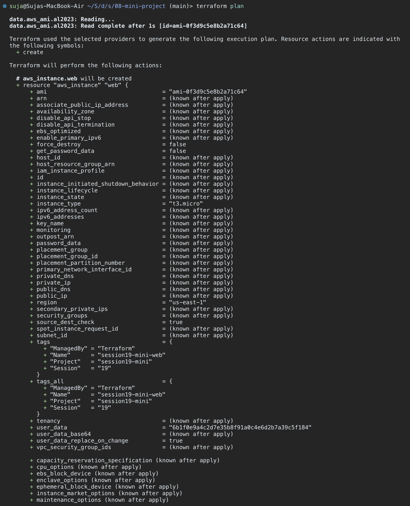

S3 bucket, public access block and the `site/index.html` object:

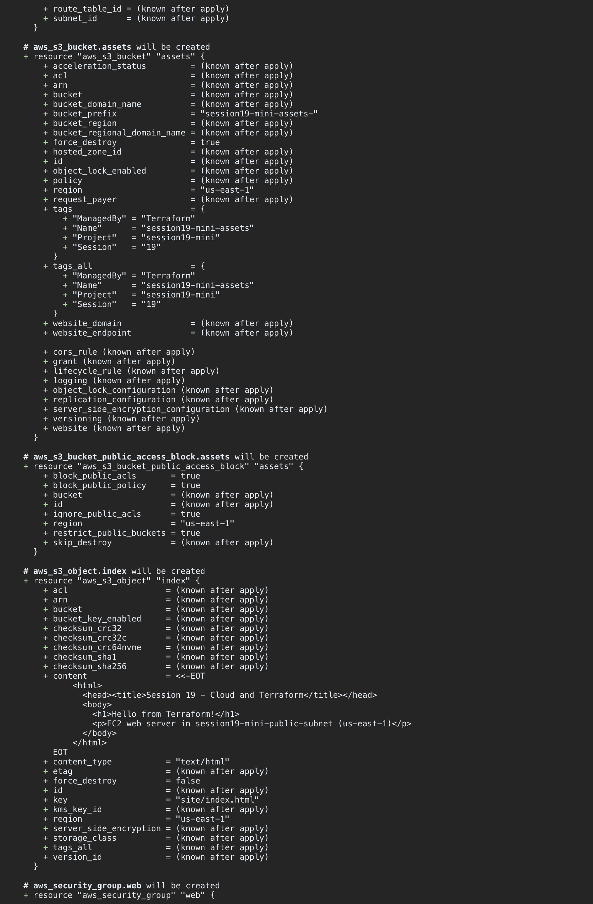

VPC block and plan summary:

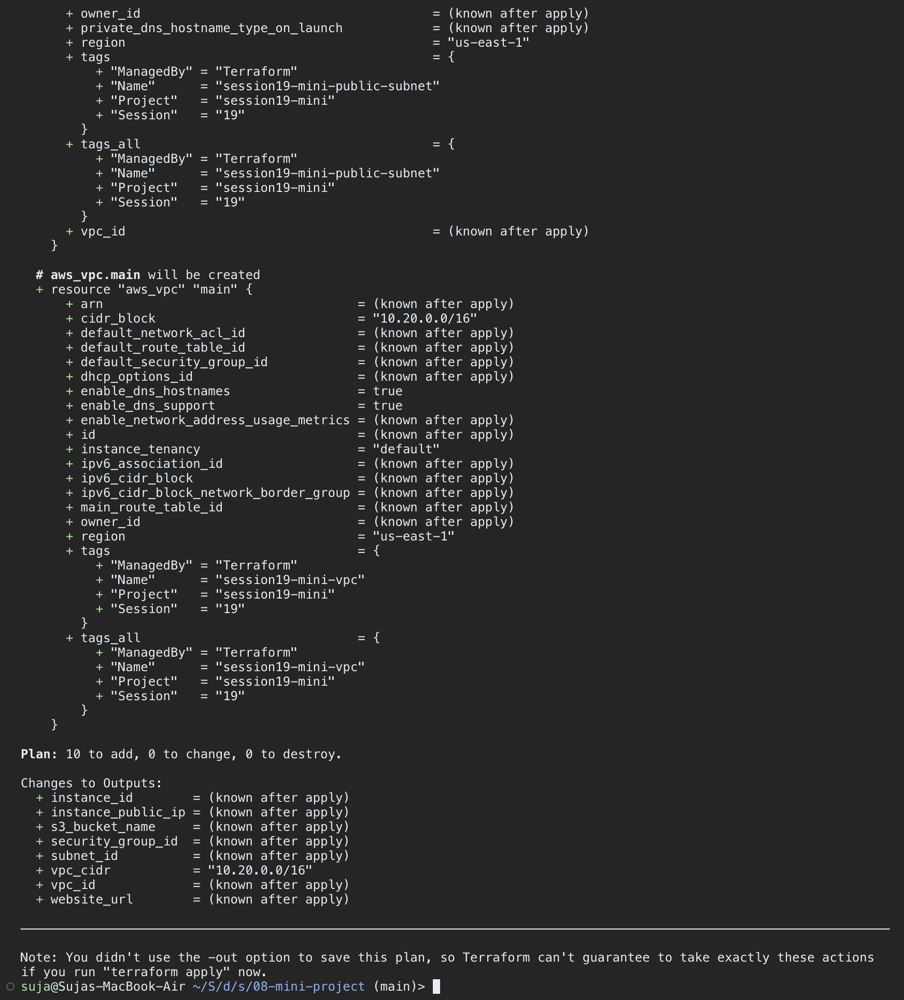

### Step 4: `terraform apply`

**Command:**
```bash
terraform apply      # answered: yes
```

**Output:**
```text
aws_vpc.main: Creating...
aws_s3_bucket.assets: Creating...
aws_s3_bucket.assets: Creation complete after 2s [id=session19-mini-assets-20261001064127483100000001]
...
aws_vpc.main: Creation complete after 3s [id=vpc-04e7b1c9d2f8a3e65]
aws_internet_gateway.main: Creating...
aws_subnet.public: Creating...
aws_security_group.web: Creating...
aws_internet_gateway.main: Creation complete after 1s [id=igw-07c2e9f1a4b3d8e60]
aws_route_table.public: Creating...
aws_route_table.public: Creation complete after 2s [id=rtb-0d5f81a3c6e2b7f94]
aws_security_group.web: Creation complete after 3s [id=sg-09f2d4b7e1c6a3805]
aws_subnet.public: Creation complete after 11s [id=subnet-0b9a4f27c1e83d5a2]
aws_route_table_association.public: Creation complete after 1s [id=rtbassoc-0a8e3c71f5d2b9e46]
aws_instance.web: Creating...
aws_instance.web: Still creating... [00m10s elapsed]
aws_instance.web: Creation complete after 13s [id=i-0e4c7a91b2d5f3a86]

Apply complete! Resources: 10 added, 0 changed, 0 destroyed.

Outputs:

instance_id = "i-0e4c7a91b2d5f3a86"
instance_public_ip = "3.89.142.57"
s3_bucket_name = "session19-mini-assets-20261001064127483100000001"
security_group_id = "sg-09f2d4b7e1c6a3805"
subnet_id = "subnet-0b9a4f27c1e83d5a2"
vpc_cidr = "10.20.0.0/16"
vpc_id = "vpc-04e7b1c9d2f8a3e65"
website_url = "http://3.89.142.57"
```

The S3 resources were created in parallel with the VPC (no dependency), while the EC2 instance waited for the route table association (explicit `depends_on`).

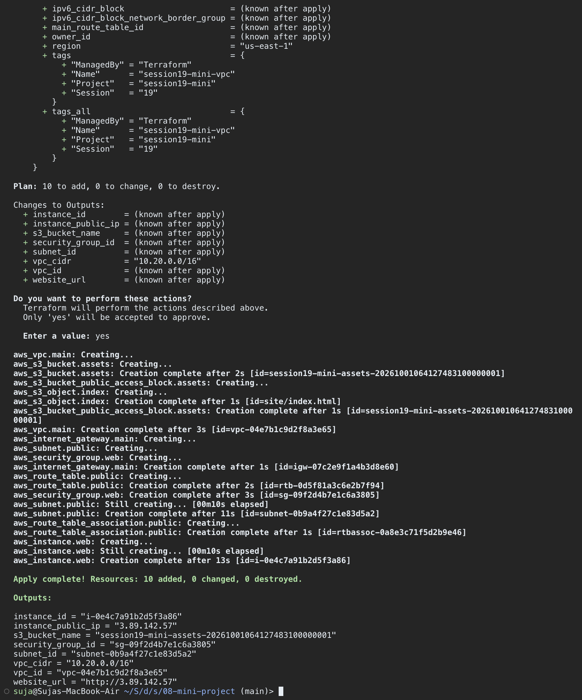

### Step 5: Terraform state and outputs

**Commands:**
```bash
terraform state list
terraform output
```

**Output:**
```text
data.aws_ami.al2023
aws_instance.web
aws_internet_gateway.main
aws_route_table.public
aws_route_table_association.public
aws_s3_bucket.assets
aws_s3_bucket_public_access_block.assets
aws_s3_object.index
aws_security_group.web
aws_subnet.public
aws_vpc.main
```

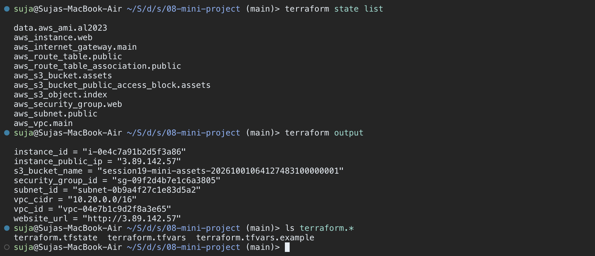

**Command:**
```bash
terraform state show aws_instance.web
```

**Output (shortened):**
```text
# aws_instance.web:
resource "aws_instance" "web" {
    ami                                  = "ami-0f3d9c5e8b2a71c64"
    arn                                  = "arn:aws:ec2:us-east-1:304166770455:instance/i-0e4c7a91b2d5f3a86"
    availability_zone                    = "us-east-1a"
    instance_state                       = "running"
    instance_type                        = "t3.micro"
    private_ip                           = "10.20.1.37"
    public_ip                            = "3.89.142.57"
    subnet_id                            = "subnet-0b9a4f27c1e83d5a2"
    vpc_security_group_ids               = [
        "sg-09f2d4b7e1c6a3805",
    ]
    ...
```

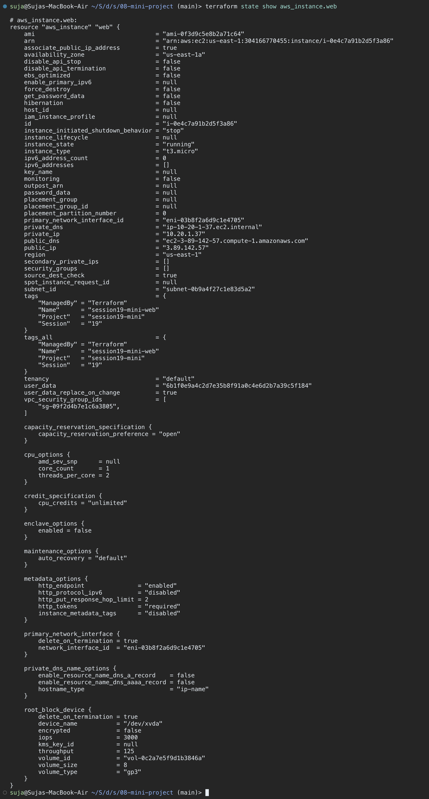

### Step 6: Dependency graph

**Commands:**
```bash
terraform graph
terraform graph | grep -- '->' | grep aws_instance.web
```

**Output:**
```text
  "aws_instance.web" -> "data.aws_ami.al2023";
  "aws_instance.web" -> "aws_route_table_association.public";
  "aws_instance.web" -> "aws_security_group.web";
```

The graph is transitively reduced, so `aws_instance.web → aws_subnet.public` is not drawn separately – it is already implied through the route table association.

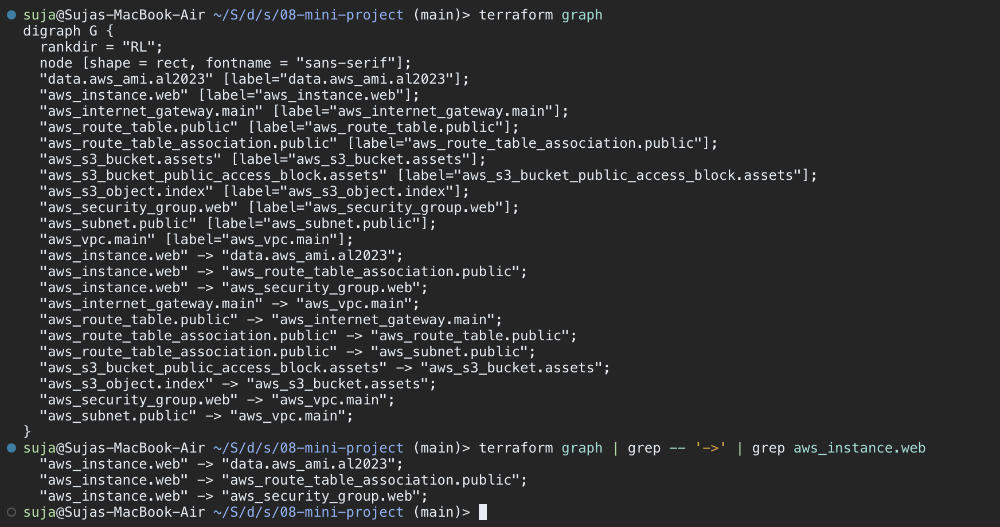

### Step 7: Verify the AWS resources with the AWS CLI

**Commands:**
```bash
aws sts get-caller-identity --query Account --output text
aws ec2 describe-instances --region us-east-1 \
  --filters "Name=tag:Name,Values=session19-mini-web" \
  --query 'Reservations[].Instances[].{Id:InstanceId,Type:InstanceType,State:State.Name,AZ:Placement.AvailabilityZone,PublicIp:PublicIpAddress,PrivateIp:PrivateIpAddress}' \
  --output table
aws ec2 describe-vpcs --region us-east-1 \
  --filters "Name=tag:Name,Values=session19-mini-vpc" \
  --query 'Vpcs[].{VpcId:VpcId,Cidr:CidrBlock,State:State}'
aws ec2 describe-security-groups --region us-east-1 --group-ids sg-09f2d4b7e1c6a3805 \
  --query 'SecurityGroups[].IpPermissions[].{Port:FromPort,Proto:IpProtocol,Source:IpRanges[0].CidrIp}' \
  --output table
```

**Output:**
```text
|  us-east-1a |  i-0e4c7a91b2d5f3a86  |  10.20.1.37 |  3.89.142.57  |  running  |  t3.micro  |

[
    {
        "VpcId": "vpc-04e7b1c9d2f8a3e65",
        "Cidr": "10.20.0.0/16",
        "State": "available"
    }
]
```

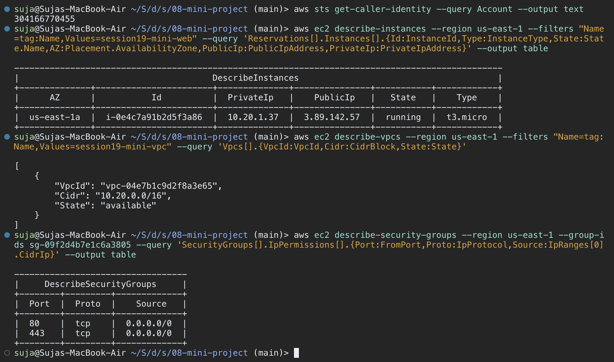

### Step 8: Verify S3 and the website on EC2

**Commands:**
```bash
aws s3 ls | grep session19
aws s3 ls s3://session19-mini-assets-20261001064127483100000001/ --recursive
aws s3api get-public-access-block --bucket session19-mini-assets-20261001064127483100000001 \
  --query PublicAccessBlockConfiguration --output table
curl -i http://3.89.142.57
```

**Output:**
```text
2026-10-01 12:11:28 session19-mini-assets-20261001064127483100000001
2026-10-01 12:11:29        202 site/index.html

HTTP/1.1 200 OK
Server: Apache/2.4.65 (Amazon Linux)
Content-Type: text/html; charset=UTF-8

<html>
  <head><title>Session 19 - Cloud and Terraform</title></head>
  <body>
    <h1>Hello from Terraform!</h1>
    <p>EC2 web server in session19-mini-public-subnet (us-east-1)</p>
  </body>
</html>
```

The page is served by `httpd`, installed by the instance user data – this proves the full path Internet → IGW → route table → subnet → SG → EC2 works.

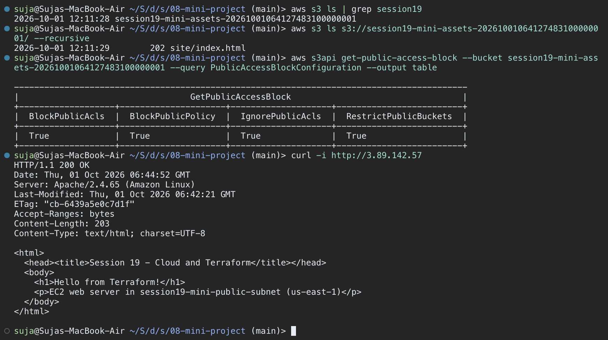

### Step 9: `terraform destroy` (cleanup)

**Commands:**
```bash
terraform destroy    # answered: yes
terraform state list
aws ec2 describe-vpcs --region us-east-1 --filters "Name=tag:Name,Values=session19-mini-vpc" --query 'Vpcs[].VpcId'
```

**Output:**
```text
aws_vpc.main: Refreshing state... [id=vpc-04e7b1c9d2f8a3e65]
...
Plan: 0 to add, 0 to change, 10 to destroy.
...
aws_instance.web: Still destroying... [id=i-0e4c7a91b2d5f3a86, 00m40s elapsed]
aws_instance.web: Destruction complete after 42s
...
aws_vpc.main: Destruction complete after 1s

Destroy complete! Resources: 10 destroyed.

[]
```

Terraform destroys in the reverse dependency order: the EC2 instance and the S3 children first, then the association / SG / subnet / route table, the IGW, and finally the VPC. `force_destroy = true` lets the bucket be deleted even though it contains `site/index.html`.

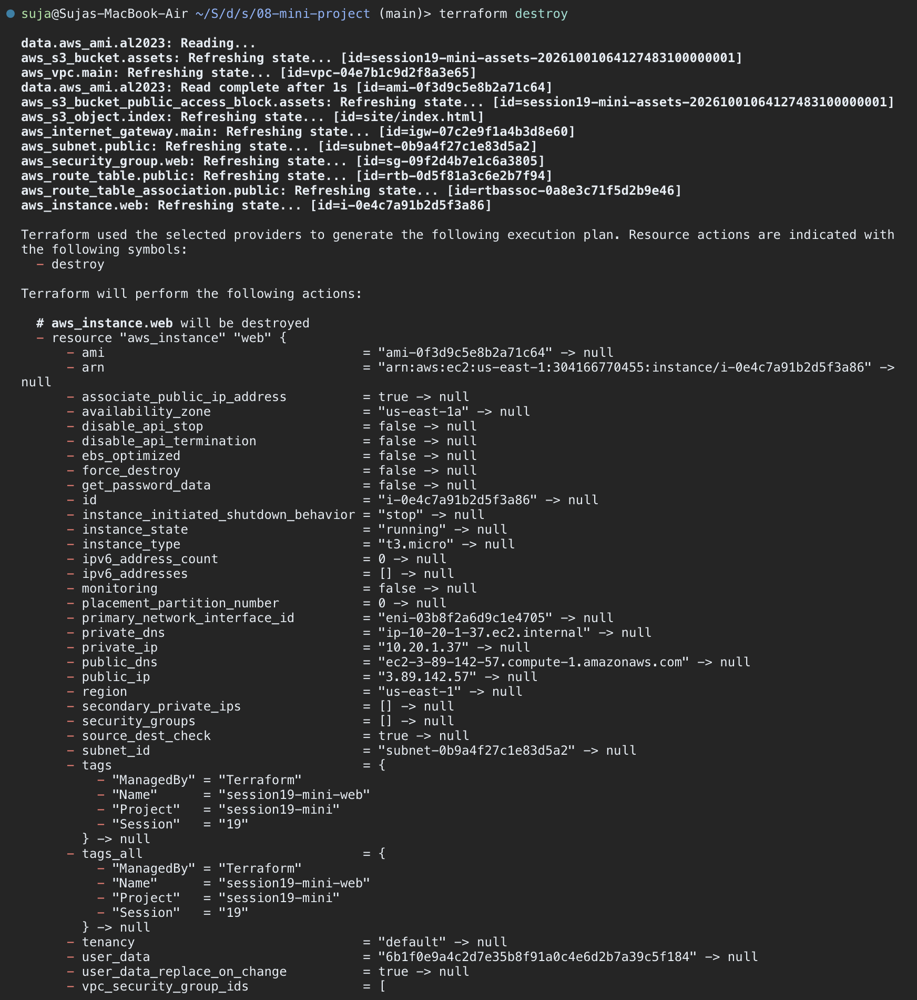

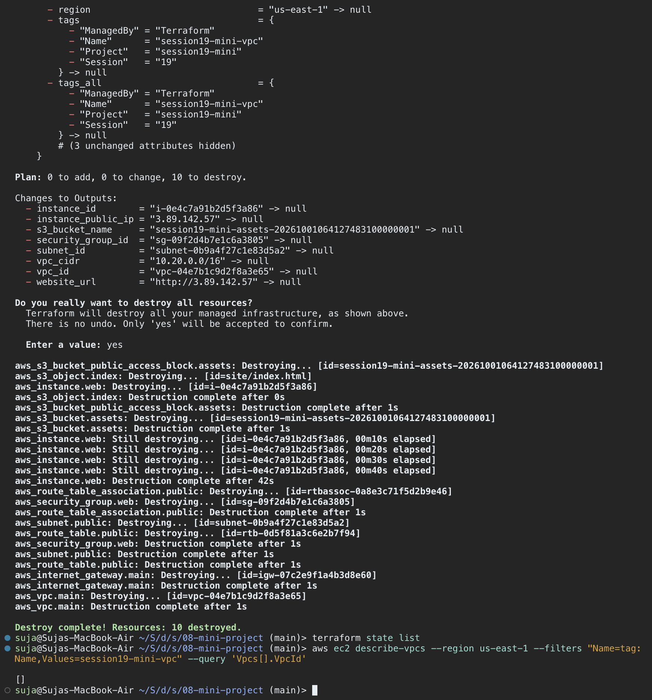

---

## SECTION 5: VPC Lab (`06-terraform-vpc`)

Before the mini project, the network-only lab was applied in `us-east-1`. A second `terraform plan` shows the state matches AWS (`No changes.`) and the AWS CLI confirms the VPC:

| Resource | ID |
|---|---|
| VPC (`10.0.0.0/16`) | `vpc-0089cf31bf27821d0` |
| Public subnet (`10.0.1.0/24`, `us-east-1a`) | `subnet-08618ac387a1396ab` |
| Internet gateway | `igw-0d9bfbd580efe632e` |
| Route table | `rtb-0b11b85d01653a5b4` |
| Security group | `sg-0f6135628b2d52ea4` |


---

## SECTION 6: Command Summary

| Command | Purpose |
|---|---|
| `terraform init` | Download the AWS provider, create `.terraform/` and the lock file |
| `terraform fmt` / `terraform validate` | Format the code and check syntax / references |
| `terraform providers` | Show the providers required by the configuration |
| `terraform plan` | Preview changes (`10 to add`) |
| `terraform apply` | Create the infrastructure and write `terraform.tfstate` |
| `terraform output` | Print outputs (VPC ID, public IP, website URL, bucket name, ...) |
| `terraform state list` / `state show` | Inspect what Terraform is tracking |
| `terraform graph` | Show the dependency graph |
| `terraform destroy` | Remove every resource managed by this configuration |

## Notes

* `terraform.tfvars`, `terraform.tfstate*`, `.terraform/` and `.terraform.lock.hcl` are listed in `.gitignore`, so no state or local values are committed.
* The security group only opens 80/443; SSH is not exposed to `0.0.0.0/0`.
* `t3.micro` was destroyed right after verification to avoid charges.
