# Session 20: Monitoring, Observability & GitOps

**Name:** Shaikh Suja Rahaman
**Enrollment Number:** 24bcs10038

---

## Overview

This session covers three linked topics:

* **Monitoring:** watch known signals such as CPU, memory, errors and target health, show them on dashboards, and raise **alerts** when a signal crosses a threshold.
* **Observability:** collect enough **metrics, logs and traces** to explain *why* a system behaves the way it does, including problems nobody predicted.
* **GitOps:** Git holds the desired state of the cluster, and a controller (Argo CD) keeps reconciling the live cluster until it matches Git.

| Task | What was done | Folder used |
|------|---------------|-------------|
| Task 1: Monitoring | Ran Prometheus and then Prometheus + Grafana with Docker Compose. Checked health endpoints, scraped metrics, ran PromQL for CPU and memory, built a Grafana dashboard, added alert rules and triggered a real `InstanceDown` alert. Used `kubectl top` and `kubectl logs` on minikube | `03-prometheus/`, `04-grafana/`, `02-metrics-logs-traces/k8s-demo/` |
| Task 2: Observability | Documented the three pillars, why observability is needed, common tools and how observability works in Kubernetes | `01-monitoring-vs-observability/`, `02-metrics-logs-traces/` |
| Task 3: GitOps | Installed Argo CD, registered an Application that points at this GitHub repo, scaled the app by committing to Git, showed self-healing after a manual `kubectl scale`, then deployed the mini project the same way | `05-…` to `08-mini-project/` (demo: `07-argocd/`, `08-mini-project/`) |

**Environment:** macOS, Docker 29.3.1 (Compose v2), Prometheus v3.5.0, Grafana 12.1.1, minikube v1.39.0 (single node `minikube`), kubectl v1.34.1, Argo CD v3.5.2 (server and CLI). All work was done on **Sat 3 Oct 2026 (IST)**.

### Small changes made to the provided files

| File | Change | Why |
|------|--------|-----|
| `03-prometheus/alert-rules.yml` *(new)* | 4 alert rules: `Watchdog`, `InstanceDown`, `HighCPUUsage`, `HighMemoryUsage` | The task asks for **alerts**, and the folder had no rule file |
| `03-prometheus/prometheus.yml`, `docker-compose.yml` | `evaluation_interval`, `rule_files:` and a volume mount for the rule file | Lets Prometheus load and evaluate the rules |
| `04-grafana/prometheus.yml`, `docker-compose.yml` | Added a `grafana` scrape job (`grafana:3000`) and mounted `../03-prometheus/alert-rules.yml` | Gives a second target, so target health and `InstanceDown` can be shown properly |
| `07-argocd/app/argocd-application.yaml` | `path:` set to `session20-monitoring-observability-gitops/07-argocd/app`, plus `directory.exclude: argocd-application.yaml` | The repo is a monorepo, so `path: app` does not exist at the repo root. The exclude stops Argo CD from also syncing its own Application manifest |
| `08-mini-project/app/argocd-application.yaml` | Replaced the `YOUR_USERNAME/YOUR_GITOPS_REPO` placeholder with this repo, and applied the same path and exclude fix | Makes the mini project deployable |

---

## Task 1: Monitoring

**Goal:** Show the six monitoring items from the task: **metrics, logs, alerts, CPU utilisation, memory utilisation and application health**.

| Item | Where it is demonstrated |
|------|--------------------------|
| Metrics | `/metrics` endpoint, PromQL `up`, Prometheus graph, Grafana panels (1.2, 1.4, 1.5) |
| Logs | `kubectl logs deployment/session20-demo` (1.7) |
| Alerts | `alert-rules.yml`, `/api/v1/rules`, `/api/v1/alerts`, Alerts page, `InstanceDown` firing and resolving (1.3, 1.6) |
| CPU utilisation | `rate(process_cpu_seconds_total[1m]) * 100`, Grafana CPU panel, `kubectl top` (1.5, 1.7) |
| Memory utilisation | `process_resident_memory_bytes`, Grafana memory panel, `kubectl top` (1.2, 1.5, 1.7) |
| Application health | `/-/healthy`, `/-/ready`, Grafana `/api/health`, `up` metric, target health page, Deployment conditions (1.1, 1.4, 1.7) |

### 1.1 Start Prometheus and check its health

**Commands:**
```bash
cd session20-monitoring-observability-gitops/03-prometheus
docker compose up -d
docker compose ps --format 'table {{.Name}}\t{{.Image}}\t{{.Status}}\t{{.Ports}}'
curl -s localhost:9090/-/healthy
curl -s localhost:9090/-/ready
docker compose exec prometheus promtool check config /etc/prometheus/prometheus.yml
```

**Output:**
```text
[+] Running 3/3
 ✔ prometheus Pulled                                                            9.4s
 ✔ Network 03-prometheus_default     Created                                    0.0s
 ✔ Container session20-prometheus    Started                                    0.4s
NAME                   IMAGE                    STATUS          PORTS
session20-prometheus   prom/prometheus:v3.5.0   Up 13 seconds   0.0.0.0:9090->9090/tcp, [::]:9090->9090/tcp
Prometheus Server is Healthy.
Prometheus Server is Ready.
Checking /etc/prometheus/prometheus.yml
  SUCCESS: 1 rule files found
 SUCCESS: /etc/prometheus/prometheus.yml is valid prometheus config file syntax

Checking /etc/prometheus/alert-rules.yml
  SUCCESS: 4 rules found
```

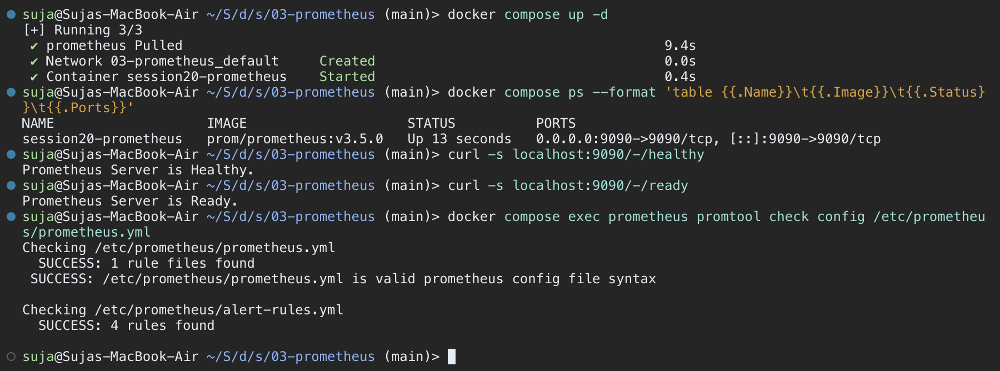

* `/-/healthy` is a **liveness** check: the process is running. `/-/ready` is a **readiness** check: Prometheus can serve queries. Kubernetes probes use the same idea.
* `promtool check config` validates the config and the rule file it references before Prometheus relies on them.

### 1.2 Metrics: the `/metrics` endpoint and the query API

**Commands:**
```bash
curl -s localhost:9090/metrics | grep -E '^(process_cpu_seconds_total|process_resident_memory_bytes|prometheus_build_info|prometheus_tsdb_head_series)[ {]'
curl -s 'localhost:9090/api/v1/query?query=up' | jq
curl -s 'localhost:9090/api/v1/query?query=process_resident_memory_bytes' | jq -c '.data.result[] | {job: .metric.job, bytes: .value[1]}'
```

**Output (partial):**
```text
process_cpu_seconds_total 1.37
process_resident_memory_bytes 6.4524288e+07
prometheus_build_info{...,version="3.5.0"} 1
prometheus_tsdb_head_series 1047
...
"metric": { "__name__": "up", "instance": "prometheus:9090", "job": "prometheus" },
"value": [ 1791002031.284, "1" ]
...
{"job":"prometheus","bytes":"64524288"}
```

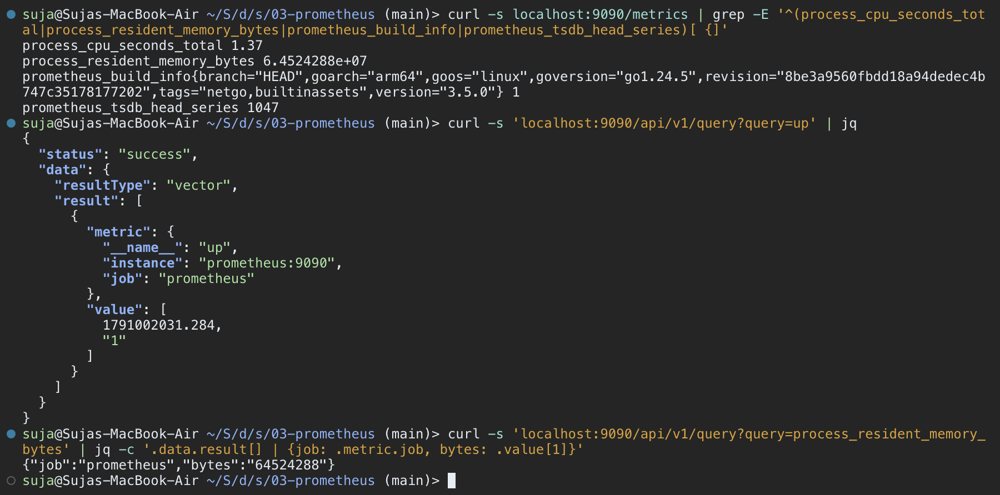

* A target exposes plain-text metrics at `/metrics`. Prometheus **scrapes** that endpoint every `scrape_interval` (5s here) and stores each value as a time series.
* `process_cpu_seconds_total` is a **counter** (it only goes up), so CPU usage is read with `rate()`. `process_resident_memory_bytes` is a **gauge** that can go up or down. 64,524,288 bytes is about 61.5 MiB.
* `up` is created by Prometheus for every target: `1` means the last scrape worked and `0` means it failed. It is the simplest health signal.

### 1.3 Alerts: rules and the alerts API

`03-prometheus/alert-rules.yml`:
```yaml
groups:
  - name: session20-alerts
    rules:
      - alert: Watchdog              # always firing, proves the pipeline works
        expr: vector(1)
      - alert: InstanceDown          # application health
        expr: up == 0
        for: 30s
        labels: { severity: critical }
      - alert: HighCPUUsage          # CPU utilisation
        expr: rate(process_cpu_seconds_total[1m]) * 100 > 80
        for: 2m
      - alert: HighMemoryUsage       # memory utilisation
        expr: process_resident_memory_bytes > 512 * 1024 * 1024
        for: 2m
```
*(The real file also has `labels` and `annotations.summary` on every rule.)*

**Commands:**
```bash
curl -s localhost:9090/api/v1/rules | jq -r '.data.groups[] | .name as $g | .rules[] | [$g, .name, .health, .state] | @tsv' | column -t
curl -s localhost:9090/api/v1/alerts | jq '.data.alerts[] | {alertname: .labels.alertname, severity: .labels.severity, state, activeAt, summary: .annotations.summary}'
docker compose down
```

**Output:**
```text
session20-alerts  Watchdog         ok  firing
session20-alerts  InstanceDown     ok  inactive
session20-alerts  HighCPUUsage     ok  inactive
session20-alerts  HighMemoryUsage  ok  inactive
{
  "alertname": "Watchdog",
  "severity": "none",
  "state": "firing",
  "activeAt": "2026-10-03T04:32:01.912475183Z",
  "summary": "Alerting pipeline is working"
}
```

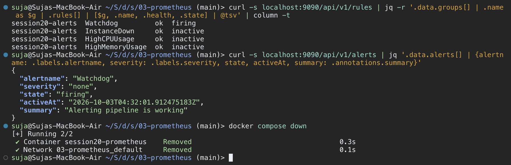

* Every rule has `health: ok`, so all four expressions evaluate without errors.
* An alert moves through **inactive → pending → firing**. It is *pending* while the expression is true but the `for:` time has not passed yet, and *firing* after that. `for:` stops short spikes from paging anyone.
* `Watchdog` is a common pattern: an alert that always fires. If it ever stops arriving, the alerting pipeline itself is broken.
* In production, Prometheus sends firing alerts to **Alertmanager**, which groups, silences and routes them to Slack, e-mail or PagerDuty. This demo reads them directly from the Prometheus API and UI.

### 1.4 Prometheus + Grafana stack

**Commands:**
```bash
cd ../04-grafana
docker compose up -d
docker compose ps --format 'table {{.Name}}\t{{.Image}}\t{{.Status}}\t{{.Ports}}'
curl -s localhost:3000/api/health | jq

# add Prometheus as a data source (same as Connections > Data sources > Add > Prometheus in the UI)
curl -s -u admin:admin -H 'Content-Type: application/json' -X POST localhost:3000/api/datasources \
  -d '{"name":"Prometheus","type":"prometheus","url":"http://prometheus:9090","access":"proxy","isDefault":true}' \
  | jq '{id, message, name, uid: .datasource.uid, url: .datasource.url}'
curl -s -u admin:admin localhost:3000/api/datasources/uid/ef0x4k2l8m9s0a/health | jq
```

**Output (partial):**
```text
NAME                   IMAGE                    STATUS          PORTS
session20-grafana      grafana/grafana:12.1.1   Up 21 seconds   0.0.0.0:3000->3000/tcp, [::]:3000->3000/tcp
session20-prometheus   prom/prometheus:v3.5.0   Up 22 seconds   0.0.0.0:9090->9090/tcp, [::]:9090->9090/tcp
{ "database": "ok", "version": "12.1.1", ... }
{ "id": 1, "message": "Datasource added", "name": "Prometheus", "uid": "ef0x4k2l8m9s0a", "url": "http://prometheus:9090" }
{ "message": "Successfully queried the Prometheus API.", "status": "OK" }
```

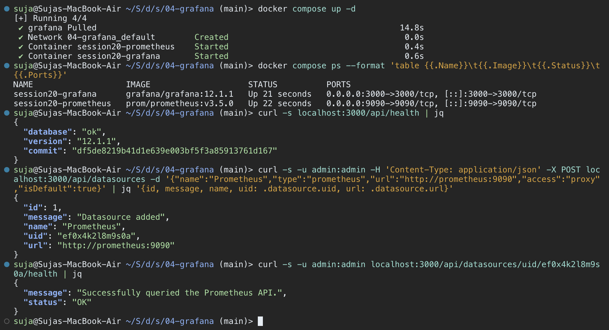

* The data source URL is `http://prometheus:9090`, not `localhost`. The Grafana container reaches Prometheus by its Compose **service name** on the `04-grafana_default` network.
* `/api/health` is Grafana's own application health endpoint (`"database": "ok"`).

**Target health:** `http://localhost:9090/targets` shows both scrape pools (`grafana` and `prometheus`) as **UP**.

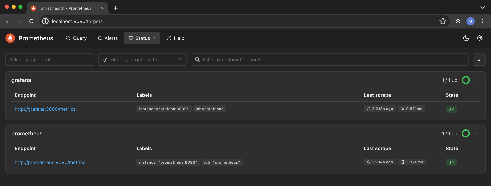

### 1.5 CPU and memory utilisation: PromQL and the Grafana dashboard

CPU query in the Prometheus graph (`Query > Graph`, last 30 minutes):
```promql
rate(process_cpu_seconds_total[1m]) * 100
```

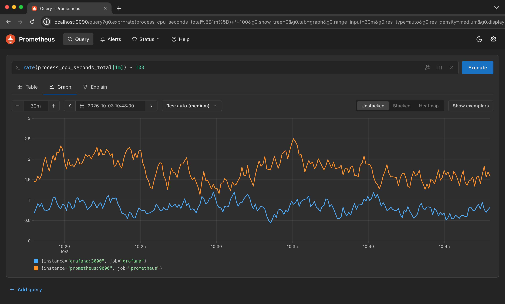

* `rate(...[1m])` gives CPU-seconds used per second. Multiplying by 100 gives **percent of one core**. Prometheus stays around 1.5–2.5% and Grafana stays under about 1.2%, far below the 80% `HighCPUUsage` threshold.

I then built the dashboard **Session 20 - Monitoring demo** (folder *Session 20*) with these panels:

| Panel | Query | Shows |
|-------|-------|-------|
| Prometheus health / Grafana health | `up{job="prometheus"}`, `up{job="grafana"}` with value mapping `1 → UP`, `0 → DOWN` | Application health |
| Targets up | `sum(up)` / `count(up)` | 2 / 2 |
| Prometheus CPU | `rate(process_cpu_seconds_total{job="prometheus"}[1m]) * 100` | CPU utilisation |
| Prometheus memory | `process_resident_memory_bytes{job="prometheus"}` | Memory utilisation (88.7 MiB) |
| Firing alerts | `count(ALERTS{alertstate="firing"})` | 1 (`Watchdog`) |
| CPU utilisation (time series) | `rate(process_cpu_seconds_total[1m]) * 100` | Per job |
| Memory utilisation (time series) | `process_resident_memory_bytes` | Per job |
| Target health (table) | `up`, `scrape_duration_seconds`, `scrape_samples_scraped` | Health per target |
| HTTP requests/s | `sum by (handler) (rate(prometheus_http_requests_total[1m]))` | Traffic to the Prometheus API |

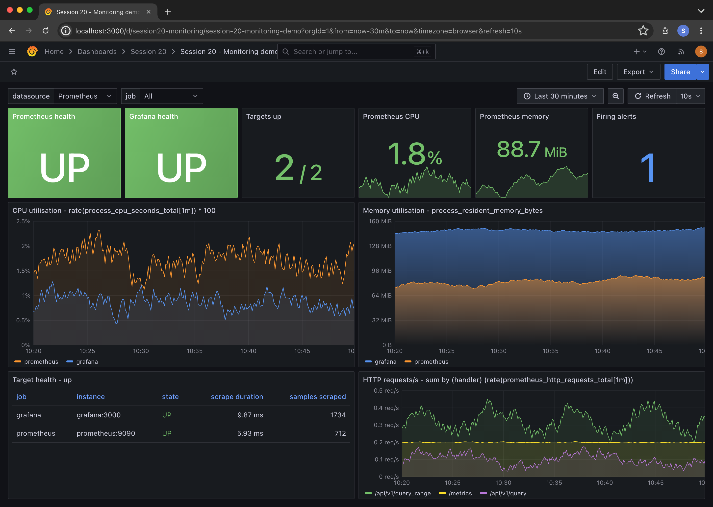

### 1.6 Alert demo: stop a target and watch `InstanceDown` fire

**Commands:**
```bash
docker compose stop grafana
curl -s 'localhost:9090/api/v1/query?query=up' | jq -r '.data.result[] | "\(.metric.job)=\(.value[1])"'
curl -s localhost:9090/api/v1/alerts | jq -c '.data.alerts[] | {alertname: .labels.alertname, job: .labels.job, state, activeAt}'
sleep 30; curl -s localhost:9090/api/v1/alerts | jq -c '...'
docker compose start grafana
sleep 15; curl -s localhost:9090/api/v1/alerts | jq -c '.data.alerts[] | {alertname: .labels.alertname, state}'
```

**Output (partial):**
```text
grafana=0
prometheus=1
{"alertname":"InstanceDown","job":"grafana","state":"pending","activeAt":"2026-10-03T05:22:47.904118562Z"}
{"alertname":"InstanceDown","job":"grafana","state":"firing","activeAt":"2026-10-03T05:22:47.904118562Z"}
Target grafana:3000 (grafana) is down
...
{"alertname":"Watchdog","state":"firing"}
grafana=1
```

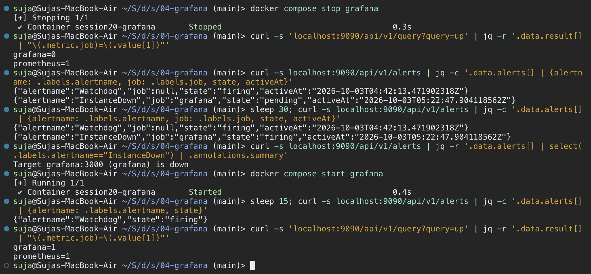

While Grafana was stopped, the Prometheus **Alerts** page showed `InstanceDown` as firing for `instance="grafana:3000"` with value `0`, active since 10:52:47 IST:

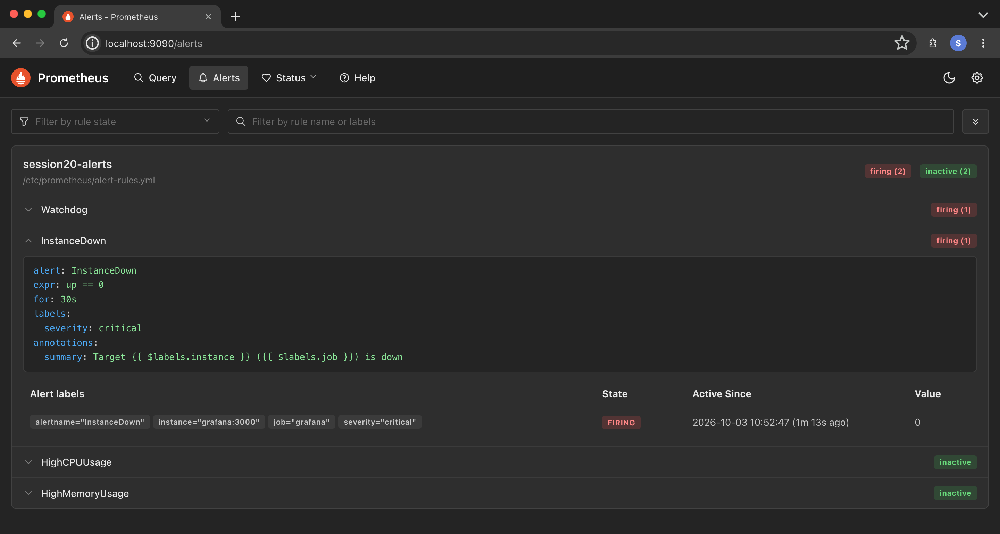

* Timeline: `up{job="grafana"}` becomes `0`, the alert is **pending**, and after `for: 30s` it becomes **firing**. Once Grafana is started again `up` returns to `1` and the alert **resolves** without any manual step. Only `Watchdog` is left.

### 1.7 Kubernetes: CPU/memory with `kubectl top`, logs and workload health

**Commands:**
```bash
cd ../02-metrics-logs-traces
minikube addons enable metrics-server
kubectl apply -f k8s-demo/
kubectl get pods -l app=session20-demo -o wide
kubectl top nodes
kubectl top pods -A --sort-by=cpu
kubectl logs deployment/session20-demo --timestamps | head -n 7
kubectl get deployment session20-demo
kubectl describe deployment session20-demo | grep -A4 Conditions
```

**Output (partial):**
```text
NAME       CPU(cores)   CPU(%)   MEMORY(bytes)   MEMORY(%)
minikube   387m         4%       1893Mi          24%
NAMESPACE     NAME                               CPU(cores)   MEMORY(bytes)
kube-system   kube-apiserver-minikube            58m          262Mi
...
default       session20-demo-7b9c6d5f8d-hx2qj    1m           1Mi
2026-10-03T05:30:43.517304118Z Session 20 observability demo started
2026-10-03T05:30:43.517391027Z Request received
2026-10-03T05:30:43.517402883Z Health check OK
...
  Available      True    MinimumReplicasAvailable
  Progressing    True    NewReplicaSetAvailable
```

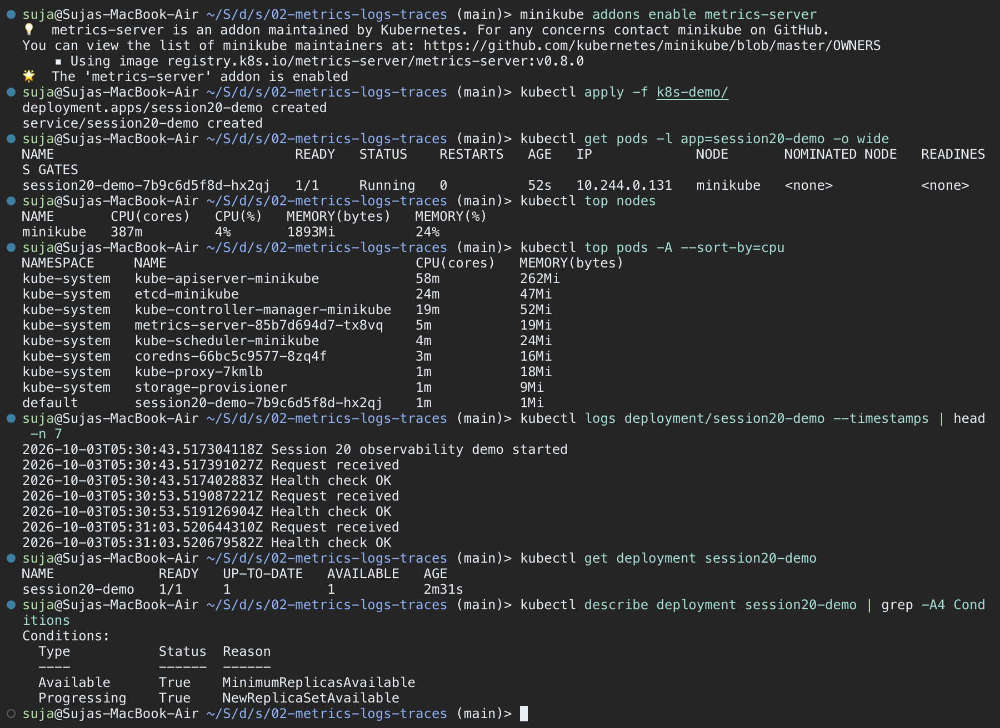

* `kubectl top` reads from **metrics-server**, which collects CPU and memory from the kubelet (cAdvisor) on every node. CPU is shown in millicores (`387m` = 0.387 of a core) and memory in MiB.
* `metrics-server` keeps only the latest values, with no history. For trends, dashboards and alerts on a cluster you use Prometheus (for example the kube-prometheus-stack), as in 1.1–1.6.
* `kubectl logs` shows the container's stdout/stderr. The demo pod prints a `Request received` / `Health check OK` pair every 10 seconds, and `--timestamps` adds the time in UTC (05:30 UTC = 11:00 IST).
* The Deployment conditions `Available=True` and `Progressing=True` are Kubernetes' own health view of the workload.

**Cleanup:**
```bash
kubectl delete -f k8s-demo/
cd ../04-grafana && docker compose down
```

---

## Task 2: Observability

### 2.1 Monitoring vs observability

| Monitoring | Observability |
|---|---|
| "Is something wrong?" | "Why is it wrong?" |
| Known failure modes, decided in advance | Unknown problems, explored after the fact |
| Dashboards, thresholds, alerts | Metrics + logs + traces, correlated |
| Answers fixed questions | Lets you ask new questions without shipping new code |

Monitoring is part of observability. Task 1's alert told us *that* Grafana was down (`up == 0`). Logs, traces and more detailed metrics tell us *why*.

### 2.2 The three pillars

| Pillar | What it is | Answers | Example from this session | Typical tools |
|--------|------------|---------|---------------------------|---------------|
| **Metrics** | Numeric measurements over time, with labels. Cheap to store and fast to aggregate | *How much? How often? Is it getting worse?* | `process_cpu_seconds_total`, `process_resident_memory_bytes`, `up`, `prometheus_http_requests_total` | Prometheus, Grafana, Thanos/Mimir, Datadog, CloudWatch |
| **Logs** | Timestamped records of individual events, either text or structured JSON | *What exactly happened, and when?* | `Session 20 observability demo started`, `Health check OK` | Loki, Elasticsearch/OpenSearch (ELK/EFK), Fluent Bit/Fluentd, Splunk |
| **Traces** | The path of **one request** through many services, made of timed *spans* that share a trace ID | *Where did this request spend its time, and where did it fail?* | `API 20ms → Order 80ms → Payment 120ms → DB 600ms` | OpenTelemetry, Jaeger, Grafana Tempo, Zipkin, AWS X-Ray |

Simple way to remember them: **Metrics = numbers, Logs = events, Traces = journey.**

**Example of a trace (one checkout request, trace ID `4bf92f3577b34da6`):**
```text
checkout  POST /api/checkout                         820 ms
├── api-gateway                                       20 ms
├── order-service    createOrder                      80 ms
├── payment-service  charge                          120 ms
└── postgres         SELECT … FROM inventory         600 ms   <-- bottleneck
```
The latency metric shows that p99 is high. The trace shows that the database query causes it. The log line from `order-service` carrying the same `trace_id` shows the exact SQL and error. Linking the three signals through a shared ID is what makes a system *observable*.

### 2.3 Why observability is required

* **Distributed systems fail in new ways.** One user request crosses many pods, services and nodes. No single dashboard can predict every failure.
* **Faster incident resolution (lower MTTD/MTTR).** Engineers go from "the alert fired" to "this service, this query, this deploy" in minutes instead of hours.
* **Ephemeral infrastructure.** Pods are rescheduled and replaced all the time. Without centralised logs and metrics, the evidence disappears with the pod.
* **SLOs and capacity planning.** Error rates, latency percentiles and CPU/memory trends decide when to scale and whether the service is meeting its promises.
* **Safe delivery.** After every GitOps sync or deploy, metrics and logs confirm the new version is healthy, or show that a rollback is needed.

### 2.4 Common tools

| Area | Tools |
|------|-------|
| Metrics collection and storage | **Prometheus**, node-exporter, kube-state-metrics, cAdvisor, metrics-server, Thanos/Mimir (long-term storage) |
| Visualisation | **Grafana**, Kibana |
| Alerting | Prometheus rules + **Alertmanager**, Grafana Alerting, PagerDuty/Opsgenie |
| Logs | Fluent Bit/Fluentd/Promtail (shippers), **Loki**, Elasticsearch/OpenSearch |
| Traces | **OpenTelemetry** (SDKs + Collector), Jaeger, Grafana Tempo, Zipkin |
| All-in-one / SaaS | Datadog, New Relic, Dynatrace, Elastic Observability, AWS CloudWatch |

### 2.5 Kubernetes observability

| Layer | Metrics | Logs | Health / events |
|-------|---------|------|-----------------|
| Node | node-exporter (CPU, memory, disk, network), `kubectl top nodes` | kubelet / container runtime logs | `kubectl describe node` conditions (`MemoryPressure`, `DiskPressure`, `Ready`) |
| Pod / container | cAdvisor via the kubelet, metrics-server (`kubectl top pods`) | `kubectl logs` (stdout/stderr), collected by a DaemonSet log shipper | Liveness, readiness and startup probes, restart count |
| Kubernetes objects | kube-state-metrics (desired vs available replicas, pod phase) | API server audit logs | `kubectl get events`, Deployment conditions |
| Application | `/metrics` endpoint scraped by Prometheus (ServiceMonitor/PodMonitor with the Prometheus Operator) | Structured JSON logs with `trace_id` | OpenTelemetry traces through the Collector |

A typical in-cluster stack is **kube-prometheus-stack** (Prometheus Operator, Prometheus, Alertmanager, Grafana, node-exporter, kube-state-metrics) together with **Loki** for logs and **Tempo/Jaeger + the OpenTelemetry Collector** for traces, all viewed in Grafana.

```text
             ┌──────────── Kubernetes cluster ────────────┐
 app pods ──►│ /metrics ──► Prometheus ──► Alertmanager ──┼──► Slack / e-mail
             │ stdout   ──► Fluent Bit  ──► Loki          │
             │ spans    ──► OTel Collector ──► Tempo      │
             └──────────────────────┬─────────────────────┘
                                    ▼
                         Grafana (one place for metrics, logs and traces)
```

---

## Task 3: GitOps

### 3.1 Concepts

| Concept | Meaning |
|---------|---------|
| **What is GitOps?** | An operating model in which the desired state of applications and infrastructure is stored in Git, and an automated agent applies it to the cluster. Every change is a Git commit: reviewed, versioned and reversible |
| **Git as the source of truth** | Whatever is on `main` is what *should* run. The cluster is never edited by hand. If Git and the cluster disagree, Git wins |
| **Declarative configuration** | We describe *what* we want (`replicas: 5`, `image: nginx:1.27-alpine`), not the steps to get there. Kubernetes YAML is already declarative |
| **Continuous reconciliation** | A controller repeatedly compares **desired state (Git)** with **live state (cluster)**. When they differ (*OutOfSync*) it applies the difference. Argo CD polls about every 3 minutes, or immediately on a webhook or refresh, and `selfHeal` reverts manual drift |
| **Pull-based delivery** | The agent runs *inside* the cluster and pulls from Git. CI never needs cluster credentials, which is safer than push-based `kubectl apply` from a pipeline |

**The four OpenGitOps principles:** Declarative · Versioned and immutable · Pulled automatically · Continuously reconciled.

### 3.2 GitOps workflow

```text
 Developer                 GitHub (source of truth)              Kubernetes (minikube)
 ─────────                 ───────────────────────              ─────────────────────
 edit app/deployment.yaml
 git commit / git push ──► main @ 8f3c2a1  ◄───── poll / refresh ─────  Argo CD
                                                                         │ compare desired vs live
                                                                         │ OutOfSync → sync
                                                                         ▼
                                                    Deployment session20-gitops-app  2 → 5 pods
                                                                         ▲
 kubectl scale --replicas=1 (drift) ─────────────────────────────────────┘ selfHeal reverts to 5
```

**Kubernetes + GitOps:** Kubernetes already works through declarative objects and its own reconciliation loops (a ReplicaSet keeps *N* pods running). GitOps adds one more loop on top: Argo CD keeps the *objects themselves* equal to Git. Kubernetes keeps pods equal to the objects, and Argo CD keeps the objects equal to Git.

### 3.3 Install Argo CD

**Commands:**
```bash
cd session20-monitoring-observability-gitops/07-argocd
kubectl create namespace argocd
kubectl apply -n argocd --server-side --force-conflicts \
  -f https://raw.githubusercontent.com/argoproj/argo-cd/stable/manifests/install.yaml
```

**Output (partial):**
```text
namespace/argocd created
customresourcedefinition.apiextensions.k8s.io/applications.argoproj.io serverside-applied
customresourcedefinition.apiextensions.k8s.io/applicationsets.argoproj.io serverside-applied
customresourcedefinition.apiextensions.k8s.io/appprojects.argoproj.io serverside-applied
serviceaccount/argocd-application-controller serverside-applied
...
statefulset.apps/argocd-application-controller serverside-applied
networkpolicy.networking.k8s.io/argocd-server-network-policy serverside-applied
```

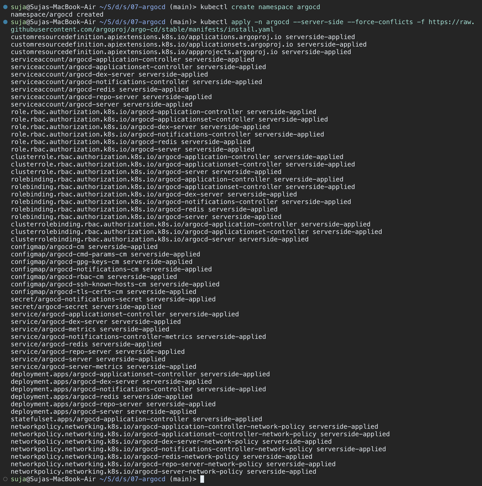

* `--server-side` is used because the Argo CD CRDs are too large for the `last-applied-configuration` annotation of a client-side apply.

**Check the pods, get the admin password and open the UI:**
```bash
kubectl get pods -n argocd
kubectl get svc argocd-server -n argocd
kubectl -n argocd get secret argocd-initial-admin-secret -o jsonpath="{.data.password}" | base64 -d && echo
kubectl port-forward svc/argocd-server -n argocd 8080:443     # keep this tab open
```

```text
NAME                                               READY   STATUS    RESTARTS   AGE
argocd-application-controller-0                    1/1     Running   0          3m51s
argocd-applicationset-controller-6d8f7c5b9-2hxkp   1/1     Running   0          3m52s
argocd-dex-server-7b5c9d8f6-qw4lz                  1/1     Running   0          3m52s
argocd-notifications-controller-5f9b8c7d6-mz7tn    1/1     Running   0          3m52s
argocd-redis-6c8d9f7b5-k5vrp                       1/1     Running   0          3m52s
argocd-repo-server-74b9c6d8f5-j8xnl                1/1     Running   0          3m52s
argocd-server-5b7f8c9d6-hj2mn                      1/1     Running   0          3m51s
pQ7xK2mVwN9sLr4T
Forwarding from 127.0.0.1:8080 -> 8080
```

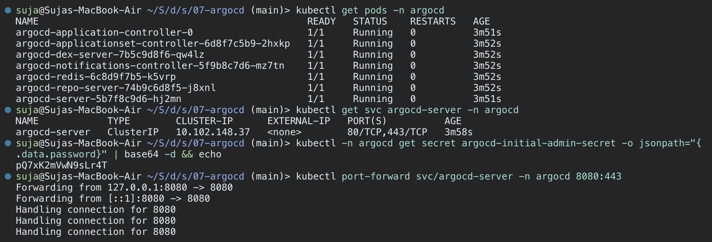

| Component | Role |
|-----------|------|
| `argocd-server` | API + web UI (https://localhost:8080) |
| `argocd-repo-server` | Clones Git and renders the manifests (plain YAML, Helm, Kustomize) |
| `argocd-application-controller` | The reconciliation loop: compares Git with the cluster, syncs and self-heals |
| `argocd-applicationset-controller` | Generates many Applications from templates |
| `argocd-redis`, `argocd-dex-server`, `argocd-notifications-controller` | Cache, SSO and notifications |

### 3.4 Register the application (the only manual `kubectl apply`)

`07-argocd/app/argocd-application.yaml`:
```yaml
apiVersion: argoproj.io/v1alpha1
kind: Application
metadata:
  name: session20-app
  namespace: argocd
spec:
  project: default
  source:
    repoURL: https://github.com/Shaikh-Suja-Rahaman/devops-heros.git
    targetRevision: main
    path: session20-monitoring-observability-gitops/07-argocd/app
    directory:
      exclude: argocd-application.yaml
  destination:
    server: https://kubernetes.default.svc
    namespace: session20
  syncPolicy:
    automated:
      prune: true      # delete resources that are removed from Git
      selfHeal: true   # undo manual changes in the cluster
    syncOptions:
      - CreateNamespace=true
```

**Commands:**
```bash
grep -n replicas app/deployment.yaml          # Git currently says 2 (commit 4b7e91d)
kubectl apply -f app/argocd-application.yaml
kubectl get applications -n argocd
kubectl get deploy,svc,pods -n session20
argocd login localhost:8080 --username admin --password pQ7xK2mVwN9sLr4T --insecure
argocd app get session20-app
```

**Output (partial):**
```text
8:  replicas: 2
application.argoproj.io/session20-app created
NAME            SYNC STATUS   HEALTH STATUS
session20-app   Synced        Healthy
deployment.apps/session20-gitops-app   2/2     2            2           41s
pod/session20-gitops-app-6f8b7c9d4-k2x7p    1/1     Running   0          41s
pod/session20-gitops-app-6f8b7c9d4-q9lwm    1/1     Running   0          41s
...
Sync Status:        Synced to main (4b7e91d)
Health Status:      Healthy
```

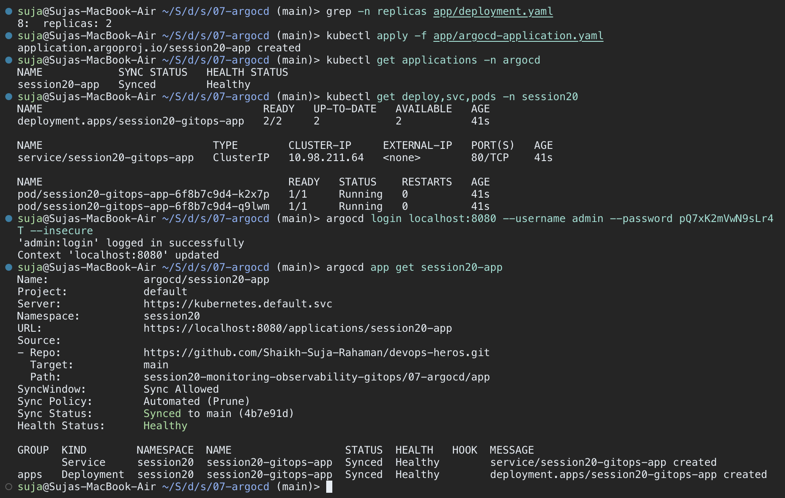

I never ran `kubectl apply` on `deployment.yaml` or `service.yaml`. Argo CD read them from GitHub, created the `session20` namespace (`CreateNamespace=true`) and deployed them.

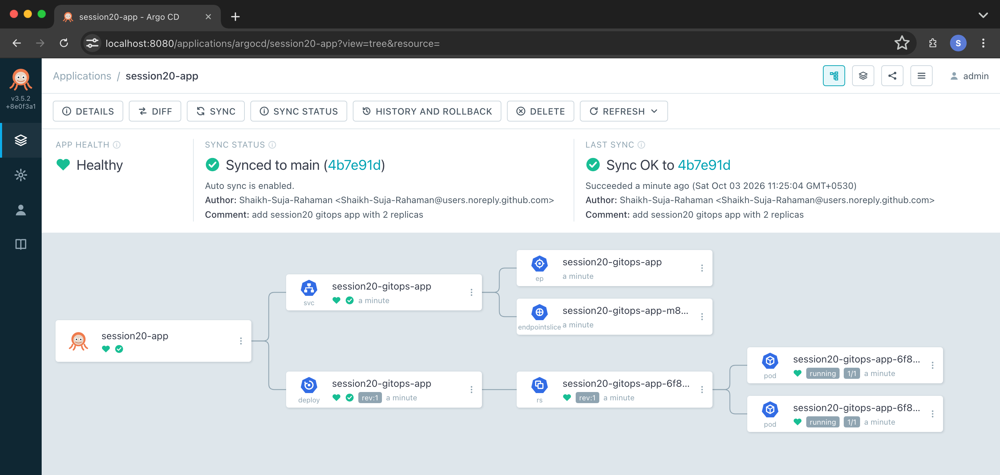

### 3.5 GitOps in action: scale by committing to Git

**Commands:**
```bash
sed -i '' 's/replicas: 2/replicas: 5/' app/deployment.yaml
git diff app/deployment.yaml
git add app/deployment.yaml
git commit -m "scale session20-gitops-app to 5 replicas"
git push origin main
```

**Output (partial):**
```text
-  replicas: 2
+  replicas: 5
[main 8f3c2a1] scale session20-gitops-app to 5 replicas
 1 file changed, 1 insertion(+), 1 deletion(-)
To https://github.com/Shaikh-Suja-Rahaman/devops-heros.git
   4b7e91d..8f3c2a1  main -> main
```

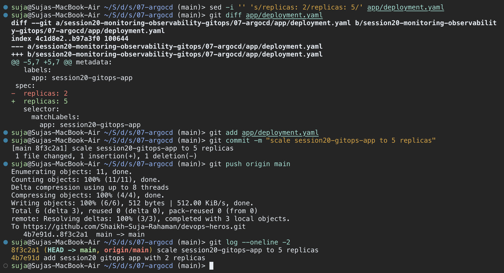

**Argo CD detects the new commit and syncs it automatically, with no `kubectl` command:**
```bash
kubectl get applications -n argocd -w
argocd app get session20-app
kubectl get deployment session20-gitops-app -n session20
kubectl get pods -n session20
argocd app history session20-app
```

```text
session20-app   Synced        Healthy
session20-app   OutOfSync     Healthy        <- new commit seen in Git
session20-app   Synced        Progressing    <- auto-sync applied it
session20-app   Synced        Healthy
...
Sync Status:        Synced to main (8f3c2a1)
apps   Deployment  session20  session20-gitops-app  Synced  Healthy  deployment.apps/session20-gitops-app configured
session20-gitops-app   5/5     5            5           8m47s
...
ID  DATE                           REVISION
0   2026-10-03 11:25:04 +0530 IST  main (4b7e91d)
1   2026-10-03 11:33:10 +0530 IST  main (8f3c2a1)
```

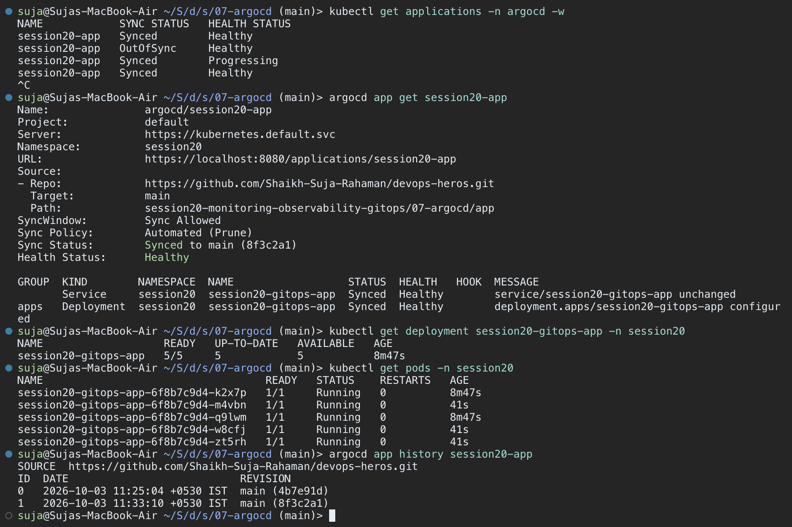

* The two original pods (`k2x7p`, `q9lwm`) were kept and three new ones were added. A replica change does not change the pod template, so the ReplicaSet stays `6f8b7c9d4` (Deployment `rev:1`).
* `argocd app history` is the deployment audit trail. Each entry maps to a Git commit, so rolling back means `git revert` (or *History and rollback* in the UI).

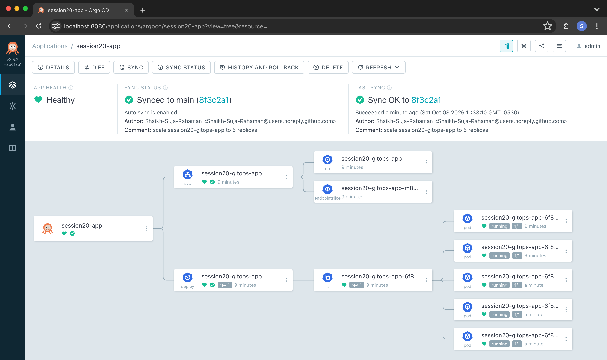

### 3.6 Self-healing: manual drift is reverted

**Commands:**
```bash
kubectl scale deployment session20-gitops-app -n session20 --replicas=1   # change the cluster by hand
kubectl get deployment session20-gitops-app -n session20 -w
kubectl get pods -n session20
kubectl get events -n session20 --field-selector involvedObject.kind=Deployment --sort-by=.lastTimestamp
argocd app get session20-app | grep -E 'Sync Status|Health Status'
```

**Output (partial):**
```text
deployment.apps/session20-gitops-app scaled
session20-gitops-app   1/1     1            1           13m
session20-gitops-app   1/5     1            1           13m
...
session20-gitops-app   5/5     5            5           13m
24s   Normal   ScalingReplicaSet   deployment/session20-gitops-app   Scaled down replica set session20-gitops-app-6f8b7c9d4 from 5 to 1
19s   Normal   ScalingReplicaSet   deployment/session20-gitops-app   Scaled up replica set session20-gitops-app-6f8b7c9d4 from 1 to 5
Sync Status:        Synced to main (8f3c2a1)
Health Status:      Healthy
```

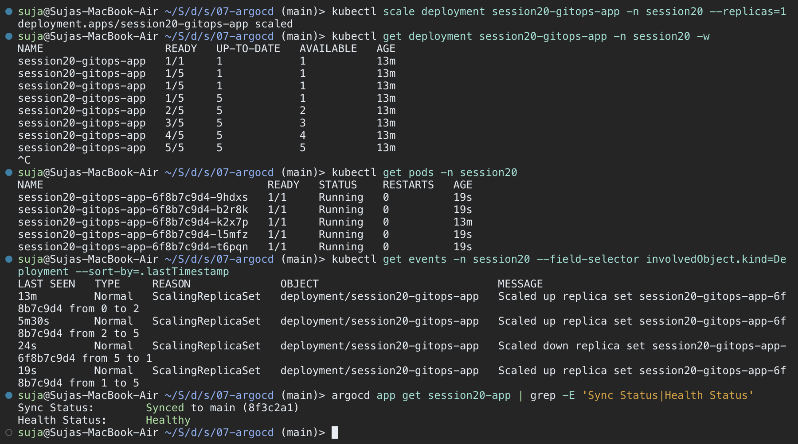

* The manual scale to 1 lasted about 5 seconds. Argo CD saw that the live Deployment (`replicas: 1`) no longer matched Git (`replicas: 5`) and, because `selfHeal: true` is set, synced it straight back. The events show the full story: 0→2 (first sync), 2→5 (Git commit), 5→1 (manual drift), 1→5 (self-heal).
* This is why changes must go through Git. A hand-made change is either reverted or, without self-heal, shown as *OutOfSync*.

### 3.7 Mini project: a second application from the same repo

**Commands:**
```bash
cd ../08-mini-project
kubectl apply -f app/argocd-application.yaml
kubectl get applications -n argocd
argocd app get session20-mini
kubectl get deploy,svc -n session20
kubectl get pods -n session20 -l app=session20-mini
```

**Output (partial):**
```text
application.argoproj.io/session20-mini created
NAME             SYNC STATUS   HEALTH STATUS
session20-app    Synced        Healthy
session20-mini   Synced        Healthy
...
       Namespace             session20       Synced                   namespace/session20 configured
       Service     session20  session20-mini  Synced  Healthy          service/session20-mini created
apps   Deployment  session20  session20-mini  Synced  Healthy          deployment.apps/session20-mini created
deployment.apps/session20-gitops-app   5/5     5            5           17m
deployment.apps/session20-mini         2/2     2            2           38s
```

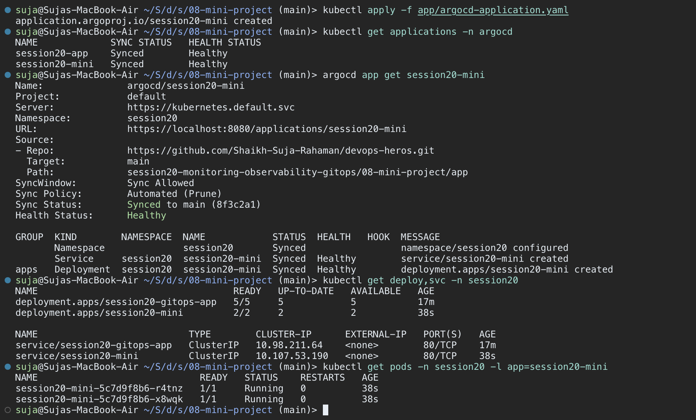

Both applications are **Healthy** and **Synced** from the same repository:

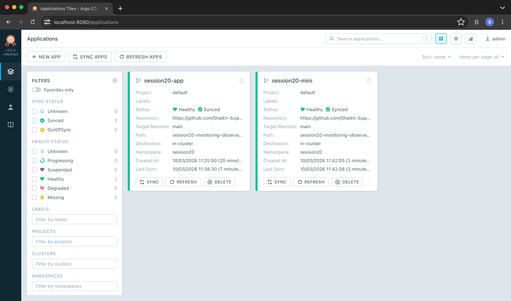

**Cleanup:**
```bash
kubectl delete -f ../08-mini-project/app/argocd-application.yaml
kubectl delete -f ../07-argocd/app/argocd-application.yaml     # prune removes the app resources
kubectl delete namespace argocd session20
```

---

## Deliverables Checklist

| Deliverable | Status | Where |
|-------------|--------|-------|
| Monitoring demo (metrics, logs, alerts, CPU, memory, health) | ✅ | Task 1, screenshots 01–10 |
| Observability documentation (pillars, why, tools, Kubernetes) | ✅ | Task 2 |
| GitOps demo (install, Git as source of truth, auto-sync, self-heal) | ✅ | Task 3, screenshots 11–20 |
| Screenshots | ✅ | `./screenshots/` (20 images) |
| README | ✅ | this file |

## Notes / Learnings

* `up` is the most useful single metric: one alert rule (`up == 0`) covers "my app stopped responding" for every target.
* Counters need `rate()`. Plotting `process_cpu_seconds_total` directly only shows an ever-rising line.
* Inside Docker Compose, containers reach each other by **service name** (`prometheus:9090`, `grafana:3000`), not `localhost`.
* `metrics-server` is for `kubectl top` and the HPA only. It stores no history, so Prometheus is still needed for dashboards and alerts.
* In a monorepo the Argo CD `path` must be the full path from the repo root. Keep the `Application` manifest out of the synced path, or exclude it, so Argo CD does not try to manage itself.
* With `selfHeal: true`, `kubectl edit/scale` on a managed resource is reverted within seconds. With `prune: true`, deleting a file from Git deletes the resource from the cluster.
